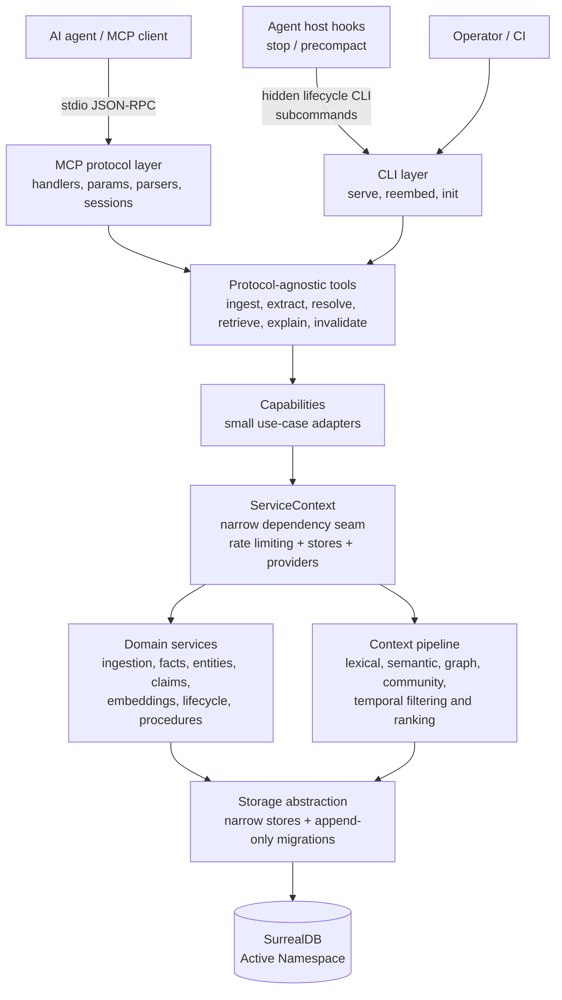
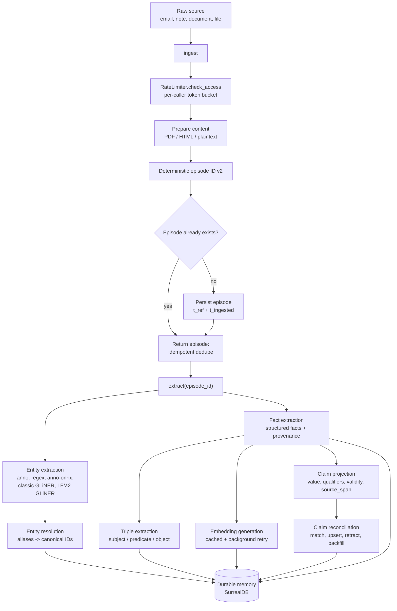
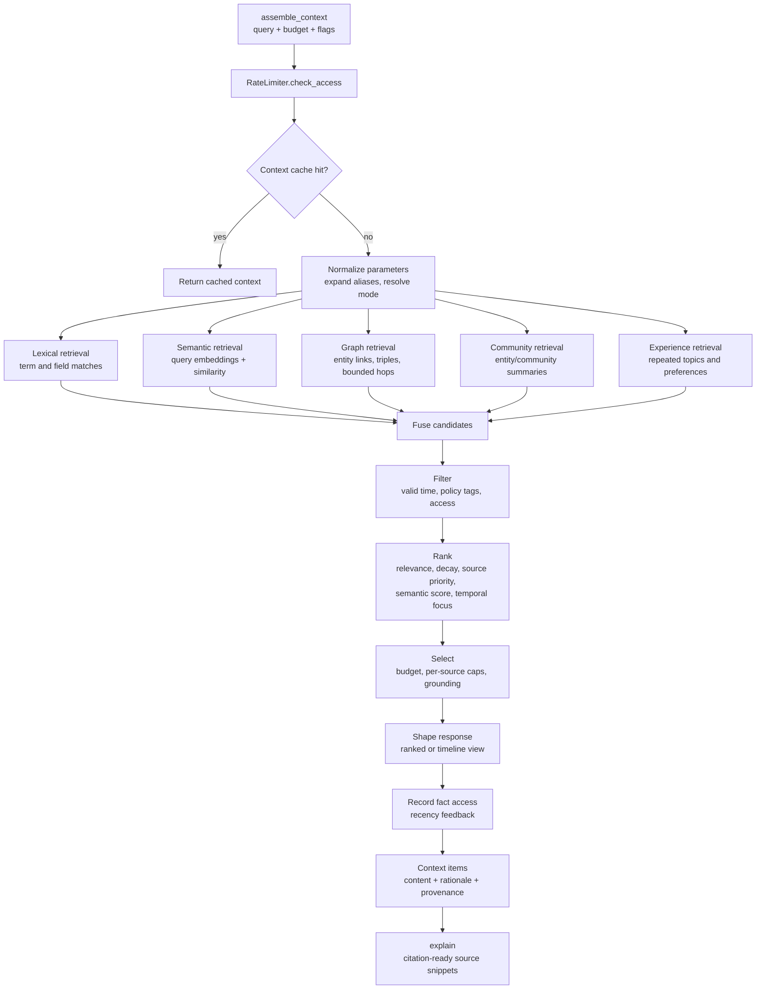
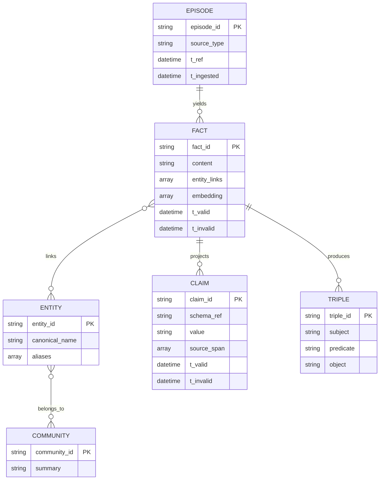
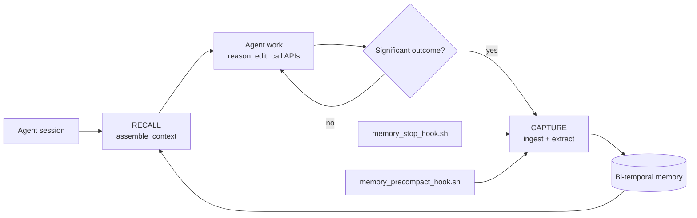

# Memory MCP

[](https://www.rust-lang.org)
[](https://doc.rust-lang.org/edition-guide/)
[](LICENSE)

> ⚠️ **Disclaimer:** This project is **not production-ready**. It is currently an **educational project** intended for learning, experimentation, and research purposes only. Do not use it in production environments or for critical workloads.

`memory_mcp` is a Rust-based Model Context Protocol (MCP) server that gives AI agents a structured long-term memory layer backed by SurrealDB.

It is designed for workflows where agents need more than short-lived chat context: episodic memory, extracted entities and facts, bi-temporal validity, ranked context assembly, and graph-style relationships between people, companies, tasks, and decisions.

## Table of contents

- [Overview](#overview)
- [What it provides](#what-it-provides)
- [Architecture](#architecture)
  - [Runtime layers](#runtime-layers)
  - [Write path: ingest and extraction](#write-path-ingest-and-extraction)
  - [Read path: context assembly](#read-path-context-assembly)
  - [Bi-temporal data model](#bi-temporal-data-model)
- [Quick start](#quick-start)
- [Configuration](#configuration)
- [MCP tools](#mcp-tools)
- [Development](#development)
- [Testing](#testing)
- [Project layout](#project-layout)
- [Documentation](#documentation)
- [Contributing](#contributing)
- [License](#license)

## Overview

Memory MCP implements a memory system for AI agents with core goals:

- preserve important source material as episodes
- extract entities, facts, and links in a deterministic way
- track knowledge over both valid time and transaction time
- assemble compact, relevant context for downstream reasoning
- support policy-tag-aware retrieval and access filtering within one Active Namespace

In practice, an agent can ingest emails, notes, or working documents, resolve entities consistently, store facts with provenance, and later ask for ranked context instead of replaying entire histories.

## What it provides

- **Bi-temporal knowledge model** for valid time and ingestion time
- **Episode ingestion** for storing raw source material
- **Entity resolution** with alias handling and deterministic IDs
- **Fact extraction** for metrics, promises, and other structured knowledge
- **Context assembly** for ranked retrieval by query, policy tags, and time cutoff
- **Graph relationships** between episodes, entities, and facts
- **Optional semantic retrieval providers** including in-process `local-candle`
- **Pluggable NER backends** for entity extraction: `anno`, `regex`, explicit Anno NuNER ONNX, and two native Candle zero-shot GLiNER backends (selectable via `NER_EXTRACTOR`)
- **SurrealDB support** for embedded and remote deployments
- **Optional filesystem ingestion inside `serve`** for filesystem-backed auto-ingest workflows (activated by `MEMORY_INGESTION_INBOX`)
- **MCP-native interface** for tool-driven agent workflows
- **Structured logging** with predictable operational behavior

## Architecture

Memory MCP is a layered system with a narrow service seam between protocol
adapters and domain logic. The MCP and CLI interfaces share the same
protocol-agnostic capabilities, so behavior does not diverge between an agent
calling a tool and an operator running a command locally.

### Runtime layers



**Important boundaries**

- `main.rs` is intentionally thin: argument parsing and dispatch only.
- `mcp/` is a protocol adapter; business logic stays in `service/`.
- `tools/` and `service/capabilities/` are reusable from both MCP and CLI.
- Storage is selected once at startup. Requests do not choose a namespace.
- Facts and claims are never deleted. They are invalidated while preserving
  historical traceability.

### Write path: ingest and extraction

The write path turns source material into durable, structured memory. Ingestion
is deterministic and idempotent: sending the same source again returns the
existing episode instead of creating a duplicate.



The claim pipeline preserves provenance: `source_span` points back to the
source range that produced a claim, while remaining outside deterministic
claim identity. This lets metadata improve traceability without changing
whether two claims are considered the same claim.

### Read path: context assembly

The read path fuses several retrieval strategies, then applies policy,
temporal, provenance, and budget constraints before returning a compact
context pack.



A query can therefore succeed even when one retrieval signal is weak: lexical
matches, semantic similarity, graph expansion, community summaries, and
experience candidates are fused before ranking. Each result includes enough
rationale and provenance for an agent to decide whether to use it.

### Bi-temporal data model

Memory distinguishes **when something was true** from **when the system learned
it**. This is essential for correcting stale knowledge without erasing the
historical record.



- `t_ref` / `t_valid`: when the source says the information is true.
- `t_ingested`: when Memory MCP recorded the source.
- `t_invalid`: when a fact or claim was superseded; the row remains available
  for audit and historical queries.

### Main modules

| Module | Purpose |
| --- | --- |
| `mcp` | MCP handlers, params, parsers, and tool-facing types |
| `service` | Core business logic for ingest, extract, retrieval, graph operations, and validation |
| `storage` | Database integration and persistence helpers |
| `models` | Shared domain models and request/response types |
| `config` | Environment-driven configuration loading |
| `logging` | Logging setup and log-level utilities |
| `observability` | Optional Prometheus installation and bounded runtime metrics |

## Quick start

### Requirements

- Rust 1.88+ only when compiling from source
- No external SurrealDB service is required for the default embedded mode

### First run with a release binary

1. Download the release asset for your platform and verify its accompanying SHA-256 checksum. Rename it to `memory_mcp` (or create a symlink with that name); the Windows asset already includes `.exe`.
2. Put the renamed executable on `PATH`.
3. Run `memory_mcp init` for the default VS Code snippet, or pass one of the exact targets `claude-desktop`, `codex`, `zed`, or `env`.
4. Copy the printed host-native snippet into the indicated configuration file.
5. Ingest one source, run `extract --episode-id <episode-id>`, then run `assemble-context` to verify a real fact is recalled.

The default path needs no environment variables, configuration file, external database, API key, network request, or model download. It uses a user-owned embedded database, Anno extraction, and lexical/graph retrieval immediately. `memory_mcp init` prints configuration only: it does not edit host files, change environment variables, start a database, download models, or access the network.

### Install from source (fallback)

A Rust toolchain is needed only when a prebuilt release is unavailable:

```bash
cargo install --path crates/memory-mcp --locked
```

This builds the same full-capability application as the release binary; it is not a reduced onboarding build.

### Measuring time-to-value

The clean-machine harness measures the path from the selected persona's start to a
real fact recalled by `assemble-context`; it does not measure GUI host startup or
memory quality. It uses isolated `HOME`, `XDG_DATA_HOME`, `CARGO_HOME`, and working
directories and prints machine-readable timings with median and p90 aggregates:

```bash
scripts/measure_ttv.sh --binary ./target/release/memory_mcp --persona release-binary --repeat 5
scripts/measure_ttv.sh --binary ./target/release/memory_mcp --persona host-config-user --repeat 5
scripts/measure_ttv.sh --cargo-install --source . --persona rust-user --repeat 5
```

The fixture is a summary-like `requirement` episode because the existing extractor
intentionally limits note fallback facts to summary-capable source types. The
validator rejects malformed responses, empty fact arrays, and episode-only fallback
items, so a run is successful only when a persisted fact—not an episode fallback—is
recalled. Installation, host-snippet preparation, storage initialization, episode
write, extraction, and fact recall are reported separately. A median total of
`<= 300` seconds is the measured target, not a guarantee; the first clean rust-user
run on this macOS workspace took `544.098` seconds, with `542.634` seconds spent in
isolated compilation/install and approximately `1.46` seconds in the application
path.

### Run

```bash
cargo run --release -- serve
# or
make serve-release
```

For local NER workloads, run the MCP server from a release build. The development
profile leaves the `memory_mcp` crate at `opt-level = 0`; dependency code is optimized,
but GLiNER window orchestration and span enumeration are not. Performance claims and
timeout investigations are valid only for release builds. Use `cargo run` only for
development and functional debugging.

The binary uses stdio transport, which makes it suitable for local MCP client integration.

### Run with environment

The default embedded mode needs no `SURREALDB_*` variables. To select a remote
SurrealDB explicitly, use one of the supported remote schemes (`ws`, `wss`,
`http`, or `https`) and provide non-empty credentials:

```bash
SURREALDB_URL=ws://127.0.0.1:8000/rpc \
SURREALDB_EMBEDDED=false \
SURREALDB_DB_NAME=memory \
SURREALDB_NAMESPACE=org \
SURREALDB_USERNAME=<your-remote-username> \
SURREALDB_PASSWORD=<your-remote-password> \
RUST_LOG=info \
cargo run --quiet --bin memory_mcp
```

`mem://` and `rocksdb://` are not remote URL schemes. For an explicit local
RocksDB location, set `SURREALDB_DATA_DIR`; otherwise the server uses a
user-owned data directory by default.

### Filesystem ingestion (optional, inside `serve`)

Filesystem ingestion turns a directory into a **passive memory intake pipe**:
drop or save files into the configured inbox and the stdio MCP server ingests
them through the full `ingest → extract` pipeline without manual tool calls.

**Activation**

Set `MEMORY_INGESTION_INBOX` to an existing absolute directory when starting
`serve` (the variable is optional; when absent, startup behavior is unchanged).
The binary must be built with the `fs-watch` feature (official release binaries
include it). A binary compiled without the feature rejects a configured inbox
with an actionable startup error.

```bash
# Single terminal — the MCP server owns filesystem ingestion
RUST_LOG=info \
  MEMORY_INGESTION_INBOX=$HOME/projects/atlas/inbox \
  SURREALDB_DATA_DIR=$HOME/.memory-mcp/atlas \
  memory_mcp serve
```

**What it does**

- Startup validates the inbox, attaches the OS watcher, then scans existing
  supported files in the background (files cannot fall into a scan-to-watch gap)
- Watches the inbox recursively for file **create** and **modify** events
- Processes files only after size and modification time stabilize
- Skips symlinks and unsupported file types silently
- Tracks durable revisions: each distinct set of bytes at a path is one
  immutable revision; renaming a file starts a new lineage; deleting a file
  never invalidates memory
- One failed file never stops ingestion or MCP; the watcher backend is
  recreated with bounded backoff and then enters a logged degraded state

**Supported file types**

| Extension | Format | Extracted content |
|-----------|--------|-------------------|
| `.pdf` | PDF | Text content (pages, paragraphs) |
| `.docx` | Word document | Body text, headings, tables |
| `.xlsx` | Spreadsheet | Cell values, sheet structure |
| `.pptx` | Presentation | Slide text, speaker notes |
| `.md`, `.markdown` | Markdown | Headings, lists, code blocks |
| `.txt` | Plain text | Raw text content |
| `.eml` | Email message | Subject, sender, recipients, body, date |

Files with other extensions (`.json`, `.png`, `.zip`, etc.) are **silently skipped**.

**MCP host example (Zed)**

```json
{
  "context_servers": {
    "memory_mcp": {
      "command": "memory_mcp",
      "args": [],
      "env": {
        "MEMORY_INGESTION_INBOX": "/absolute/path/to/inbox",
        "SURREALDB_DATA_DIR": "/absolute/path/to/atlas-data"
      }
    }
  }
}
```

**MCP host example (Claude Desktop)**

```json
{
  "mcpServers": {
    "memory_mcp": {
      "command": "memory_mcp",
      "args": [],
      "env": {
        "MEMORY_INGESTION_INBOX": "/absolute/path/to/inbox",
        "SURREALDB_DATA_DIR": "/absolute/path/to/atlas-data"
      }
    }
  }
}
```

Each stdio client process needs its own `SURREALDB_DATA_DIR`; changing only the
database name or namespace does not avoid the embedded directory lock.

### Optional MCP apps surface

The repository also contains an optional app-oriented MCP surface for reviewer and inspector workflows. It is intentionally feature-gated so the eight canonical memory tools stay available without exposing extra session/resource endpoints by default.

Build or run with apps enabled:

```bash
cargo run --features mcp-apps -- serve
```

Recommended verification for this surface:

```bash
cargo check --all-targets --features mcp-apps
cargo clippy --all-targets --features mcp-apps
```

**How it works internally**

<details>
<summary><strong>Architecture flow</strong></summary>

```
serve (stdio MCP) with MEMORY_INGESTION_INBOX set
  │
  ▼
FsWatchRuntime::start(service, config)
  │
  ├─ Validate: inbox must be absolute, readable, not a symlink
  ├─ Attach OS watcher (watcher-first) — before the scan starts
  ├─ Requeue: expired leases + one retry cycle for failed revisions
  │
  ├─ Spawn event bridge: forwards Create/Modify events
  ├─ Spawn startup scan: enqueues existing supported files recursively
  └─ Spawn sequential processor: drains the durable inbox revision store

  SHARED DISCOVERY (both event bridge and scan)
       │
       ├─ prepare_candidate: reject symlinks + unsupported extensions,
       │   wait for size + mtime stability
       ├─ Hash raw bytes (SHA-256) → immutable revision identity
       ├─ discover_prepared: persist durable prepared-content snapshot
       │
       └─ Processor (sequential, lease-based):
           ├─ ingest → extract (from the durable snapshot, never the path)
           ├─ retry transient failures (bounded, exponential)
           └─ mark processed; failed revisions requeue once per startup
```

</details>

**Revision and deduplication behavior**

<details>
<summary><strong>How rapid saves are handled</strong></summary>

When you save a file, editors often fire multiple filesystem events in quick succession (write + metadata + timestamp). Files are processed only after **size and modification time stabilize** (two consecutive matching samples), and each distinct set of raw bytes becomes exactly **one immutable inbox revision**:

- Revision identity is SHA-256 over the raw bytes plus the normalized lineage (path relative to the inbox)
- Re-scanning or re-observing identical bytes returns the existing revision — no duplicate episode or facts
- A file that changes creates a **new revision** (new episode, same `source_lineage`)
- Renaming a file starts a **new lineage** (new episode source lineage); deleting a file never invalidates memory

</details>

**Command-line reference**

<details>
<summary><strong>Activation</strong></summary>

```
MEMORY_INGESTION_INBOX=/absolute/path/to/inbox memory_mcp serve

The variable must be a non-empty absolute path to an existing readable
directory that is not a symlink. Omit it to keep filesystem ingestion
disabled. The binary must include the `fs-watch` feature (official release
binaries do); a binary compiled without it rejects a configured inbox with
an actionable startup error.
```

Important notes:
- One process watches exactly one inbox recursively; symlinks and unsupported
  files are skipped.
- Files are processed only after size and modification time stabilize.
- Each distinct set of bytes is one immutable revision; renaming starts a new
  lineage; deleting a file never invalidates memory.
- One failed file or a degraded watcher backend never stops MCP or queued work.
</details>

**Logging during filesystem ingestion**

<details>
<summary><strong>What to expect at each log level</strong></summary>

| Level | Events you'll see |
|-------|-------------------|
| `info` | `fs_watch.ready` (startup), `fs_watch.revision` (per-revision outcome: relative path + short revision prefix only) |
| `warn` | `fs_watch.degraded` (watcher backend exhausted after bounded backoff) |
| `debug` | `fs_watch.shutdown` outcome on clean exit |

Revision events contain relative paths and short revision prefixes only; file
contents and absolute inbox roots never appear in logs except startup
diagnostics.
</details>

### VS Code MCP host example

Run the renderer for the current VS Code schema and copy its JSON into
`.vscode/mcp.json`:

```bash
memory_mcp init --target vscode
```

The generated snippet uses `servers.memory_mcp` with a stdio `command` of
`memory_mcp` and no environment variables. After `cargo build --release` or
`cargo install --path crates/memory-mcp --locked`, the installed binary can be
used directly by the host.

## Streamable HTTP SaaS profile

The optional `memory_mcp_http` binary is a separate multi-user composition root.
It exposes only modern MCP Streamable HTTP at `POST /mcp`; it has no memory
operation CLI and never accepts a namespace selector from a request. The request
path is Bearer API key → Account → ready Tenant → immutable namespace-bound
runtime. The control Registry uses its own SurrealDB namespace/database, while
Tenant data is provisioned in server-generated namespaces.

Build and run it with the `streamable-http` feature:

```bash
cargo build --release --locked --features streamable-http,control-plane
MEMORY_MCP_HTTP_PUBLIC_BASE_URL=https://mcp.example.com \
ALLOWED_HOSTS=mcp.example.com \
ALLOWED_ORIGINS=https://mcp.example.com \
MEMORY_MCP_HTTP_SIGNUP_MODE=invite_only \
SURREALDB_CONTROL_URL=wss://surreal.example.com/rpc \
SURREALDB_CONTROL_USERNAME=... \
SURREALDB_CONTROL_PASSWORD=... \
SURREALDB_CONTROL_NAMESPACE=control \
SURREALDB_CONTROL_DB=registry \
SURREALDB_TENANT_URL=wss://surreal.example.com/rpc \
SURREALDB_TENANT_USERNAME=... \
SURREALDB_TENANT_PASSWORD=... \
SURREALDB_TENANT_NAMESPACE=tenant \
SURREALDB_TENANT_DB=tenant \
MEMORY_MCP_API_KEY_PEPPER=... \
MEMORY_MCP_HTTP_IDENTITY_INDEX_KEY=... \
MEMORY_MCP_HTTP_SESSION_KEY=... \
MEMORY_MCP_HTTP_OIDC_STATE_KEY=... \
MEMORY_MCP_HTTP_OIDC_NONCE_KEY=... \
MEMORY_MCP_HTTP_CSRF_KEY=... \
./target/release/memory_mcp_http
```

The full environment contract, proxy requirements, deletion semantics, and
production gates are in the [Streamable HTTP SaaS specification](docs/superpowers/specs/2026-08-27-streamable-http-saas.md),
[ADR-0052](docs/adr/0052-streamable-http-saas-profile.md), and the
[operations runbooks](docs/operations/).

For `MEMORY_MCP_HTTP_SIGNUP_MODE=open`, also set all seven durable plan seed
variables: `MEMORY_MCP_HTTP_MAX_INGESTED_BYTES`,
`MEMORY_MCP_HTTP_MAX_EPISODE_COUNT`, `MEMORY_MCP_HTTP_INGEST_PER_MINUTE`,
`MEMORY_MCP_HTTP_MAX_OPEN_APP_SESSIONS`, `MEMORY_MCP_HTTP_MAX_ACTIVE_API_KEYS`,
`MEMORY_MCP_HTTP_REQUEST_CONCURRENCY`, and
`MEMORY_MCP_HTTP_EXTRACTION_CONCURRENCY`. They are used only to create Registry
plan version 1 when it is absent; an existing durable plan is not overwritten.

The embedded `rocksdb://` backend is suitable only for development, demos, and
single-process tests. Public production requires remote SurrealDB, reverse-proxy
TLS/host/origin enforcement, restricted `/metrics`, and the release evidence in
§20.5 of the specification.

## Configuration

Configuration is loaded from environment variables.

### Storage variables and defaults

| Variable | Type | Default | Required | Description |
| --- | --- | --- | --- | --- |
| `SURREALDB_DB_NAME` | string | `memory` | No | Database name |
| `SURREALDB_NAMESPACE` | string | `main` | No | One namespace; changing it takes effect after restart and never moves data |
| `SURREALDB_USERNAME` | string | `root` (embedded); explicit value required (remote) | Remote only | Database username |
| `SURREALDB_PASSWORD` | string | `root` (embedded); explicit value required (remote) | Remote only | Database password |
| `SURREALDB_URL` | URL | unset (embedded) | Remote only | Remote connection URL using `ws`, `wss`, `http`, or `https` |
| `SURREALDB_EMBEDDED` | boolean | inferred from `SURREALDB_URL` | No | Explicit `true`/`false`; remote URLs select remote mode and all other URLs select embedded mode when unset |
| `SURREALDB_DATA_DIR` | path | `$XDG_DATA_HOME/memory_mcp`; else `$HOME/.local/share/memory_mcp`; else `./.memory_mcp` (embedded); unset (remote config) | No | Custom embedded data directory; an existing executable-relative `data/surrealdb` directory may be reused for compatibility, and the effective default root also backs local model caches |
| `SURREALDB_EMBEDDING_DIMENSION` | unsigned integer | unset | No | Existing vector dimension override; the provider fallback is `384` for `local-candle` and `1536` for other embedding providers |

The default local path is embedded RocksDB with no external service, credential,
or model download required to start storage. Remote mode requires a valid URL and
non-empty explicit username and password. NER defaults to the in-process Anno
backend; `zero-config` does not mean the binary has no dependencies.

### Advanced runtime overrides

The following settings are optional for power users. They are read by the same executable used by the no-configuration quick start.

| Variable | Type | Default | Description |
| --- | --- | --- | --- |
| `RUST_LOG` | string | `info` | Logging level; canonical values are `trace`, `debug`, `info`, `warn`, and `error`; `warning` aliases `warn`, and unknown values fall back to `info` |
| `MEMORY_LOG_FILE` | path | unset | Write structured log events to this file instead of stderr; the file is created if missing (parent directory must exist), opened in append mode, and flushed after every line; on open failure the process falls back to stderr with a warning |
| `MEMORY_PROMETHEUS_LISTEN_ADDR` | socket address (`IP:port`) | unset | Prometheus HTTP listener address; active only when the `prometheus` feature is compiled and this variable is set |
| `QUERY_LOGGING_ENABLED` | boolean | `false` | Persist `assemble_context` analytics rows into `query_log` when `true` |
| `QUERY_LOG_RETENTION_DAYS` | unsigned integer | `90` | Days to retain persisted `query_log` analytics before best-effort pruning |
| `LIFECYCLE_ENABLED` | boolean | `false` | Enable background lifecycle jobs |
| `LIFECYCLE_DECAY_INTERVAL_SECS` | unsigned integer | `3600` | Decay worker interval in seconds |
| `LIFECYCLE_ARCHIVAL_INTERVAL_SECS` | unsigned integer | `86400` | Archival worker interval in seconds |
| `LIFECYCLE_DECAY_THRESHOLD` | floating-point number | `0.3` | Confidence threshold for fact invalidation |
| `LIFECYCLE_ARCHIVAL_AGE_DAYS` | unsigned integer | `90` | Days before archiving episodes |
| `LIFECYCLE_DECAY_HALF_LIFE_DAYS` | floating-point number | `365` | Half-life in days for decay computation |
| `EMBEDDINGS_ENABLED` | boolean | `false` when unset and no provider is set; `true` when a provider is set and this variable is unset | Enable semantic retrieval; explicit `false` takes precedence over provider selection |
| `EMBEDDINGS_PROVIDER` | string enum | `disabled` when both variables are unset; `local-candle` when `EMBEDDINGS_ENABLED=true` without a provider | Embedding backend: `local-candle`, `openai-compatible`, or `ollama`; when `EMBEDDINGS_ENABLED` is unset, setting a provider enables embeddings, while explicit `false` disables them and explicit `true` enables the selected/default provider |
| `EMBEDDINGS_MODEL` | string | `intfloat/multilingual-e5-small` for `local-candle`; required for external providers when enabled | Model identifier for the selected embedding provider |
| `EMBEDDINGS_MODEL_DIR` | path | unset (derived under the effective data/cache root for `local-candle`) | Optional local cache directory for `local-candle` |
| `EMBEDDINGS_BASE_URL` | URL | unset for `local-candle`; `https://api.openai.com/v1` for `openai-compatible`; `http://127.0.0.1:11434` for `ollama` | Base URL for remote embedding providers |
| `EMBEDDINGS_MAX_TOKENS` | unsigned integer | `384` | Max token budget before `local-candle` chunks long inputs |
| `EMBEDDINGS_TIMEOUT_SECS` | unsigned integer | `15` | Timeout for remote embedding calls |
| `EMBEDDINGS_RECOVERY_INTERVAL_SECS` | positive unsigned integer | `60` | Initial delay before the in-process recovery worker probes a remote provider after degraded startup; failed probes use exponential backoff |
| `EMBEDDINGS_AUTO_RECOVERY` | boolean | `true` | Enable automatic in-process recovery after a failed remote startup preflight; set `false` for explicit opt-out |
| `EMBEDDINGS_SIMILARITY_THRESHOLD` | floating-point number | `0.7` | Minimum cosine similarity for semantic matches |
| `EMBEDDINGS_API_KEY` | string | unset | Optional bearer token for OpenAI-compatible providers |
| `NER_EXTRACTOR` | string enum | `anno` (unset) | Entity extraction backend selector. Closed catalog: `anno` (lightweight, download-free), `regex` (project-owned deterministic), `anno-onnx` (Anno NuNER ONNX, local-path only), `urchade/gliner_multi-v2.1` (classic Candle GLiNER), `VAGOsolutions/SauerkrautLM-LFM2.5-GLiNER` (native Candle LFM2 GLiNER). Unknown values and arbitrary repository IDs are rejected. The removed `NER_PROVIDER` and `NER_MODEL` variables fail with migration guidance if present |
| `NER_CACHE_DIR` | path | `<data>/models/ner` | Artifact store root for model-backed extractors (Anno ONNX, classic GLiNER, VAGO LFM2) |
| `NER_LABELS` | comma-separated list | `person`, `company`, `location`, `product`, `event`, `technology` | Runtime labels for model-backed extractors; trimmed, lowercased, deduplicated in first-declared order |
| `NER_THRESHOLD` | floating-point number | `0.5` | Confidence threshold for model-backed extractors (each backend owns an evaluated default; explicit in-range values override it) |
| `NER_MAX_CONCURRENCY` | positive integer | `1` | Concurrent local NER inference limit |
| `NER_IDLE_UNLOAD_SECS` | unsigned integer | `0` | Seconds of inactivity before any model-backed extractor unloads its model; `0` keeps it loaded for the process lifetime |
| `GLINER_BATCH_SIZE` | positive integer | `1` | Max windows per transformer forward pass; increase only after workload-specific benchmarking |
| `GLINER_MAX_BATCH_TOKENS` | positive integer | `1536` | Max padded tokens per batch |
| `GLINER_DEVICE` | string enum | `cpu` | Device for the native Candle GLiNER backends: `cpu`, `metal`, or `auto`; `metal` requires `--features metal`, while `auto` uses Metal when available and otherwise falls back to CPU (with an event) |
| `MEMORY_CLAIM_ROLLOUT_STAGE` | string enum | `shadow` | Claim reconciliation rollout stage: `disabled`, `shadow`, `relations`, or `evidence` |
| `MEMORY_CLAIM_CANDIDATE_PAGE_SIZE` | unsigned integer | `256` | Candidate page size for claim reconciliation |
| `MEMORY_CLAIM_INLINE_CANDIDATE_LIMIT` | unsigned integer | `1024` | Inline claim candidate limit |
| `MEMORY_CLAIM_INLINE_BUDGET_MS` | unsigned integer | `50` | Inline claim reconciliation budget in milliseconds |
| `ENTITY_FUZZY_THRESHOLD` | floating-point number | `0.85` | Entity fuzzy-match threshold |

Advanced provider selection may cause network access or model downloads. Keep these variables unset for the local-first quick start.

### Runtime metrics

Build with the optional `prometheus` feature and set
`MEMORY_PROMETHEUS_LISTEN_ADDR` to expose the Prometheus endpoint. The runtime
exports three generic bounded metric families:

| Metric | Labels | Meaning |
| --- | --- | --- |
| `memory_operation_calls_total` | `operation`, `outcome` | Logical operation volume; outcome is `success` or `error` |
| `memory_operation_duration_seconds` | `operation`, `outcome` | Operation latency histogram |
| `memory_operation_results_total` | `operation`, `result` | Counts of bounded domain outputs such as facts, entities, or retrieved items |

Claim reconciliation exports additional `memory_claim_*` families under the
cardinality rules in [ADR-0005](docs/adr/0005-separate-claim-traces-from-metric-labels.md).
The evaluation harness does not publish ephemeral Prometheus series: its
versioned JSON artifacts are the source of truth for batch latency, capacity,
retrieval quality, gates, and case outcomes. Individual record identifiers are
never metric labels; use structured logs for per-request diagnosis. See
[ADR-0048](docs/adr/0048-bounded-runtime-observability.md).

### Optional build features

The binary supports a few opt-in Cargo features:

| Feature | Effect |
| --- | --- |
| `mimalloc` | Use the mimalloc global allocator instead of the system allocator. This remains an explicit experiment: the fresh macOS matrix reduced physical footprint after GLiNER unload but increased observed RSS to about 2.56 GB, so it is not the server default. Build: `cargo build --release --features mimalloc`. |
| `accelerate` | Enable Candle's Apple Accelerate CPU backend. This is an explicit Apple-specific feature, not a portable package default; the current A/B did not pass the no-degradation gate, so do not present it as a production speedup. Build: `cargo build --release --features accelerate`. |
| `metal` | Enable Candle's Metal backend for explicit macOS GPU experiments. It is not a production default. Build: `cargo build --release --features metal`. |
| `mcp-apps` | Enable the optional interactive MCP app-session surface. It is not required for the eight core tools or the zero-config first-value path. Build: `cargo build --release --features mcp-apps`. |
| `control-plane-ui` | Compile the optional Dioxus control-plane SPA. It requires a prebuilt web bundle; see [Control-plane UI asset packaging](#control-plane-ui-asset-packaging). |
| `prometheus` | Compile the optional Prometheus recorder/listener. Set `MEMORY_PROMETHEUS_LISTEN_ADDR` at runtime to expose `/metrics`. |

The allocator evidence is recorded in [`docs/performance/MEMORY_PROFILE.md`](docs/performance/MEMORY_PROFILE.md), the CPU-backend result in [`docs/performance/NER_PERFORMANCE.md`](docs/performance/NER_PERFORMANCE.md), and the policy in [ADR-0034](docs/adr/0034-allocator-and-accelerator-default-policy.md). For infrequent local GLiNER extraction, `NER_IDLE_UNLOAD_SECS=30` is the measured workload-specific memory recommendation; the runtime compatibility default remains `0`.

### Control-plane UI asset packaging

The `control-plane-ui` feature embeds the separately built Dioxus 0.7 web bundle
into the `memory_mcp` binary at compile time. The runtime does not read a
filesystem asset directory, and the build never fetches UI assets from the
network.

Build the UI with the Dioxus CLI matching the crate's 0.7 dependency, then pass
an **absolute** bundle directory to the backend build:

```bash
cd crates/control-plane-ui
dx bundle --platform web --release --out-dir "$PWD/../../target/control-plane-ui-dist"
cd ../..
MEMORY_MCP_CONTROL_PLANE_UI_DIST="$PWD/target/control-plane-ui-dist" \
  cargo build --release --features control-plane-ui
```

The bundle must contain a non-empty `index.html`. All regular files are copied
in deterministic path order into Cargo's `OUT_DIR` and embedded with
`include_bytes!`; symlinks, non-UTF-8 paths, and invalid bundle entries are
rejected. If `control-plane-ui` is enabled without the environment variable or
without a complete bundle, compilation fails with an actionable error instead
of producing a placeholder page. Builds without that feature do not require UI
assets.

### One active namespace

Each server process selects exactly one SurrealDB **namespace** at startup. The
default is `main`; `SURREALDB_NAMESPACE` may select one other namespace. All
ordinary MCP, CLI, lifecycle, app, and worker operations use that namespace
implicitly — tool calls do not carry `scope`, `project`, or a request-level
namespace.

**`SURREALDB_NAMESPACE`** accepts exactly one name. The removed plural variable
`SURREALDB_NAMESPACES` is a hard configuration error; if your environment still
sets it, choose one name and replace it:

```dotenv
# old and unsupported
SURREALDB_NAMESPACES=kaspersky,org,personal,private-domain

# choose exactly one
SURREALDB_NAMESPACE=kaspersky
```

Switching and restarting accesses another namespace without moving data. One
Active Namespace does **not** isolate personal/corporate/family/project memories
internally; operators who need separate authorization domains must run separate
process configurations. Namespace transfer/export/import is not automatic.

### Example

```bash
SURREALDB_DB_NAME=memory
SURREALDB_NAMESPACE=org
SURREALDB_USERNAME=root
SURREALDB_PASSWORD=root
SURREALDB_URL=ws://127.0.0.1:8000/rpc
SURREALDB_EMBEDDED=false
RUST_LOG=info
QUERY_LOGGING_ENABLED=false
QUERY_LOG_RETENTION_DAYS=90

# Lifecycle background jobs (optional)
LIFECYCLE_ENABLED=true
LIFECYCLE_DECAY_INTERVAL_SECS=3600
LIFECYCLE_ARCHIVAL_INTERVAL_SECS=86400
LIFECYCLE_DECAY_THRESHOLD=0.3
LIFECYCLE_ARCHIVAL_AGE_DAYS=90
# LIFECYCLE_DECAY_HALF_LIFE_DAYS=365

# Optional local model configuration
# EMBEDDINGS_ENABLED=true
# EMBEDDINGS_PROVIDER=local-candle
# EMBEDDINGS_MODEL=intfloat/multilingual-e5-small
# EMBEDDINGS_MODEL_DIR=./data/models/intfloat/multilingual-e5-small
# NER_EXTRACTOR=urchade/gliner_multi-v2.1
# NER_CACHE_DIR=./data/models/ner
# GLINER_DEVICE=cpu
```

### Classic GLiNER (background refresh)

`NER_EXTRACTOR=urchade/gliner_multi-v2.1` is the only model-backed
selector that performs remote acquisition. The classic GLiNER backend
follows these rules so MCP readiness never waits on the network:

- **First install** with no local cache: the MCP `initialize` request
  succeeds immediately. Extraction is unavailable in this process; the
  server returns a structured `model_not_ready` error with
  `retryable=false`, `restart_required=true`, and
  `activation=next_restart`. A background refresh task starts **after**
  MCP readiness and downloads the 1+ GB checkpoint with cancel-safe
  staging.
- **Operator guidance**: the structured event
  `ner.artifact_refresh.candidate_ready` (with `activation=next_restart`)
  on stderr/logs means a new revision was staged locally. Restart Memory
  MCP (and therefore Zed) to activate it. Retrying `extract` in the
  same process cannot activate the model — the active extractor and
  fingerprint are immutable for the process lifetime.
- **Download-free alternatives**: `NER_EXTRACTOR=anno` (the default),
  `NER_EXTRACTOR=regex`, and `NER_EXTRACTOR=anno-onnx` (CPU only, manual
  checkpoint) do not perform network acquisition. Anno and Regex are
  the recommended choices for offline installs.
- **Operational failures** (inaccessible `NER_CACHE_DIR`, missing read
  permissions) remain explicit startup errors and never silently
  downgrade extraction.

See ADR-0051 for the state machine, cancellation guarantees, and
rejected alternatives.

### Embedding providers and switching

The server supports three embedding backends, controlled by `EMBEDDINGS_PROVIDER`:

| Provider | What it is | Default dimension | Requires network? |
| --- | --- | --- | --- |
| `local-candle` | In-process BERT model via Candle (Rust ML) | 384 | Only for first download |
| `openai-compatible` | External OpenAI-compatible HTTP API | 1536 (configurable) | Yes, every call |
| `ollama` | External Ollama HTTP API | 1536 (configurable) | Yes, every call |

#### How it works at startup

At startup the server resolves a **target embedding identity** from the configured provider, model, base URL, and effective dimension.
For remote providers (`openai-compatible`, `ollama`) the effective dimension is normally detected with a single short **dimension probe** request to the provider.
Two startup behaviors keep this from blocking `serve`:

- If `SURREALDB_EMBEDDING_DIMENSION` is set, the probe is **skipped entirely** — the override is authoritative at startup, so the server resolves its embedding identity without any network access. A wrong override then surfaces as a dimension-validation error on embed; use `reembed` as the recovery path.
- If no override is set and the provider is unreachable, the probe fails fast (single attempt, bounded by a short probe timeout) and the server degrades to lexical/graph-only retrieval instead of stalling startup.

That identity is persisted per namespace in `embedding_state:fact` as an `active_signature` once the namespace is known to be compatible.
In normal `serve` startup, the Active Namespace is checked before semantic retrieval is enabled.
If it is already marked `ready` for the same signature and has no missing vectors, semantic retrieval starts normally. If it is marked `backfill_pending`, startup resumes the recovery worker; a matching `ready` state with `embedding IS NONE` facts is also treated as resumable for compatibility with states written before the durable marker existed.
If its state is missing but it is clearly compatible (empty namespace or sampled legacy vectors all match the current dimension), the service bootstraps a `ready` state automatically.
If it is marked `rebuilding`, `failed`, or has embeddings that do not match the configured target, the service **degrades to lexical/graph-only retrieval** instead of mixing incompatible vectors. When a signature differs but missing vectors exist, the service starts degraded and schedules safe backfill of only those missing vectors; the old persisted signature remains until `reembed` completes.

That is the safety rail: after a provider switch, normal MCP traffic keeps working, but semantic retrieval is intentionally disabled until embeddings are rebuilt.

#### What happens when you switch providers

To switch, change the environment variables and restart. The server does **not** silently rewrite old vectors during normal startup.

The runtime now separates two modes:

**Normal mode** (`memory_mcp` or `memory_mcp serve`) — safe startup checks run first. If stored embeddings are incompatible with the configured target, semantic retrieval is disabled and the process logs `embedding.rebuild_required`.
**Maintenance mode** (`memory_mcp reembed`) — a dedicated one-shot command that forces the configured embedding provider on, rewrites every fact embedding, persists progress, and exits when complete.

This keeps the public MCP tool surface unchanged while giving operators a deterministic recovery path after provider changes.

#### Air-gapped startup and recovery

A remote embedding provider is an external dependency, so the server separates startup availability from later semantic recovery:

1. Startup performs one bounded dimension preflight. If the remote endpoint is unavailable, the server logs `embedding.preflight_failed` and `embedding.startup_decision`, installs the disabled provider, and continues with lexical/graph-only retrieval. MCP operations do not wait for the provider's runtime retry loop. Remote HTTP errors include the sanitized endpoint, model, and bounded `response_payload`; JSON fields such as `api_key`, `authorization`, `token`, `input`, and `prompt` are redacted.
2. When `EMBEDDINGS_AUTO_RECOVERY` is enabled, a background worker waits `EMBEDDINGS_RECOVERY_INTERVAL_SECS` (default `60`) and probes again. Probe failures use `15s → 30s → 60s` exponential backoff capped at `300s`; transport failures and HTTP errors, including `404`, remain retryable. After three consecutive failures the repetitive probe event is logged at debug level.
3. If the probe dimension matches the active index and the persisted signature is equal or absent, the worker first persists `embedding_state:fact.status = "backfill_pending"`, then swaps in the provider, invalidates the context cache, and backfills facts created while degraded. Only after backfill completes does it persist `status = "ready"`. Backfill selects only `embedding IS NONE`, uses `fact_id` order and batches of `100`, and never drops the HNSW index.
4. If the dimension matches but the signature differs, the worker enables the provider for new writes, logs `embedding.reembed_required`, and backfills only facts without vectors. It preserves the old persisted signature and never rewrites existing vectors, so a restart remains degraded until `reembed`. If the dimension differs, semantic mode stays disabled and `embedding.reembed_required` points to `reembed`.
5. After compatible recovery and an empty applicable backfill set, the worker exits. Server shutdown cancels and joins it through the existing lifecycle shutdown path. A crash during backfill is restart-safe: `backfill_pending` or the missing-vector count causes the next startup to resume.

The observed startup `404` is not proof of an air gap: it usually means that the configured URL, route, model, or provider API shape is wrong. The recovery worker keeps probing so a transient endpoint failure does not require a restart, but a persistent `404` still requires correcting the endpoint configuration.

#### The `reembed` maintenance command

Use the maintenance command after changing any embedding target that should become authoritative for stored facts:

- `EMBEDDINGS_PROVIDER`
- `EMBEDDINGS_MODEL`
- `EMBEDDINGS_BASE_URL`
- effective embedding dimension (including override/probe changes)

Example:

```bash
memory_mcp reembed
```

From the workspace during development:

```bash
cargo run --quiet --bin memory_mcp -- reembed
```

**Flags:**

| Flag | Default | Description |
|------|---------|-------------|
| `--max-failures N` | 10% of total (min 10) | Maximum failed facts before aborting. Use `0` for fail-fast behavior. |
| `--retry-failed` | off | Retry only facts that failed in a previous run. |

What the command does:

1. Resolves the configured target signature and dimension.
2. Loads or creates a persisted control-plane job record at `embedding_job:fact_reembed`.
3. Marks the Active Namespace as `rebuilding` in `embedding_state`.
4. Rewrites **all** fact embeddings in the Active Namespace, including invalidated / historical facts.
5. Stores fresh metadata on each fact (`embedding_provider`, `embedding_model`, `embedding_dimension`, `embedding_signature`, `embedding_updated_at`).
6. Marks the Active Namespace `ready` on success, or `failed` if the failure quota is exceeded.

The job is **restart-safe** for the same target signature: if the process stops mid-run, invoking `memory_mcp reembed` again resumes from the persisted Active-Namespace cursor instead of starting from scratch. Legacy aggregate job records are read only for the currently selected namespace; other entries are left untouched.

**Ctrl+C handling:** Pressing Ctrl+C interrupts the run gracefully. The current fact finishes, job state is persisted with status `interrupted`, and the exit code is 130. Resume with `memory_mcp reembed`.

**Continue-on-error:** By default, the command continues processing after a fact failure. If the number of failures stays within the quota (10% of total, minimum 10), the run completes with status `completed_with_errors`. Use `--max-failures 0` to restore fail-fast behavior. After a run with errors, use `--retry-failed` to retry only the failed facts.

See ADR-0018 for the full architectural rationale.

#### Progress, status, and logging

The maintenance flow supports two modes:

**TTY mode (interactive terminal):** When stderr is a TTY, a live progress bar shows:

```
Reembedding [org] ██████████░░░░░░░░ 1240/3000 (41%) eta 2m 15s | 38/s ✓1230 ✗10
```

- Percentage, processed/total, ETA in human-readable format, facts/sec
- Success/failure counters (`✓1230 ✗10`)
- Namespace label in the bar prefix
- Spinner during service initialization
- Redraw throttled to 10 Hz

After completion, a compact summary is printed to stdout:

```
✓ Reembed completed (with errors)

  Total:       3000 facts
  Processed:   3000 (2990 succeeded, 10 failed)
  Duration:    135.2s
  Speed:       22 facts/sec

  10 facts failed. Re-run with --retry-failed to retry only failures.
```

**Non-TTY mode (pipes, CI, scripts):** When stderr is not a TTY, the command falls back to structured log events:

- `reembed.init_completed` — service initialized, ready to process
- `reembed.namespace_started` / `reembed.namespace_completed`
- `reembed.index_recreating` / `reembed.index_recreated`
- `reembed.progress` — batch-level progress (every 100 facts)
- `reembed.fact_failed` — a fact failed to re-embed (with error reason)
- `reembed.job_interrupted` — Ctrl+C received
- `reembed.job_completed` — final outcome with `outcome` field
- `reembed.job_failed` — quota exceeded or unrecoverable error
- `main.reembed_completed` — compact summary with totals and elapsed time

Job statuses persisted in the control-plane record: `running`, `completed`, `completed_with_errors`, `failed`, `interrupted`.

#### Recommended procedure after switching

To restore semantic retrieval safely after a provider change:

Change the embedding environment variables.
Run `memory_mcp reembed` (or `cargo run --quiet --bin memory_mcp -- reembed`).
Wait for the maintenance run to complete successfully.
Start the normal MCP server again.

Until step 3 completes, the server may intentionally run with semantic retrieval disabled while lexical and graph-based retrieval continue to work.

#### Transient failures from external embedding providers

For external embedding backends (`openai-compatible` and `ollama`), the server now treats transient provider issues differently from hard configuration errors.

Bounded retries with backoff are applied automatically for:

- request timeouts / connect failures
- HTTP `429` rate limits
- retryable upstream statuses such as `408`, `425`, `500`, `502`, `503`, and `504`

If those retries still do not recover the provider:

**write-paths** keep the fact write and schedule an **in-memory background retry** to fill in the missing embedding later;
**query-time semantic retrieval** falls back to lexical / graph-only results for the current request and schedules a background warm-up of a short-lived query embedding cache for repeated identical queries;
**`memory_mcp reembed`** still stops after bounded retries and keeps the maintenance job in a failed state so operators can fix the provider and rerun it explicitly.

Important limitation: the deferred background path is intentionally **in-memory only**. If the process restarts before a background retry succeeds, those deferred retries are lost and will be attempted again only when a new request hits the same path.

#### Similarity threshold

The `EMBEDDINGS_SIMILARITY_THRESHOLD` (default `0.7`) filters semantic search results: only facts with cosine similarity ≥ threshold are returned. After a provider switch, this threshold effectively filters out **all** old facts because cross-provider similarity scores are meaningless.

If you only use **lexical** (BM25/FTS) retrieval and **graph-expanded** context assembly, the provider switch has **no impact** on those retrieval tiers — they do not use embeddings.

### Retrieval behavior

`assemble_context` remains lexical/BM25-first, but now applies deterministic query-mode routing before ranking results:

- explicit `view_mode` still wins;
- temporal-history queries such as `timeline of Atlas changes in Q1 2026` automatically resolve to timeline ordering when `view_mode` is omitted;
- named entity anchors can expand into 1-hop graph context (2 hops for explicit connection/path questions) without requiring semantic retrieval.

### Query analytics logging

Persisted query analytics are **optional** and **disabled by default**.

When `QUERY_LOGGING_ENABLED=true`, successful `assemble_context` calls write a row to the `query_log` table with:

- `query`
- `view_mode`
- `resolved_view_mode`
- `query_flags`
- `retrieval_tiers`
- `result_count`
- `latency_ms`
- `retrieval_tier`
- `cache_hit`
- `logged_at`

Old `query_log` rows are pruned with a best-effort retention pass after successful writes. By default, rows older than `90` days are deleted; override this with `QUERY_LOG_RETENTION_DAYS=<days>`.

This switch only controls database-backed query analytics. Regular runtime logs still follow `RUST_LOG`.

### Logging levels and what they cover

`memory_mcp` emits structured logs across the plan-added functionality using the standard levels below:

- `info` — lifecycle milestones and successful high-level operations such as `ingest`, `extract`, `assemble_context`, filesystem-ingestion readiness and per-revision outcomes, and community rebuild passes
- `debug` — feature-path decisions such as document ingest transport detection (`file`/`directory`/`url`/`inline`), view-mode selection, graph insight assembly, hub/community map building, and successful `query_log` writes when enabled
- `trace` — fine-grained diagnostics such as cache misses/sets, `query_log` skips when disabled, retrieval-tier summaries, appended `experience` facts, and Active-Namespace community rebuild details
- `warn` — recoverable issues such as unknown `view_mode` fallback, access-heat tracking failures, query analytics write failures, degraded worker passes, and `fs_watch.degraded`
- `error` — terminal failures such as process-level startup/serve failures

Recommended presets:

- `RUST_LOG=info` for normal local/server usage
- `RUST_LOG=debug` when validating new ingest/view-mode/graph behavior
- `RUST_LOG=trace` when debugging retrieval tiers, cache behavior, or filesystem-ingestion revision decisions

An `.env` file already exists in the repository root, so you can keep local values there if your MCP host or shell loads it.

When `MEMORY_LOG_FILE` is set to a non-empty path, all structured log events are written to that file instead of stderr. This is useful for MCP hosts that do not expose the server's stderr. The file is opened in append mode (no rotation); the parent directory must already exist. If the file cannot be opened, a warning is emitted to stderr and logging continues there.

## MCP tools

The public MCP surface is centered on a small set of high-value operations rather than endpoint-by-endpoint plumbing.

| Tool | Purpose |
| --- | --- |
| `ingest` | Store an episode with source metadata and timestamps |
| `extract` | Extract entities, facts, and links from an episode or raw content |
| `resolve` | Canonicalize an entity name and aliases into a stable entity record |
| `assemble_context` | Return ranked memory context for a query |
| `explain` | Expand context items with source citations and multi-source provenance |
| `invalidate` | Mark a fact as no longer valid as of a given time |
| `open_app` | Launch an optional MCP app session and return a session-backed resource URI |
| `app_command` | Execute coarse-grained actions against an open MCP app session |

When the MCP host supports resources, the server also exposes app discovery and session resources such as `ui://memory/apps` and `ui://memory/app/{app}/{session_id}` for inspector, diff, ingestion review, lifecycle, and graph views.

### `explain` Multi-Source Provenance

The `explain()` operation returns complete provenance lineage for each fact:

- **Direct sources** — episodes that directly generated the fact
- **Linked sources** — episodes connected via shared entities

**Returns:**
- `all_sources`: Array of provenance sources including:
  - `episode_id`: Source episode identifier
  - `episode_content`: Excerpt from the episode
  - `episode_t_ref`: Episode timestamp
  - `relationship`: "direct" (created fact) or "linked" (via entity)
  - `entity_path`: Path from fact to episode via entity (if linked)

This enables full audit trails, understanding of information propagation, and building trust through transparency.

This design lines up with the intent-driven MCP guidance reflected in the docs: fewer tools, clearer semantics, better outcomes.

### Adaptive Memory Features

As of 2026-03-27, `memory_mcp` implements adaptive memory alignment with SOTA research:

- **Fact-augmented index keys**: Entity names, aliases, and temporal markers (month-year, ISO dates) indexed at ingest for enriched BM25 retrieval. FTS matches on both `content` and `index_keys`.

- **Heat-aware lifecycle**: Recently-accessed facts protected from decay/archival via `access_count` and `last_accessed` fields. Retrieval increments by 1, explain increments by 3 (stronger signal).

- **Timeline retrieval**: `assemble_context` supports `view_mode=timeline` with optional `window_start`/`window_end` for chronological queries. Results sorted by `t_valid` (oldest first).

- **LongMemEval-style acceptance tests**: Coverage for multi-session reasoning, temporal reasoning, knowledge update, abstention, and direct fact lookup.

See `docs/superpowers/specs/2026-03-27-sota-memory-alignment-design.md` for target-state design and `docs/MEMORY_SYSTEM_SPEC.md` for current runtime contract.

## Development

### Daily commands

```bash
cargo check
cargo fmt
cargo clippy -- -D warnings
cargo doc --no-deps
```

### Performance benchmarks

Performance measurements live under `crates/eval-harness/benches/` and use
Criterion. They are not part of `cargo test`.

```bash
# Pipeline stages (ingest, extraction, claims, retrieval, end-to-end)
cargo bench -p eval-harness --bench pipeline -- --noplot

# NER on CPU
cargo bench -p eval-harness --bench ner_cpu -- --noplot

# NER on Metal (macOS only; feature belongs to memory_mcp)
cargo bench -p eval-harness --features memory_mcp/metal --bench ner_metal -- --noplot

# NER CPU with Candle Accelerate (macOS only; currently experimental)
cargo bench -p eval-harness --features memory_mcp/accelerate --bench ner_cpu -- --noplot

# Contention
cargo bench -p eval-harness --bench contention -- --noplot
```

See `docs/performance/NER_PERFORMANCE.md` for raw samples, contention results,
and the Criterion reproduction contract.

### MCP Tasks (optional)

The server advertises the official `io.modelcontextprotocol/tasks` extension.
`extract` is the only task-capable tool. A client that advertises the extension
calls `extract` through ordinary `tools/call` and receives a task handle with
`taskId`, `status`, timestamps, TTL, and a suggested polling interval at the
result level. Poll `tasks/get` until the task is terminal; completed payloads are
embedded in the detailed task’s `result` field and failed payloads in its `error`
field. `tasks/update` is available for input responses and `tasks/cancel` requests
cooperative cancellation. Task listing and a separate terminal-result request are
not part of this extension contract.

Clients that do not advertise `io.modelcontextprotocol/tasks` continue to receive
synchronous `extract` results. rmcp’s `TaskManager` supplies the default five-minute
TTL, polling metadata, lifecycle, and retention behavior.

CPU is the production default. Metal remains an experimental, explicit opt-in until its
candidate parity, latency, contention, and memory gates are recorded for the deployment
hardware.

```bash
# Run with Metal GPU (requires --features metal)
GLINER_DEVICE=metal cargo run --release --features metal -- serve

# Auto tries Metal and falls back to CPU; do not make it a deployment default before gating
GLINER_DEVICE=auto cargo run --release --features metal -- serve
```

### Binary entry points

- `crates/memory-mcp/src/main.rs` — main MCP server binary

MCP input/output schemas are exposed by the server itself through the protocol's
tool metadata and remain regression-covered by the schema tests under
`crates/memory-mcp/src/mcp/`.

## Testing

Run the production crate's test suite:

```bash
cargo test
```

Run every workspace member, including the private evaluation harness:

```bash
cargo test --workspace
```

Useful narrower runs:

```bash
cargo test --test service_integration
cargo test --test service_acceptance
cargo test --test tools_e2e
```

Coverage output is stored under `coverage/` when generated with Tarpaulin.

## Project layout

```text
.
├── AGENTS.md
├── Cargo.toml              # workspace root
├── Makefile                # thin eval profile adapters
├── crates/
│   ├── memory-mcp/         # production package
│   │   ├── migrations/
│   │   ├── src/            # library, thin binary, MCP and domain services
│   │   └── tests/          # production integration and release-gate tests
│   └── eval-harness/       # private evaluation package
│       ├── benches/        # Criterion benchmark families
│       ├── src/            # domain, artifact, metrics, gate, suites, runner, CLI
│       └── tests/          # harness integration tests and fixtures
├── evals/
│   ├── corpora/            # immutable corpus manifests + NER corpora
│   ├── longmemeval_v2/     # prepared LoCoMo/LongMemEval corpora
│   ├── performance/        # pinned-runner config
│   ├── profiles/           # pr.json, release.json, nightly.json, ner_quality.json
│   ├── results/            # recorded comparison results (e.g. NER)
│   └── schema/             # eval-artifact-v1.json
└── docs/
```

## Evaluation

The `eval-harness` crate (`memory-eval` binary) provides a profile-driven,
truthful evaluation system. It is never linked into the production binary.

```bash
# PR profile (target 10 min)
make eval-pr

# Release profile (target 20 min)
make eval-release

# Nightly profile (full end-to-end)
make eval-nightly

# Corpus preparation (one-time, requires network)
cargo run -p eval-harness --bin memory-eval -- prepare-corpus \
  --manifest evals/corpora/longmemeval.json \
  --output-root data/corpora
```

Profiles, modes, outcome semantics, artifact schema, and baseline governance
are documented in the design spec at
`docs/superpowers/specs/2026-07-28-truthful-evaluation-system-design.md`
and the supporting ADRs under `docs/adr/`.

## Documentation

- [`docs/MEMORY_SYSTEM_SPEC.md`](docs/MEMORY_SYSTEM_SPEC.md) — full system specification
- [`docs/superpowers/specs/2026-07-28-truthful-evaluation-system-design.md`](docs/superpowers/specs/2026-07-28-truthful-evaluation-system-design.md) — evaluation architecture and design
- [`docs/SIMPLIFIED_SEARCH_REDESIGN_SPEC.md`](docs/SIMPLIFIED_SEARCH_REDESIGN_SPEC.md) — target-state spec for the upcoming breaking search simplification
- [`docs/ENTITY_RESOLUTION_GUIDE.md`](docs/ENTITY_RESOLUTION_GUIDE.md) — normalization, classification, and alias-resolution reference
- [`docs/GRAPH_RELATION_COMPATIBILITY.md`](docs/GRAPH_RELATION_COMPATIBILITY.md) — relation-table strategy and migration path
- [`docs/INTENT_DRIVEN_MCP_DESIGN_GUIDE.md`](docs/INTENT_DRIVEN_MCP_DESIGN_GUIDE.md) — curated references for intent- and skills-driven MCP design
- [`docs/security-hardening-roadmap.md`](docs/security-hardening-roadmap.md) — current query-surface inventory, deployment assumptions, and remaining hardening work
- [`docs/BACKLOG.md`](docs/BACKLOG.md) — open engineering backlog

## Contributing

This repository follows the conventions in [`AGENTS.md`](AGENTS.md).

In particular:

- keep public APIs stable unless a change is explicitly requested
- avoid introducing dependencies without approval
- prefer typed errors and deterministic behavior
- run formatting, clippy, and tests before considering work done

## CLI Mode

Every memory tool can be invoked directly from the command line. The CLI shares the same implementation as the MCP protocol — zero code duplication.

### Subcommands

| Command | Description |
|---------|-------------|
| `serve` (default) | Run the stdio MCP server. Set `MEMORY_INGESTION_INBOX` to enable filesystem ingestion (`fs-watch` feature) |
| `reembed` | Rebuild all fact embeddings after a provider switch. Flags: `--max-failures N`, `--retry-failed` |
| `lifecycle` | Inspect or run lifecycle maintenance: `dashboard`, `archive-candidates`, `restore-archived`, `recompute-decay`, `rebuild-communities` |
| `ingest` | Store raw source material as an episode |
| `extract` | Extract entities, facts, and relationships |
| `resolve` | Resolve entity aliases to a canonical entity id |
| `invalidate` | Invalidate a fact while preserving history |
| `explain` | Get citation-ready source snippets |
| `assemble-context` | Assemble ranked, relevant context for a query |
| `init [--target TARGET]` | Print deterministic, output-only host setup for `vscode`, `claude-desktop`, `codex`, `zed`, or `env` |

`init` is the one authorized output-only onboarding exception to the ordinary
CLI surface. It does not build a service, touch storage, edit files, or change
environment variables.

### Examples

```bash
# Ingest an episode
memory_mcp ingest \
  --source-type email \
  --source-id msg-001 \
  --content "I will finish the API by Friday." \
  --t-ref 2026-06-30T10:00:00Z

# Extract entities and facts
memory_mcp extract --episode-id episode:abc123

# Extract from inline content
memory_mcp extract \
  --content "Alice works at Acme Corp." \
  --source-type ad-hoc \
  --t-ref 2026-06-30T10:00:00Z

# Resolve an entity
memory_mcp resolve \
  --entity-type person \
  --canonical-name "Alice Smith" \
  --aliases Alice --aliases "A. Smith"

# Query assembled context
memory_mcp assemble-context \
  --query "What did Alice promise?" \
  --budget 10

# Inspect lifecycle state
memory_mcp lifecycle dashboard

# Run a dry-run archival selection without changing storage
memory_mcp lifecycle archive-candidates episode:old-1 \
  --dry-run

# Recompute confidence decay (requires --confirmed to mutate)
memory_mcp lifecycle recompute-decay --confirmed

# Invalidate a fact
memory_mcp invalidate \
  --fact-id fact:xyz \
  --reason "Decision reversed" \
  --t-invalid 2026-06-30T00:00:00Z

# Get provenance citations
memory_mcp explain \
  --context-items '[{"content":"API delivery","source_episode":"episode:abc"}]'
```

### Output Format

Memory-operation CLI subcommands print the `ToolResponse<T>` as pretty JSON to **stdout**. The `lifecycle` command prints an operation/result JSON envelope, and the output-only `init` command prints its documented result object to **stdout**:

```json
{
  "status": "success",
  "result": "episode:abc123",
  "guidance": "Call extract next to derive entities and facts.",
  "has_more": false,
  "total_count": 1,
  "next_offset": null
}
```

Structured log events go to **stderr** (controlled by `RUST_LOG`), or to the
file named by `MEMORY_LOG_FILE` when that variable is set. Successful
CLI results, including `memory_mcp init`, go to **stdout** as JSON. Configuration
failures and other error responses go to **stderr** as JSON:

```json
{
  "error": "Invalid `t_ref` value: bad-date. ...",
  "kind": "Validation",
  "exit_code": 2
}
```

### Exit Codes

| Code | Meaning |
|------|---------|
| 0 | Success |
| 1 | Internal / storage / config error |
| 2 | Validation error or not found |

## License

This project is licensed under the **MIT** license. See [`LICENSE`](LICENSE) for details.

## Agent Memory Lifecycle Integration

`memory_mcp` supports agent-host lifecycle integration through an internal
control plane that does not add new public tools. The eight-tool MCP surface
remains exactly eight tools. The ordinary CLI surface has one separate,
output-only onboarding exception: `memory_mcp init`.

- **Architecture:** A versioned host lifecycle bridge invokes internal
  `LifecycleRecall` and `LifecycleCapture` capabilities, which reuse the
  existing `assemble_context` and inline `extract` paths.
- **Trust:** Derived from the invocation channel, never from public arguments.
  External content cannot become privileged instruction, preference, policy,
  retraction, or procedure.
- **Growth control:** Ignored and duplicate events create zero durable rows.
  Accepted content is stored once. Quotas prevent unbounded ingestion.
- **Procedural memory:** Separately gated and projected through the existing
  `FactType::Experience` seam. Currently shadow-only.



The lifecycle integration deliberately reuses the normal retrieval and
extraction paths. Hooks do not create a second memory implementation, and
external content is treated as data rather than privileged instruction.

See:
- [ADR 0016](docs/adr/0016-agent-memory-lifecycle-integration.md)
- [Integration Contract](docs/agent_integration/CONTRACT.md)
- [Evaluation Results](docs/evals/AGENT_MEMORY_LIFECYCLE.md)
- [Procedural Memory](docs/evals/PROCEDURAL_MEMORY.md)
