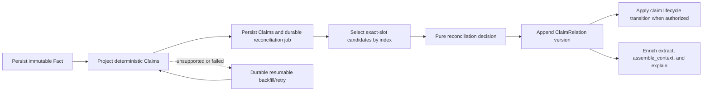

# Claim Reconciliation and Contradiction Detection

**Status:** Accepted design target; implementation pending<br>
**Scope:** Local, deterministic, zero-configuration claim extraction and reconciliation<br>
**Related ADRs:** 0002-0015

## 1. Outcome

Contradiction detection is a derived claim-reconciliation subsystem — not string comparison between facts. Facts stay immutable, provenance-bearing evidence. Deterministically extracted claims are the units of comparison, temporal change, targeted correction, and contradiction.

Runs in-process, requires no LLM or external service, and favors high precision over broad coverage. Unsupported facts stay fully retrievable; they just don't participate in automatic reconciliation.

## 2. Current State and Replacement Boundary

The current implementation has two partial and independent mechanisms:

1. `detect_contradiction_warnings()` loads at most 500 active facts, filters them in memory by scope, compares equal `fact_type`, overlapping entity IDs, and different normalized content, and returns response-only warnings.
2. Background regex triple extraction writes untyped string triples and uses a hard-coded singleton-predicate list to invalidate conflicting triple rows. This path is best-effort, swallows failures, and does not represent claim validity, project isolation, canonical comparison keys, or source authority.

Neither mechanism is the target reconciliation engine. During rollout:

- existing fact and triple records remain readable;
- past migrations remain untouched;
- the public `extract` warning shape remains compatible;
- claim relations become the source for new warnings and lifecycle decisions;
- legacy singleton triple invalidation is disabled once the claim path is active;
- the triple table is not dropped or destructively rewritten.

## 3. Invariants

1. A contradiction never invalidates a fact or claim.
2. Supersession closes only real-world claim validity.
3. Correction closes only the erroneous claim projection in transaction time.
4. Whole-fact retraction is reserved for invalid or withdrawn source evidence.
5. Ingestion order, confidence, recency, fuzzy similarity, and an unconfirmed alias never select a winner.
6. Automatic reconciliation never crosses namespace, scope, project, access-policy, canonical-subject, comparison-key, or qualifier boundaries.
7. Unknown claim keys are set-valued by default.
8. Missing validity remains unknown; observation time is not promoted to validity.
9. Every stored decision is explainable from immutable inputs and a versioned evaluator fingerprint.
10. Retry, restart, and backfill are idempotent.

## 4. Architecture



The domain decision engine is pure and storage-independent. SurrealDB adapters own indexed candidate queries, transactions, leases, and persistence. MCP handlers remain thin adapters over the service layer.

## 5. Domain Model

### 5.1 Claim

Target fields:

| Field | Purpose |
|---|---|
| `claim_id` | Deterministic immutable identifier |
| `source_fact_id`, `source_episode_id` | Provenance back to exact evidence |
| `scope`, `project`, `policy_tags` | Isolation and access inheritance |
| `schema_id`, `schema_version` | Compositional structural form |
| `subject` | Canonical entity or stable source-record reference; unresolved subjects are non-comparable |
| `comparison_key`, `comparison_key_hash` | Versioned canonical dimension or relation |
| `value` | Typed canonical value |
| `qualifiers`, `qualifier_hash` | Sorted context that identifies the logical slot |
| `cardinality` | `set_valued` or explicitly confirmed `single_valued` |
| `observed_at` | When the source recorded the assertion |
| `valid_from`, `valid_to` | Real-world validity; either bound may be unknown |
| `validity_source` | `explicit`, `source_contract`, or `unknown` |
| `source_lineage` | Explicit stable lineage when supplied by a connector or trusted source contract |
| `derivation` | Rule, source span, canonicalization version, and extractor fingerprint |
| `t_ingested`, `t_invalid_ingested` | Transaction-valid projection interval |

Claims copy the fact's isolation metadata. A missing canonical subject, comparison key, or required qualifier does not reject the claim as evidence; it makes the claim ineligible for automatic reconciliation.

### 5.2 ClaimRelation

Target fields:

| Field | Purpose |
|---|---|
| `claim_relation_id` | Deterministic ID for pair plus reconciliation context |
| `left_claim_id`, `right_claim_id` | Canonically ordered claim pair |
| `outcome` | `duplicate`, `supersession`, `correction`, `contradiction`, or `temporal_ambiguity` |
| `predecessor_claim_id`, `successor_claim_id` | Direction for supersession or correction; absent for symmetric outcomes |
| `reason_code` | Stable bounded machine-readable explanation |
| `evidence` | Temporal, value, cardinality, lineage, authority, and correction evidence used |
| `evaluator_version` | Decision-engine version |
| `context_fingerprint` | Schema, alias, policy, and evaluator versions |
| `evaluated_at` | Evaluation time |
| `supersedes_relation_id` | Previous relation version when re-evaluated |
| `scope`, `project`, `policy_tags` | Most restrictive shared visibility boundary |
| `t_ingested`, `t_invalid_ingested` | Transaction-valid decision interval |

Relation visibility requires access to both source facts. A relation never leaks the existence or content of a more restricted fact.

### 5.3 Durable Work

Projection and reconciliation jobs are persisted with:

- job kind and extractor/evaluator fingerprint;
- namespace and stable cursor;
- `pending`, `running`, `completed`, or `failed` state;
- lease owner and expiry for crash recovery;
- processed, succeeded, skipped, and failed counters;
- last error and retry count;
- timestamps and per-namespace progress.

Claim creation and its reconciliation-job creation are atomic. A job is complete only after its stable candidate cursor is exhausted.

## 6. Deterministic Claim Schemas

The initial registry is compiled into the binary and requires no configuration. It defines structural forms, not a closed catalog of world properties.

| Schema | Structural slots | Typical deterministic sources |
|---|---|---|
| `attribute/v1` | subject, dimension, typed scalar, qualifiers | key-value records, explicit status/outcome/preferences |
| `quantity/v1` | subject, measure, decimal value, unit, qualifiers | metrics, amounts, percentages, durations |
| `relation/v1` | subject, relation, entity or typed literal object, qualifiers | explicit relation statements and validated triples |
| `commitment/v1` | actor, normalized action, target, deadline/status qualifiers | explicit promises and action items |

New schemas are added only with deterministic extraction rules, canonicalization fixtures, cardinality semantics, and labeled positive and negative cases. Runtime user-defined schemas and remote model adapters are deferred until a concrete need appears.

### 6.1 Extraction Order

1. Parse explicit structured input: typed connector fields, JSON/YAML-like records, tables, headings, and key-value lines.
2. Apply conservative schema-specific sentence patterns.
3. Validate required slots, typed values, source span, and isolation metadata.
4. Emit a claim only when canonicalization succeeds.
5. Record a bounded reason code when extraction is skipped.

The existing rule-based triple extractor may feed `relation/v1` only after canonical subject, key, value, and qualifier validation. Its raw predicate strings and singleton list never drive reconciliation directly.

### 6.2 Typed Values

Supported value kinds are versioned and explicit: boolean, integer, decimal, normalized text, date/time, duration, entity reference, and quantity with unit. Numeric conversion occurs only through a deterministic unit registry. Unknown or incompatible units are `not_comparable`, not contradictory.

Text normalization performs Unicode normalization, case and whitespace normalization, and schema-declared punctuation handling. It does not use semantic or fuzzy similarity. Fuzzy matching may create a `PossibleAlias`, which remains non-authoritative until confirmed.

## 7. Comparison Key and Claim Slot

The comparison key excludes the value and temporal interval. It is a versioned canonical serialization of schema-defined dimension or relation components. Qualifiers are normalized and sorted separately.

The indexed claim slot is:

```text
namespace
+ scope
+ project identity, including absent project
+ access-policy fingerprint
+ canonical subject
+ compatible schema family
+ comparison-key hash
+ qualifier hash
```

Candidate lookup uses a composite index and stable pagination. It never scans the full fact or claim table and never uses a fixed latest-N window. A processing budget may pause work only when a durable job retains the remaining cursor.

Confirmed comparison-key aliases participate through a versioned alias registry. Similarity scores are diagnostic suggestions only.

## 8. Reconciliation Decision

The decision engine receives two normalized claims plus versioned schema, cardinality, temporal, alias, and source policies. It returns either a persisted relation outcome or a non-persisted skip/coexistence result with a reason code.

Evaluation order:

| Condition | Result |
|---|---|
| Isolation or slot mismatch | `skipped:not_same_slot` |
| Incompatible value types or units | `skipped:not_comparable` |
| Same normalized proposition with compatible validity | `duplicate` |
| Different values on a set-valued key without an exclusivity rule | `coexistent:set_valued` |
| Explicit correction evidence plus lineage/authority for the same validity context | `correction` |
| Mutually exclusive values with known overlapping validity | `contradiction` |
| Explicit temporal transition plus `single_valued` policy and lineage/authority gate | `supersession` |
| Different potentially exclusive values but insufficient temporal evidence | `temporal_ambiguity` |

Important rules:

- Known non-overlapping closed intervals may coexist as history without a relation.
- Observation and ingestion timestamps never substitute for `valid_from`.
- Contradiction does not need one source to be authoritative; it preserves disagreement.
- Supersession and correction require the source gate because they change active truth selection.
- Explicit correction means the source states that the earlier assertion was wrong, withdrawn, or corrected. A newer value alone is insufficient.
- A schema may declare mutual exclusion for a set-valued domain, but the default remains coexistence.

## 9. Persistence, Concurrency, and Failure Semantics

Facts are committed first because they are the durable source of truth. Claim projection is a derived operation:

1. Persist the deterministic claim projection and a durable reconciliation job atomically.
2. Attempt reconciliation inline while the extraction latency budget permits.
3. Continue remaining work through the local durable worker.
4. Persist a relation version and any authorized claim lifecycle transition in one SurrealDB transaction.
5. Mark the job complete only after every stable candidate page has been processed.

A projection failure never deletes or rolls back a fact. It returns a partial extraction result, records a retryable job failure, and leaves the fact retrievable. Errors must not be swallowed as the current fire-and-forget triple path does.

Concurrent workers are safe because claims, claim pairs, and reconciliation contexts have deterministic IDs. Jobs use expiring leases, and retries use create-or-validate semantics. Each new claim owns a reconciliation job, so concurrently inserted claims are eventually compared; canonical pair IDs prevent duplicate relations.

## 10. Backfill and Upgrade

The additive migration planned for this subsystem is a new migration after the current highest version; no existing `.surql` file is changed. It creates claim, relation, alias/policy, and durable-job tables plus indexes. Historical fact processing is not part of the migration transaction.

After the server is ready, a local worker backfills legacy facts with conservative built-in concurrency and batch size. It follows the proven `reembed` operational pattern: stable fact-ID cursor, per-namespace progress, persisted status, resume after restart, and no cursor advance past a failed fact. The reusable job mechanism should be shared; extraction and embedding business logic should remain separate.

Changing the extractor fingerprint schedules a new projection pass without blocking startup. Until a fact has a current claim projection, existing fact retrieval is the compatibility fallback.

## 11. Retrieval and Public Contracts

No new public MCP tool is required.

### `extract`

- Keep existing fields and warning shape for old clients.
- Generate contradiction warnings from persisted active claim relations.
- Add only optional reconciliation summary fields.
- Return a partial-success status when facts were stored but claim projection remains pending or failed.

### `assemble_context`

- Continue retrieving legacy facts with no claims.
- Add optional claim/reconciliation metadata to selected items.
- Apply claim validity at the requested `as_of` without excluding an entire multi-claim fact because one claim was superseded.
- Never present one side of an unresolved contradiction as a resolved winner. If the budget cannot include both source facts, include a compact relation summary and counterpart evidence handles.
- Corrected and superseded claims are excluded from current truth selection but remain available for historical and audit views.

### `explain`

- Return the source snippets for both claims, relation reason, temporal evidence, source-policy evidence, and evaluator version.
- Preserve authorization checks for both sides of the relation.

### `invalidate`

- Preserve the existing tool name and input compatibility.
- Treat whole-fact invalidation as source-fact retraction, not ordinary claim supersession.
- Claim supersession and correction remain internal domain operations authorized by persisted `ClaimRelation` records.

## 12. Observability and Prometheus

Every projection and reconciliation stage emits a trace event containing:

- request/correlation ID, job ID, claim ID, fact ID, and relation ID;
- schema and extractor/evaluator fingerprints;
- full comparison key and qualifier hash;
- candidate cursor and count;
- match mode, outcome, reason code, and lifecycle action;
- stage and total duration;
- retry/resume state.

Full keys and identifiers exist only in trace logs. Prometheus uses bounded labels only. Initial metric families:

| Metric | Type | Bounded labels |
|---|---|---|
| `memory_claim_pipeline_total` | counter | `stage`, `schema`, `outcome`, `reason_code` |
| `memory_claim_pipeline_duration_seconds` | histogram | `stage`, `schema`, `outcome` |
| `memory_claim_candidate_count` | histogram | `schema`, `match_mode` |
| `memory_claim_relations_active` | gauge | `schema`, `outcome` |
| `memory_claim_backfill_facts_total` | counter | `outcome`, `reason_code` |
| `memory_claim_backfill_lag` | gauge | none |

Unknown or extension schema names collapse to `other` in metric labels. Namespace, project, comparison key, entity, claim, fact, relation, and job IDs are never labels.

The core records metrics through an internal facade. A Prometheus exporter is an additive optional feature so contradiction detection itself keeps zero external-service requirements and no mandatory network listener.

The current human-readable logger truncates individual values, so it cannot by itself satisfy full-key trace diagnostics. Implementation must add a structured trace representation that preserves the full canonical key at `trace` level while retaining existing redaction and log-level controls.

## 13. Security and Isolation

- Claims inherit scope, project, and policy tags from their facts.
- The claim slot includes an access-policy fingerprint.
- A relation inherits the union of both restrictions and is visible only when the caller can access both sources.
- Automatic reconciliation across access-policy fingerprints is forbidden. A future cross-policy administrative review flow must be explicit and is outside this design.
- Trace fields containing raw claims or keys follow the same redaction policy as source content.
- Prometheus exposes no tenant or object identifiers.

## 14. Module Boundaries

Target Rust structure:

```text
src/models/claim.rs              Claim, ClaimValue, ClaimRelation, value objects
src/service/claims/schema.rs     built-in ClaimSchema registry
src/service/claims/extract.rs    deterministic pure projection
src/service/claims/normalize.rs  canonical serialization and typed values
src/service/claims/reconcile.rs  pure decision engine
src/service/claims/project.rs    application orchestration
src/service/claims/backfill.rs   durable batch-job orchestration
src/storage/claims.rs            SurrealDB ClaimStore adapter and indexed queries
```

`MemoryService` depends on a narrow `ClaimStore` capability instead of adding claim policy to MCP handlers or `main.rs`. Generic durable-job mechanics may be shared with `reembed`; schema-specific extraction and embedding remain separate.

## 15. Test-Driven Delivery and Evaluation

Implementation begins with a labeled corpus and a baseline of the current warning detector. The corpus must include positive and negative examples for every schema and outcome, multilingual text, structured records, aliases, unit conversions, missing time, overlapping and disjoint intervals, set-valued relations, cross-project/scope/policy cases, source corrections, and unsupported facts.

### Unit and property tests

- canonicalization and deterministic ID golden fixtures;
- normalization idempotence and qualifier-order invariance;
- symmetric canonical claim-pair identity;
- schema extraction positive and adversarial negative cases;
- complete reconciliation decision table;
- no supersession or correction without all gates;
- no comparison across isolation boundaries.

### Embedded integration tests

- fresh migration and sequential upgrade from every supported historical snapshot;
- re-running projection creates no duplicate claims or relations;
- backfill resumes after restart and retries the failed fact;
- concurrent claims produce exactly one active relation per context fingerprint;
- re-extraction closes transaction validity without changing world validity;
- fact retraction deactivates all derived claims but preserves audit records;
- retrieval surfaces both sides of contradictions and preserves legacy no-claim facts;
- real MCP handler responses preserve old fields and add only optional metadata.

### Evaluation gates

- zero cross-scope, cross-project, or access-policy violations;
- zero automatic supersession/correction false positives in the release corpus;
- deterministic claim extraction precision at least 0.98 on supported cases;
- contradiction precision at least 0.95; recall and schema coverage are reported separately and may improve without weakening precision;
- candidate recall 1.00 for comparable claims in the same indexed slot;
- no regression beyond the existing ingest and `assemble_context` latency gates;
- backfill restart, idempotency, and bounded-memory tests pass on multi-namespace fixtures.

Every quality claim reports corpus version, split, case counts, per-schema metrics, confusion matrix, and latency percentiles. Synthetic positives alone are not sufficient.

## 16. Rollout

1. **Shadow projection:** add schema, claims, jobs, traces, and metrics; keep retrieval and lifecycle unchanged.
2. **Persist relations:** run reconciliation and compare its warnings with the legacy detector; no automatic lifecycle changes.
3. **Expose evidence:** enrich `extract`, `assemble_context`, and `explain` with optional relation metadata.
4. **Enable safe lifecycle actions:** allow supersession and correction only for evaluated schemas that satisfy every cardinality, temporal, and source gate.
5. **Retire legacy decisions:** disable fixed-window fact warnings and singleton triple invalidation; retain legacy storage and read compatibility.

Rollback disables the new projection/reconciliation worker and optional response enrichment. Additive tables and historical relation records remain intact; old migrations and facts are never rewritten.

## 17. Explicit Non-Goals

- unrestricted open-domain semantic contradiction detection;
- an LLM or remote inference dependency in the default path;
- a closed catalog of real-world properties;
- fuzzy aliases that authorize automatic decisions;
- latest-write-wins truth selection;
- rewriting historical migrations or eagerly rewriting every legacy fact at startup;
- a new public MCP tool before a concrete user workflow requires one.
