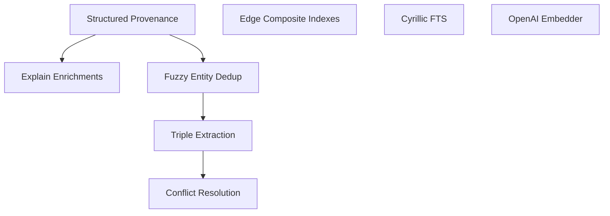

# Critical Analysis of Proposed Improvement Plan — 2026-06-29

## Executive Summary

The proposed 5-phase plan is **~60% redundant** with already-implemented functionality. The codebase has evolved significantly since the plan's assumptions were formed — DateTime types, DB-side FTS, indexed entity lookup, vector search, multi-tier retrieval with RRF, lifecycle management, and community detection are all **already in production**. The plan was written against an outdated mental model of the codebase.

This document identifies what's already done, what's genuinely missing, and produces a grounded, actionable plan.

---

## Gap Analysis: Plan Assumptions vs. Reality

### Phase 0 — Test Baseline

| Plan Item | Reality | Verdict |
|-----------|---------|---------|
| `test_open_interval_fact_visible_now` | `t_invalid` already `Option<DateTime<Utc>>`; `NONE` = open interval since schema v1. No string comparison. | ❌ INVALID — tests for a bug that doesn't exist |
| `test_future_fact_invisible_at_past_asof` | Already covered by `BI_TEMPORAL_WHERE` with `type::datetime()` comparison. | ❌ INVALID — covered by existing temporal filtering |
| `test_temporal_string_comparison_regression` | All temporal fields are `DateTime<Utc>` (see `src/models.rs:446-449`), never strings. No lexicographic comparison bug. | ❌ INVALID — tests for a non-existent defect |
| FTS correctness tests | FTS is already DB-side via `search::score(1)`, `@1@` operator, and `memory_fts` analyzer. BM25 scoring active. | ❌ INVALID — FTS is already DB-side |
| Provenance tests | Provenance is `serde_json::Value` with ad-hoc enrichment in `scoring.rs:29-49`. Not `{}` empty — it gets enriched with `matched_query_terms`, `graph_trace`, etc. But it's unstructured. | ⚠️ PARTIALLY VALID — provenance structure test would be useful, but the `_provenance` / `{}` claim is wrong |
| Entity perf tests | Entity lookup already indexed via `entity_canonical_name_normalized` + `select_entity_lookup` (O(1) not O(N)). No table scan. | ❌ INVALID — indexed lookup already exists |

**Phase 0 verdict: 0/6 items valid.** All proposed tests target bugs that don't exist.

### Phase 1 — Correctness Hardening

| Plan Item | Reality | Verdict |
|-----------|---------|---------|
| **1.1 Bi-temporal schema: TYPE datetime** | `Fact.t_valid` is already `DateTime<Utc>`. Schema already defines `TYPE datetime` with `option<datetime>` for nullable fields (see `migrations/__Initial.surql:27-30`). Migration `010_coerce_t_ingested_to_datetime` already handled the coercion. `BI_TEMPORAL_WHERE` already uses `type::datetime($cutoff)` (see `queries.rs:12-14`). Zero occurrences of `"9999-12-31"` in the codebase. | ❌ ALREADY DONE — this is the foundation of the codebase |
| **1.2 DB-side FTS** | FTS is already DB-side. Queries use `search::score(1) AS ft_score` with `@1@` operator (see `queries.rs:170`). BM25 is active via `memory_fts` analyzer. No Rust-side `.contains()` filtering. | ❌ ALREADY DONE — FTS is fully DB-side |
| **1.3 Provenance struct** | `provenance` IS `serde_json::Value` (unstructured). However, it's NOT `{}` — it gets enriched at query time with `matched_query_terms` and `graph_trace` (see `scoring.rs:29-49`). The structured `Provenance` type is a genuine improvement, but tracking fields like `ingestion_method` would require migration of existing records. | ✅ VALID — structured provenance is a real gap |
| **1.4 Edge indexes** | Schema already has `edge_relation`, `edge_in`, `edge_out` indexes (see `__Initial.surql:86-88`). Plan assumes `namespace` column on edge — it **does not exist**. SurrealDB isolates namespaces at connection level, so namespace filtering on edge is unnecessary. Plan also uses `from_id`/`to_id` — actual schema uses `in`/`out`. Missing: composite `(in, out)` index + temporal `(in, out, t_valid, t_invalid)` for graph traversal. | ⚠️ PARTIALLY VALID — basic indexes exist; composite `(in, out)` + temporal composite would help graph traversal. Plan's column names are wrong. |

**Phase 1 verdict: 1/4 items valid (provenance), 1 partially valid (edge indexes), 2 already done.**

### Phase 2 — Entity & Graph Layer

| Plan Item | Reality | Verdict |
|-----------|---------|---------|
| **2.1 `find_entity_record` indexed lookup** | `EntityService::find_entity_record` (see `entity.rs:45-56`) already uses `select_entity_lookup`, which queries by `canonical_name_normalized` with the `entity_canonical_name_normalized` index. Normalization via `normalize_text` already exists. No O(N) scan. | ❌ ALREADY DONE |
| **2.2 Entity resolution v1 fuzzy dedup** | Current resolution is exact-match only (`entity.rs:70-80`). No fuzzy matching (Levenshtein, prefix search). No automatic alias suggestion. A real gap. | ✅ VALID — fuzzy dedup doesn't exist yet |
| **2.3 Entity indexes** | `entity_canonical_name_normalized` and `entity_aliases` indexes already exist (see `__Initial.surql:81-82`). | ❌ ALREADY DONE |

**Phase 2 verdict: 1/3 items valid (fuzzy dedup).**

### Phase 3 — Semantic Retrieval Layer

| Plan Item | Reality | Verdict |
|-----------|---------|---------|
| **3.1 Embedder trait** | `EmbeddingProvider` trait already exists in `src/service/embedding.rs` with `DisabledEmbeddingProvider`. Multiple providers exist (local, OpenAI, GLiNER). However, OpenAI-compatible embedder is not yet a standalone trait implementation — it's baked into the service layer. | ⚠️ PARTIALLY VALID — embedder abstraction exists but could be cleaner |
| **3.2 Vector index** | HNSW index already exists: `fact_embedding_hnsw` with dynamic dimension (see `__Initial.surql:84`). Vector search query `build_select_facts_ann_query` already does `vector::similarity::cosine` with HNSW (see `queries.rs:200-229`). | ❌ ALREADY DONE |
| **3.3 Triple extraction** | No `triple` table or structured S→P→O extraction exists. Facts are stored as free text. A genuine gap for structured queries. | ✅ VALID — triple extraction is a real gap |
| **3.4 Hybrid retrieval + RRF** | RRF is ALREADY implemented (see `ranking.rs:21`: `RECIPROCAL_RANK_FUSION_K = 60.0`, `reciprocal_rank()` at L469). Multi-tier pipeline already does lexical → temporal → alias → experience → community → semantic with fusion scoring. `fusion_score` accumulates across tiers via `reciprocal_rank()`. | ❌ ALREADY DONE — RRF + multi-tier retrieval exists |

**Phase 3 verdict: 1/4 items valid (triples), 1 partially valid (embedder cleanup).**

### Phase 4 — Long-Term Memory & Explain

| Plan Item | Reality | Verdict |
|-----------|---------|---------|
| **4.1 explain() provenance trace** | `explain()` at `core.rs:139-290` does a full 3-phase provenance chain: Phase 1 resolves episodes/facts + collects entity_links. Phase 2 builds shared `GraphInsights` (hub entities, surprising connections). Phase 3 calls `collect_provenance_sources_cached()` which traverses entity links to find ALL connected episodes — direct + linked via entities. Output already has `citation_context` (full episode text), `t_ref`, `t_ingested`, `scope`, `provenance` (source_episode/source_type/source_id), `all_sources` (full chain), `graph_insights`. Missing: `fact_age_days`, `decayed_confidence`, and `ingestion_method` (requires P1 structured provenance). | ⚠️ MOSTLY DONE — explain already does full provenance chain tracing. Only minor enrichments missing. |
| **4.2 Conflict resolution** | `ContradictionWarning` struct exists in `models.rs:337-346` but no automatic invalidation of singleton predicates. Genuine gap. | ✅ VALID — conflict resolution is a real gap |
| **4.3 Community detection** | Community detection in `communities.rs` **already uses UnionFind** with path compression + union-by-rank (`communities.rs:261`: `let mut union_find = UnionFind::default()`). Edges collected in paginated batches via `select_edges_filtered_page`, then `union_find.union(&left, &right)` on endpoint pairs. Connected components with ≥2 entities become communities. Stale communities auto-deleted. Full implementation. | ❌ ALREADY DONE — UnionFind community detection is fully implemented |
| **4.4 Memory lifecycle tiers** | Lifecycle exists: `src/service/lifecycle/` has `decay.rs`, `archival.rs`, `communities.rs`. Active/inactive/archived tiers are implemented via `t_invalid` close + decay pass + archival pass. The plan's approach duplicates existing functionality. | ❌ ALREADY DONE |

**Phase 4 verdict: 1/4 items valid (conflict resolution), 1 partially valid (explain enrichments), 2 already done.**

### Phase 5 — Concurrency

| Plan Item | Reality | Verdict |
|-----------|---------|---------|
| **5.1 `Arc<Surreal<Db>>` instead of `Mutex`** | `SurrealDbClient` already uses `Arc<Surreal<Db>>` per namespace (see `client.rs:340-341`: `HashMap<String, Arc<Surreal<Db>>>`). No `Mutex` in the storage layer. | ❌ ALREADY DONE |

**Phase 5 verdict: 0/1 items valid.**

### Dependencies (Cargo.toml)

| Dependency | Plan Claim | Reality |
|-----------|-----------|---------|
| `chrono` | "ensure present" | **Already present**: v0.4.45 with `serde`, `clock` |
| `async-trait` | "add 0.1" | **Already present**: v0.1.89 |
| `reqwest` | "add 0.12" | **Already present**: v0.13.4 with `json`, `rustls` |
| `unicode-normalization` | "add 0.1" | **Not present** — needed for NFKC normalization |
| `strsim` | "add 0.11" | **Not present** — needed for fuzzy matching |
| `surrealdb` | "v2" | **v3.1.5** — different API, `@1@` FTS syntax |

---

## Summary: What's Actually Valid

| # | Task | Size | Priority | Depends On |
|---|------|------|----------|------------|
| P1 | **Structured Provenance** (from 1.3) | S | P0 | Nothing |
| P2 | **Edge composite/temporal indexes** (from 1.4 trimmed) | XS | P1 | Nothing |
| P3 | **Entity fuzzy dedup** (from 2.2) | M | P1 | P1 (uses provenance) |
| P4 | **Triple extraction** (from 3.3) | M | P2 | P1 |
| P5 | **Conflict resolution for singletons** (from 4.2) | M | P2 | P4 |
| P6 | **Provenance-aware explain enrichments** (from 4.1 trimmed) | XS | P2 | P1 |
| P7 | **OpenAI-compatible Embedder** (from 3.1 trimmed) | S | P3 | Nothing |
| P8 | **Cyrillic FTS analyzer** (from 1.2 note) | XS | P3 | Nothing |

Everything else in the original plan is **already implemented and deployed**.

---

## Grounded Implementation Plan

### Sprint A: Provenance & Index Hardening (P0-P1)

#### A1. Structured Provenance Type (`src/models.rs` + migration)

**What to do:**
- Define `Provenance` struct with typed fields (`source_episode_id`, `source_url`, `ingestion_method`, `created_by`, `source_confidence`, `confidence_basis`)
- Replace `provenance: serde_json::Value` with `provenance: Provenance` on `Fact` struct
- Default = `Provenance::manual()` for backward compatibility
- Migration: `022_structured_provenance.surql` — add sub-fields to existing `provenance` object, set `ingestion_method = "manual"` for existing records
- Propagate through `add_fact` call chain — accept `Provenance` instead of ad-hoc JSON
- Update `scoring.rs:ranked_fact_to_item` to enrich `Provenance` fields instead of ad-hoc keys
- `explain()` should surface `source_episode_id` + `ingestion_method` from the structured provenance

**NOT in scope:** The plan's `_provenance` underscore removal (doesn't exist), `migrations/008_provenance_struct.surql` (use number 022), confidence `RL-based feedback` loop.

**Files:** `src/models.rs`, `src/service/fact.rs` (or wherever `add_fact` lives), `src/service/context/scoring.rs`, `migrations/022_structured_provenance.surql`

#### A2. Edge Composite + Temporal Indexes (`migrations/023_edge_composite_indexes.surql`)

**What to do:**
- Add `DEFINE INDEX edge_from_to_idx ON edge COLUMNS in, out` for graph traversal optimization
- Add `DEFINE INDEX edge_temporal_idx ON edge COLUMNS in, out, t_valid, t_invalid` for bi-temporal graph queries
- No Rust code changes needed — SurrealDB uses indexes automatically

**NOT in scope:** `namespace` column on edge (edges are per-namespace via DB routing, not a column).

### Sprint B: Entity Intelligence (P1)

#### B1. Fuzzy Entity Dedup (`src/service/entity_resolution.rs`)

**What to do:**
- Add `strsim = "0.11"` to `Cargo.toml` for `normalized_levenshtein`
- Add `unicode-normalization = "0.1"` for NFKC normalization (if `normalize_text` doesn't already use it)
- Create `EntityResolver` with:
  - `find_best_match()`: exact lookup → prefix search → Levenshtein similarity with threshold 0.85
  - `resolve_or_create()`: merge or create, record aliases for near-matches
- Add `find_entities_by_prefix()` to `DbClient` trait + `SurrealDbClient`
- Integrate into `EntityService::resolve` — use fuzzy matching before creating new entities
- Threshold should be configurable: `ENTITY_FUZZY_THRESHOLD` env var, default 0.85

**NOT in scope:** Full community-based dedup, LLM-based entity merging, the plan's `add_entity_alias` (already exists via `aliases` array).

#### B2. Entity Resolution Test Suite

Add tests for:
- Exact match returns existing entity
- "Alice Smith" and "alice smith" resolve to same entity (normalization)
- "Ivan Petrov" and "I. Petrov" resolve with Levenshtein above threshold
- Below-threshold names create separate entities
- Prefix search correctness with Cyrillic names

### Sprint C: Structured Knowledge (P2)

#### C1. Semantic Triple Extraction (`src/service/triple_extractor.rs`)

**What to do:**
- Define `triple` table in `migrations/024_triples.surql`:
  ```sql
  DEFINE TABLE triple SCHEMAFULL;
  DEFINE FIELD namespace ON triple TYPE string;
  DEFINE FIELD subject ON triple TYPE string;
  DEFINE FIELD predicate ON triple TYPE string;
  DEFINE FIELD object ON triple TYPE string;
  DEFINE FIELD confidence ON triple TYPE float DEFAULT 1.0;
  DEFINE FIELD source_fact_id ON triple TYPE string;
  DEFINE FIELD t_ingested ON triple TYPE datetime VALUE time::now() READONLY;
  DEFINE INDEX triple_spo_idx ON triple COLUMNS namespace, subject, predicate;
  ```
- Create `TripleExtractor` trait with `NoOpTripleExtractor` (default) and `LlmTripleExtractor` (optional, behind feature flag)
- Fire-and-forget extraction after `add_fact` — don't block the write path
- Query support: add `assemble_context` option to search triples for structured queries ("кем работает X?")

**NOT in scope:** The plan's `migrations/012_triples.surql` (use 024), `TripleExtractor` as a standalone service (integrate into existing extraction pipeline).

#### C2. Conflict Resolution for Singleton Predicates (`src/service/conflict_resolver.rs`)

**What to do:**
- Define `SINGLETON_PREDICATES`: `works_at`, `lives_in`, `has_name`, `has_email`, `has_phone`, `is_ceo_of`, `is_married_to`
- After triple extraction, check if predicate is a singleton
- Find conflicting active facts (same subject+predicate, different object)
- Auto-invalidate via bi-temporal close (`t_invalid = now()`)
- Log invalidation events
- Optional: notification callback for human review of high-confidence conflicts

**NOT in scope:** The plan's `find_conflicting_triples` as a separate DB method (use existing `select_edges_for_triple` or add inline query).

### Sprint D: Quality of Life (P2-P3)

#### D1. Explain Enrichments (`src/service/core.rs`)

**What to do:**
- `explain()` at `core.rs:139-290` already does 3-phase provenance chain tracing. After P1 (structured provenance), enrich `ExplainItem` with:
  - `fact_age_days`: computed from `t_valid` vs. `now()`
  - `decayed_confidence`: reuse `Fact::decayed_confidence()`
  - `ingestion_method`: surface from structured `Provenance`
- No new SQL query needed — current implementation already resolves episodes via `find_episode_record` and facts via `find_fact_record`
- `citation_context` already contains full episode text ✅
- `all_sources` already contains provenance chain via `collect_provenance_sources_cached()` ✅

#### D2. Cyrillic FTS Analyzer (`migrations/025_cyrillic_fts.surql`)

**What to do:**
- SurrealDB 3.x supports `snowball(russian)`:
  ```sql
  DEFINE ANALYZER memory_fts_ru TOKENIZERS class FILTERS lowercase, snowball(russian);
  ```
- Either replace `memory_fts` or add a second analyzer for Russian-language namespaces
- No Rust code changes required — SurrealDB picks the analyzer per index

#### D3. OpenAI-Compatible Embedder (`src/service/embedding/openai.rs`)

**What to do:**
- Implement `EmbeddingProvider` for OpenAI-compatible APIs (OpenAI, Azure, Ollama, local vLLM)
- Configuration via env vars (already partially supported):
  ```
  EMBEDDING_PROVIDER=openai
  EMBEDDING_BASE_URL=https://api.openai.com/v1  # or http://localhost:11434/v1
  EMBEDDING_API_KEY=...
  EMBEDDING_MODEL=text-embedding-3-small
  ```
- Rate limiting with exponential backoff for 429 responses
- Context length truncation for long inputs

**NOT in scope:** The plan's `Embedder` trait (already have `EmbeddingProvider`), `NoOpEmbedder` (already have `DisabledEmbeddingProvider`).

---

## Execution Order

```
Sprint A (Provenance):  A1 → A2
Sprint B (Entity):      B1 → B2
Sprint C (Knowledge):   C1 → C2 → D1
Sprint D (Polish):      D2, D3 (parallel, independent)
```

## Dependency Map



## What NOT to Do

1. **Don't touch temporal types** — they're correct. `DateTime<Utc>` with `option<datetime>` and `type::datetime()` comparisons.
2. **Don't rewrite FTS** — it's DB-side with BM25 already.
3. **Don't rewrite entity lookup** — it's indexed and normalized.
4. **Don't rewrite retrieval pipeline** — multi-tier with RRF already exists.
5. **Don't add `Mutex` removal** — `Arc<Surreal<Db>>` is already the pattern.
6. **Don't add `9999-12-31` handling** — it doesn't exist in the codebase.
7. **Don't rename `_provenance`** — the underscore-prefix pattern doesn't exist.
8. **Don't add `chrono`, `async-trait`, `reqwest`** — they're already dependencies.
9. **Don't add `surrealdb = "2"`** — v3.1.5 is the current version with different APIs.
10. **Don't rewrite community detection** — UnionFind with path compression + union-by-rank is already implemented in `communities.rs:258-289`.
11. **Don't add `namespace` column to edge table** — SurrealDB isolates namespaces at connection level (`HashMap<String, Arc<Surreal<Db>>>`), so edge records are already namespace-scoped.
12. **Don't use `from_id`/`to_id` column names** — actual edge schema uses `in`/`out` (SurrealDB RELATION table convention).

---

## Risk Register

| Risk | Likelihood | Impact | Mitigation |
|------|-----------|--------|------------|
| Provenance struct migration breaks existing queries | Low | High | Backward-compatible migration: keep `provenance` as object, add typed sub-fields |
| Fuzzy dedup merges unrelated entities | Medium | Medium | Conservative threshold (0.85), human-review mode, configurable threshold |
| Triple extraction LLM costs | Medium | Low | NoOp by default, feature-flagged, rate-limited |
| Conflict resolution over-invalidates | Low | High | Singleton predicate whitelist only, audit log, optional confirmation mode |

---

## Post-Implementation Review (2026-06-29)

After the four sprints were implemented, a diff of this plan against the actual
committed code surfaced **six discrepancies**. All six were reproduced, fixed,
and protected by regression tests. Full details live in the implementation log
(`2026-06-29-implementation-log.md` → "Review fix-up"); summary:

| # | Sprint | Discrepancy | Severity | Resolution |
|---|--------|-------------|----------|------------|
| R1 | D2 | Migration `025` defined `memory_fts_ru` but **no index referenced it** — Russian stemming was dead code. Migration `006` had OVERWRITTEN the FTS indexes to use `memory_fts` (English only). | **High** | New migration `026_cyrillic_fts_active.surql` folds `snowball(russian)` into the shared `memory_fts` analyzer so all three FULLTEXT indexes inherit it. `025` left byte-identical to preserve its checksum. |
| R2 | B1 | `find_entity_id_by_alias` used `aliases @1@ $alias` (FTS operator) on a non-FULLTEXT index → query silently returned `[]`. Reproduced on a real in-memory DB. Step 2 of the fuzzy resolver was broken. | **High** | Switched to `aliases CONTAINS $alias` (SurrealDB array-membership, index-aware). |
| R3 | C2 | `invalidate_triple` set `t_invalid` but not `t_invalid_ingested`, violating the bi-temporal invariant that migration `024` introduced for triples. | Medium | Now sets both, mirroring `lifecycle/decay.rs`. |
| R4 | B1 | Dead scaffolding in `entity_resolution.rs` (`let _ = (entity_id.clone(), score);`). | Low | Removed. |
| R5 | C1 | Doc comments referenced `NoOpTripleExtractor` as the default, but the default is `RuleBasedTripleExtractor`. | Low | Comments corrected. |
| R6 | (new) | `normalize_russian_object` had duplicate endings and didn't honor its own "longest first" claim. | Low | Deduplicated, sorted, length guard switched to `chars().count()`. |

**Lessons for the plan author:**

1. "Add a migration" is not complete unless existing indexes that should use the
   new artifact are also redefined (R1).
2. The fuzzy resolver's alias-lookup step needs an integration test that resolves
   a name that exists *only* as an alias — unit tests with `MockDbClient` couldn't
   catch the wrong operator because they stub the SQL away (R2).
3. When introducing a new bi-temporal table (`triple`), every invalidation path
   must set both time axes — review them explicitly (R3).
