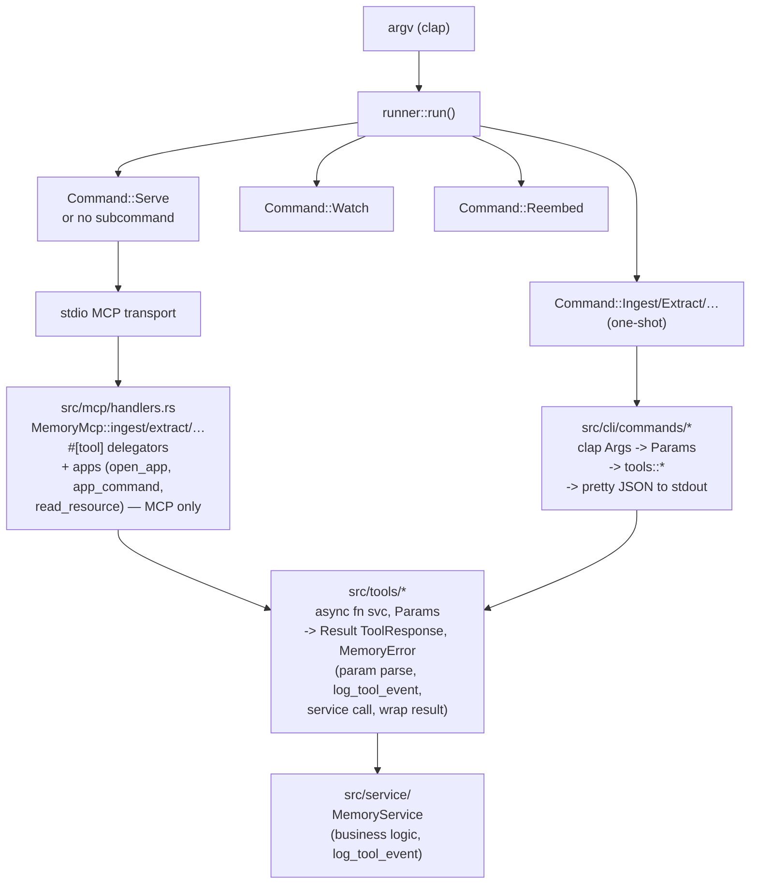

# CLI Mode Implementation Plan — DRY Tool Surface for MCP and CLI

> **For agentic workers:** REQUIRED SUB-SKILL: Use `superpowers:subagent-driven-development` (recommended) or `superpowers:executing-plans` to implement this plan task-by-task. Steps use checkbox (`- [ ]`) syntax for tracking.

**Goal:** Add a first-class CLI mode to `memory_mcp` so that every memory tool (`ingest`, `extract`, `resolve`, `invalidate`, `explain`, `assemble_context`) can be invoked from the shell with the same semantics as the MCP tools — without duplicating a single line of handler logic. The CLI surface is the MCP surface minus MCP-only constructs (interactive `apps`, MCP `resources`, stdio protocol). The result is a single shared tool layer that two thin adapters (MCP, CLI) sit on top of.

**Architecture:** Extract the six tool implementations from `MemoryMcp` into a new `src/tools/` module as protocol-agnostic async functions of the form `async fn(&MemoryService, Params) -> Result<ToolResponse<T>, MemoryError>`. The `MemoryMcp` handlers shrink to one-line delegators that map `MemoryError → ErrorData` and wrap results in rmcp's `Json<…>`. A new `src/cli/` module (replacing the current single-file `src/cli.rs`) uses `clap` to parse subcommands, builds the same `*Params` structs, calls the same `tools::*` functions, and prints `ToolResponse<T>` as pretty JSON to stdout. A new `src/runner.rs` dispatches between stdio MCP server (default / `serve`) and one-shot CLI subcommands. Structured logging via `MemoryService::log_tool_event` keeps working in both modes for free, because it already lives on the service, not on the MCP adapter.

**Tech Stack:** Rust 2024, tokio, surrealdb 3.1, rmcp 1.8, thiserror 2.0, serde/serde_json, schemars 1.2, chrono, **clap 4 (derive + env)** (new), existing `MemoryService` + `MemoryError` + `ToolResponse<T>` abstractions.

**Reference implementation:** `/Users/solovey/Documents/dev/rusty_apple_mail_mcp` — `src/server/tools/` (shared pure functions), `src/server/handler.rs` (MCP adapter), `src/cli/commands.rs` (CLI adapter calling the same functions), `src/runner.rs` (dispatch). This plan applies the same shape, adapted to memory_mcp's richer observability and async service.

---

## Global Constraints

- **Edition 2024** — `let_chains`, `if_let_guard`, etc. as already used in the codebase.
- **No breaking changes** to the MCP tool schemas, names, descriptions, or `ToolResponse<T>` wire format. Existing MCP clients must keep working byte-for-byte.
- **No breaking changes** to `MemoryService` public methods or to `MemoryError` variants.
- **DRY is the hard requirement.** After this plan, the body of each tool (param parsing, request building, `service` call, `ToolResponse` wrapping, structured `log_tool_event` calls) must exist in exactly one place: `src/tools/`. The MCP handler and the CLI command for the same tool are thin adapters that construct the params and consume the result.
- **Apps stay MCP-only.** `open_app`, `app_command`, `read_resource`, `list_resources`, `list_resource_templates` are interactive UI / protocol primitives. They remain on `MemoryMcp` and are never exposed via CLI. (See "Out of Scope".)
- **Structured logging unchanged.** Every tool keeps emitting the same `op=…` events (`ingest.start`, `ingest.done`, `ingest.error`, etc.) at the same log levels, so existing dashboards and the implementation log contract still hold. Logging happens inside `tools::*` (not in the adapters), so CLI invocations emit the same events as MCP invocations.
- **`#[must_use]`** on all pure-function return types (matches existing codebase style).
- **Error handling through `MemoryError`** (thiserror) inside `tools/*`. MCP adapter maps to `ErrorData` via the existing `mcp_error()`; CLI adapter maps to a non-zero process exit plus a JSON error object on stderr.
- **Logging via `StdoutLogger` / `log_event()` helper** — never `println!`/`eprintln!` for log events. The CLI adapter uses `serde_json::to_writer_pretty(stdout, …)` for the **tool result**, which is a payload, not a log event.
- **Request ids become process-global, not per-`MemoryMcp`-instance.** Today `MemoryMcp` holds an `Arc<AtomicU64>` counter; after this plan, `tools::request_id::next_request_id()` uses a `static AtomicU64`. The `req_NNNN` format is preserved, but numbering no longer resets between `MemoryMcp` instances or between tests. This is the only honest way to share id generation with the protocol-agnostic `tools/` layer. See Risk R2.
- **MCP delegators pass `&self.service` (which is `&Arc<MemoryService>`) directly** to `tools::*` functions expecting `&MemoryService`. Rust's `Deref` coercion handles the conversion. Do **not** call `self.service()` (which clones the `Arc`) on the hot path. See Risk R3.
- **`MemoryError` is the lingua franca** of the `tools/` layer. Both adapters map it: MCP via `mcp_error()` (unchanged), CLI via an exit-code match (`Validation`/`NotFound` ⇒ 2, others ⇒ 1) plus a JSON error envelope on stderr. The mapping is defined in exactly one place (`runner::error_exit_code`) so the policy cannot drift between tools. See Risk R6.
- **`std::process::exit` lives only in `main.rs`.** The runner returns `Result<(), ExitCode>`; async tasks get a chance to `Drop` cleanly. See Risk R7.
- **Existing tests must pass after each task.** Each task ends with `cargo build && cargo clippy --all-targets && cargo fmt --all --check && cargo test` clean.
- **Feature flags stay additive.** `default = []`; `cli-watch` continues to gate `notify`. No new feature flag is introduced for CLI mode — it ships in the default build.
- **clap is added unconditionally.** It is small, has no transitive cost beyond what rmcp already pulls, and gating the CLI behind a feature would fragment the test matrix. (If a no-CLI build is ever needed it can be added later as `cli` feature without rework.)

---

## Scope guardrails

- **Do not** touch `src/mcp/apps/` (currently empty) or pre-empt the 2026-06-26 refactoring plan. Apps stay inline in `MemoryMcp` for now.
- **Do not** extract services further from `MemoryService` — that belongs to the KISS/DRY plan. This plan only moves tool-handler bodies out of `MemoryMcp`, not service code.
- **Do not** change the public `MemoryMcp` method signatures exposed to rmcp's `#[tool]` macro (parameter shapes, return types, descriptions). Only their bodies change to one-line delegators.
- **Do not** introduce `clap-mcp` or any macro that generates MCP tools from clap definitions. The relationship is inverted (shared functions consumed by both adapters), per the reference implementation.
- **Do not** surface `open_app`, `app_command`, or any session/resource machinery through the CLI.
- **Do not** add new dependencies beyond `clap = { version = "4", features = ["derive", "env"] }`.
- **Do not** delete the existing `parse_cli_args` / `RunMode` / `run_*` helpers — reuse them from the new `cli::runtime` module so existing tests in `cli.rs` keep passing with minimal churn. (If a clean rename is preferable, do it inside one task with all call sites updated atomically.)

---

## File map

### Files created by this plan

```
src/tools/mod.rs                 — Module root, re-exports of all tools, params, response, parsers, request_id
src/tools/params.rs              — *Params structs MOVED from src/mcp/params.rs (IngestParams, ExtractParams, ResolveParams, InvalidateParams, ExplainParams, AssembleContextParams). OpenAppParams / AppCommandParams STAY in src/mcp/params.rs (MCP-only).
src/tools/response.rs            — ToolResponse<T>, OpenAppResult-construction helpers REMAIN in src/mcp/response.rs; ToolResponse<T> MOVES here.
src/tools/parsers.rs             — parse_datetime, parse_context_items, normalize_optional_string, content_hash, default_scope, default_budget MOVED from src/mcp/parsers.rs. (MCP-only `empty_extract_result` STAYS or is deleted if unused.)
src/tools/request_id.rs          — next_request_id() via static AtomicU64 (replaces MemoryMcp::next_request_id)
src/tools/ingest.rs              — pub async fn ingest(&MemoryService, IngestParams) -> Result<ToolResponse<String>, MemoryError>
src/tools/extract.rs             — pub async fn extract(&MemoryService, ExtractParams) -> Result<ToolResponse<ExtractResult>, MemoryError> (absorbs extract_impl)
src/tools/resolve.rs             — pub async fn resolve(&MemoryService, ResolveParams) -> Result<ToolResponse<String>, MemoryError>
src/tools/invalidate.rs          — pub async fn invalidate(&MemoryService, InvalidateParams) -> Result<ToolResponse<String>, MemoryError>
src/tools/explain.rs             — pub async fn explain(&MemoryService, ExplainParams) -> Result<ToolResponse<Vec<ExplainItem>>, MemoryError>
src/tools/assemble_context.rs    — pub async fn assemble_context(&MemoryService, AssembleContextParams) -> Result<ToolResponse<Vec<AssembledContextItem>>, MemoryError>

src/cli/mod.rs                   — Replaces src/cli.rs. Holds Cli (clap Parser), Command enum, runtime dispatch helpers (parse, run_serve, run_watch, run_reembed, run_cli_command).
src/cli/runtime.rs               — run_stdio_server, run_watch_mode, run_reembed_mode, log_startup, log_session_duration, event! macro, build_memory_service MOVED verbatim from src/cli.rs.
src/cli/args.rs                  — clap Args structs: IngestArgs, ExtractArgs, ResolveArgs, InvalidateArgs, ExplainArgs, AssembleContextArgs, WatchArgs.
src/cli/commands/mod.rs          — Re-exports of all CLI command handlers.
src/cli/commands/ingest.rs       — pub async fn run(&MemoryService, IngestArgs) -> Result<()>
src/cli/commands/extract.rs      — pub async fn run(&MemoryService, ExtractArgs) -> Result<()>
src/cli/commands/resolve.rs      — pub async fn run(&MemoryService, ResolveArgs) -> Result<()>
src/cli/commands/invalidate.rs   — pub async fn run(&MemoryService, InvalidateArgs) -> Result<()>
src/cli/commands/explain.rs      — pub async fn run(&MemoryService, ExplainArgs) -> Result<()>
src/cli/commands/assemble_context.rs — pub async fn run(&MemoryService, AssembleContextArgs) -> Result<()>

src/runner.rs                    — Top-level dispatch: clap parse, build MemoryService once, route to serve / watch / reembed / cli command. Called from main.rs.

tests/cli_tools_e2e.rs           — End-to-end CLI tests using assert_cmd or std::process::Command against the built binary.
tests/tools_shared.rs            — Unit tests that call src/tools::* directly with a MockDbClient-backed MemoryService, asserting ToolResponse shape.
```

### Files heavily modified

```
src/main.rs                      — Shrinks to: logger setup + runner::run().await
src/lib.rs                       — Adds pub mod tools; pub mod runner; replaces `pub mod cli` (still pub, now a directory module).
src/cli.rs                       — DELETED (becomes src/cli/mod.rs).
src/mcp.rs                       — Adjusts module declarations: keeps params (for OpenAppParams/AppCommandParams only), parsers (for mcp-only helpers if any), error, resources, session, response (OpenAppResult stays). Adds `pub(crate) use crate::tools::{params::*, response::ToolResponse, parsers::*};` re-exports so handlers compile unchanged.
src/mcp/handlers.rs              — Shrinks from ~2863 lines to ~600: each #[tool] handler becomes a 1-3 line delegator to crate::tools::<name>(&self.service, p).0. Apps (open_app, app_command, read_resource, etc.) and their helpers (inspector_payload, diff_payload, lifecycle_*, graph_*) STAY.
src/mcp/params.rs                — Shrinks to just OpenAppParams + AppCommandParams + their tests.
src/mcp/response.rs              — Shrinks to just OpenAppResult + AppCommandResult + their tests.
src/mcp/parsers.rs               — Shrinks to just MCP-only helpers (likely empty after the move; if so, the module is deleted and its declaration removed from mcp.rs).
Cargo.toml                       — Adds clap = { version = "4.6", features = ["derive", "env"] }.
README.md                        — New "CLI mode" section with examples for each subcommand.
docs/MEMORY_SYSTEM_SPEC.md       — Notes that the tool surface is now also CLI-accessible.
```

### Files NOT touched (re-confirmed)

```
src/service/*                    — No changes.
src/storage/*                    — No changes.
src/models.rs                    — No changes.
src/mcp/error.rs                 — No changes (mcp_error still maps MemoryError → ErrorData).
src/mcp/session.rs               — No changes.
src/mcp/resources.rs             — No changes.
src/mcp/apps/                    — No changes (stays empty).
migrations/*                     — No changes.
```

---

## Architecture after this plan



Three layers, one direction of dependencies:

1. **`src/tools/`** — protocol-agnostic. Knows about `MemoryService` and `MemoryError`. Returns `ToolResponse<T>`. Emits structured log events through `MemoryService::log_tool_event`. Both adapters consume this layer; nothing in `tools/` imports from `mcp/` or `clap`.
2. **`src/mcp/`** — rmcp adapter. `MemoryMcp` handlers are thin delegators that convert `Result<_, MemoryError>` to `Result<Json<_>, ErrorData>` via `mcp_error()`. Keeps all session/resource/apps machinery.
3. **`src/cli/`** — clap adapter. Builds `*Params` from `*Args`, calls `tools::*`, prints the `ToolResponse<T>` as JSON. Maps `MemoryError` to a non-zero exit code plus a JSON error object on stderr.

---

## Risks & mitigations (verified against the codebase)

These are the failure modes the plan must not trip over. Each was checked against the current source before this plan was finalised.

| # | Risk | Evidence | Mitigation in this plan |
|---|------|----------|--------------------------|
| R1 | `build_memory_service` is **not `pub`** today (`src/cli.rs:137: async fn build_memory_service(...)` — module-private). `src/runner.rs` cannot import it as written. | `grep` confirms `async fn` (no `pub`) at `src/cli.rs:137` | Task 8 Step 2 explicitly widens visibility to `pub(crate)` when moving the helper into `src/cli/runtime.rs`. |
| R2 | `MemoryMcp::next_request_id` is **instance-scoped** today (`request_counter: Arc<AtomicU64>` field at `src/mcp/handlers.rs:162`, fed by `self.next_request_id()` at 8 call sites). Moving id generation to a `static AtomicU64` in `tools::request_id` makes the counter **process-global**, so `req_0001` numbering no longer resets per `MemoryMcp` instance — observable in logs, and across tests that create many `MemoryMcp` instances via `create_test_mcp()`. | `src/mcp/handlers.rs:162, 196-199`; tests at `src/mcp/handlers.rs:2197+` create a fresh `MemoryMcp` per test | Accept the change as intended (the only honest way to share id generation with `tools/`). Documented in Global Constraints. `MemoryMcp::next_request_id` is **kept as a one-line delegator** (Task 1 Step 8) so the 2 remaining call sites in `open_app` / `app_command` keep compiling and use the same global counter. |
| R3 | `MemoryMcp::service` field is **private** (`service: Arc<MemoryService>` at `src/mcp/handlers.rs:160`); only `MemoryMcp::service()` accessor (returns a cloned `Arc`) is public. The delegator `crate::tools::ingest(&self.service, params)` works via `Deref` coercion from `&Arc<MemoryService>` to `&MemoryService`, which is easy to get wrong. | `src/mcp/handlers.rs:160, 190-193` | The contract example (Task 2 Step 2) makes the `&self.service` form explicit and adds a comment that `Deref` coercion is doing the work. Implementation must NOT call `self.service()` (which clones the Arc) inside the hot path. |
| R4 | `empty_extract_result` in `src/mcp/parsers.rs:196` is **dead code** — only the definition and its own unit test reference it. No caller outside `parsers.rs`. | `grep -rn empty_extract_result src/ tests/` returns only `src/mcp/parsers.rs:196` (definition) and `src/mcp/parsers.rs:408-413` (test) | Task 1 Step 4 explicitly says: delete `empty_extract_result` and its test (YAGNI). Do not move it. |
| R5 | `AssembleContextParams::as_of` is **`String`, not `Option<String>`** (`src/mcp/params.rs:108`), with the semantic that empty-string ⇒ now. `fact_types` is **`Vec<String>` with `#[serde(default)]`**, not `Option<Vec<String>>`. `view_mode` is `Option<String>` (`src/mcp/params.rs:114`). CLI `*Args` must mirror these exact types or the param-build in Task 9 will not compile. | `src/mcp/params.rs:95-118` | Task 9 Step 6 spells out the field types: `as_of: String` (default empty), `fact_types: Vec<String>`, `view_mode: Option<String>`, plus `--view-mode` flag added to `AssembleContextArgs`. |
| R6 | `MemoryError` variants are exactly: `ConfigMissing(String)`, `ConfigInvalid(String)`, `Storage(String)`, `Transient(String)`, `NotFound(String)`, `Validation(String)`. Task 10's exit-code mapping must match these names verbatim or the `match` will not compile. | `src/service/error.rs:4-23` | Task 10 Step 2 quotes the enum source so the implementer cannot drift. Mapping: `Validation` + `NotFound` ⇒ exit 2; `Storage` + `Transient` + `ConfigMissing` + `ConfigInvalid` ⇒ exit 1. |
| R7 | Using `Pin<Box<dyn Future>>` + closure-captured `args` + `std::process::exit` inside an async function is brittle (lifetime puzzles, blocks Tokio shutdown, no `Drop` for in-flight tasks). First draft of Task 10 used this pattern. | Reasoning | Task 10 is rewritten to use **direct match arms** (no closure, no `Pin<Box>`) and to **return `Result<(), ExitCode>`** from `runner::run()`. `main.rs` is the only place that calls `std::process::exit` (on the `Err(ExitCode)`), matching Tokio's recommendation. |
| R8 | `clap`'s default for `#[command(subcommand)] command: Command` (no `Option`) is to **print help and fail** when no subcommand is given. That would break the back-compat invariant `memory_mcp` (no args) ⇒ stdio MCP server. | clap docs `/clap-rs/clap` tutorial 03_04_subcommands: "To make a subcommand optional, wrap it in an `Option`" | `Cli.command` is `Option<Command>`; the runner treats `None` and `Some(Command::Serve)` identically (Task 10 Step 2). Verified against `rusty_apple_mail_mcp` which uses the same `Option<Command>` pattern. |
| R9 | `parse_cli_args` and `RunMode` (in `src/cli.rs`) are referenced by the unit tests at the bottom of `src/cli.rs`. If Task 10 removes them, those tests break. | `src/cli.rs:38, 52, 242-313` | Task 10 Step 4: keep `parse_cli_args` / `RunMode` in `src/cli/runtime.rs` (do not delete). Mark them `#[deprecated(note = "use Cli::parse() via runner::run() instead")]` if clippy insists; the tests are updated to call `Cli::parse_from(...)` and the old parser is deleted together with its tests in the same commit. |
| R10 | `src/mcp/handlers.rs` test module (lines 2190+) imports everything via `use super::*;` which brings in `ToolResponse`, `Parameters`, the `*Params` types through their current `super::response::` / `super::params::` / `super::parsers::` re-exports. If the moves in Task 1 break any of these re-exports, the test module stops compiling. | `src/mcp/handlers.rs:31-40, 2192` | Task 1 Step 6 lists every re-export path that must continue to resolve (`super::response::ToolResponse`, `super::params::*`, `super::parsers::{content_hash, parse_context_items, parse_datetime}`). Task 1 Step 9 runs the full test suite, which includes the handlers test module, as the gate. |
| R11 | `tests/tools_e2e.rs` constructs `MemoryMcp::new(service)` and calls public handlers (`.ingest(...)`, `.extract(...)`, etc.) via `Parameters<...>` — it does **not** touch private `extract_impl` or `next_request_id`. Confirmed safe. | `tests/tools_e2e.rs:1-50` (read in full) | No change required. These tests become regression coverage for the MCP delegators after Tasks 2-7. |
| R12 | `runner.rs` lives **inside** the `memory_mcp` crate, but the first draft of Task 10 wrote its imports as `memory_mcp::service::...` (the pattern used by the reference `rusty_apple_mail_mcp` runner). Two items are not reachable via that path: (a) the `error` submodule at `src/service.rs:30` is `mod error;` (private) — `MemoryError` is only reachable via the `pub use error::MemoryError;` re-export at `src/service.rs:15`, i.e. as `crate::service::MemoryError`, not `crate::service::error::MemoryError`; (b) `EmbeddingActivationMode` is re-exported as **`pub(crate)`** at `src/service.rs:85`, so while technically reachable via the crate name, the idiomatic and unambiguous spelling is `crate::service::EmbeddingActivationMode` (matching `src/cli.rs:9`). | `src/service.rs:15, 30, 85`; `src/cli.rs:9` | Task 10's `runner.rs` uses `crate::` paths throughout (not `memory_mcp::`) and reaches `MemoryError` via `crate::service::MemoryError`, not `crate::service::error::MemoryError`. A comment in the `use` block flags both traps so a future reader does not regress. |
| R13 | `std::process::ExitCode` has **no stable getter** for its raw `u8`. The only stable API is `ExitCode::SUCCESS`, `ExitCode::FAILURE`, and `ExitCode::from(u8)`. The first draft of Task 10 called `exit_code.to_u8()` to populate the JSON error envelope — this does not compile on stable Rust. (The nightly-only `ExitCode::exit_code()` is out of scope.) Verified with `rustc --edition 2024`. | `rustc --edition 2024 --crate-type lib` rejecting `c.to_u8()` with `error[E0599]: no method named 'to_u8'` | Task 10's `error_exit_code(&MemoryError) -> u8` returns the raw code; `report_cli_error` puts the `u8` into the JSON envelope **and** wraps it with `ExitCode::from(code)` in one place. We never round-trip through `ExitCode` just to format the envelope. |

---

## Tool adapter contract (what each `src/tools/<name>.rs` looks like)

Every tool follows the same shape. The example below is for `ingest`; the other five are mechanical applications of the same pattern, with tool-specific param parsing (e.g. `extract` also handles inline `content`/`text`, `assemble_context` parses `as_of`/`window_*`).

```rust
// src/tools/ingest.rs
//! `ingest` tool — protocol-agnostic.

use std::time::Instant;

use serde_json::json;

use crate::logging::LogLevel;
use crate::models::{AccessPayload, IngestRequest};
use crate::service::MemoryService;
use crate::service::error::MemoryError;
use crate::tools::params::IngestParams;
use crate::tools::parsers::parse_datetime;
use crate::tools::request_id::next_request_id;
use crate::tools::response::ToolResponse;

/// Ingest an episode and return its `episode_id`.
///
/// Mirrors the previous `MemoryMcp::ingest` body exactly: same validation,
/// same `ingest.start` / `ingest.done` / `ingest.error` events, same
/// `ToolResponse::success_with_guidance` guidance string.
pub async fn ingest(
    service: &MemoryService,
    params: IngestParams,
) -> Result<ToolResponse<String>, MemoryError> {
    let t_ref = parse_datetime(&params.t_ref).ok_or_else(|| {
        MemoryError::Validation(format!(
            "Invalid `t_ref` value: {}. \
             Provide a valid ISO 8601 timestamp with seconds, e.g. 2026-05-11T17:34:00Z or \
             2026-05-11T17:34:00+00:00.",
            params.t_ref
        ))
    })?;
    let t_ingested = params.t_ingested.as_ref().and_then(|s| parse_datetime(s));
    let access = AccessPayload::default();
    let request = IngestRequest {
        source_type: params.source_type,
        source_id: params.source_id,
        content: params.content,
        t_ref,
        scope: params.scope,
        project: params.project,
        t_ingested,
        visibility_scope: params.visibility_scope,
        policy_tags: params.policy_tags,
    };

    let timer = Instant::now();
    let request_id = next_request_id();
    service.log_tool_event(
        "ingest.start",
        json!({"source_type": request.source_type, "source_id": request.source_id, "scope": request.scope}),
        json!({}),
        LogLevel::Info,
        Some(&request_id),
    );

    match service.ingest(request, Some(access)).await {
        Ok(episode_id) => {
            service.log_tool_event_with_duration(
                "ingest.done",
                json!({"episode_id": &episode_id}),
                json!({"episode_id": &episode_id}),
                LogLevel::Info,
                timer.elapsed(),
                Some(&request_id),
            );
            Ok(ToolResponse::success_with_guidance(
                episode_id,
                "Call extract next to derive entities and facts.",
            ))
        }
        Err(err) => {
            service.log_tool_event_with_duration(
                "ingest.error",
                json!({}),
                json!({"error": err.to_string()}),
                LogLevel::Warn,
                timer.elapsed(),
                Some(&request_id),
            );
            Err(err)
        }
    }
}
```

### MCP adapter (after)

```rust
// src/mcp/handlers.rs (excerpt)
#[tool(description = "<unchanged description>")]
pub async fn ingest(
    &self,
    params: Parameters<IngestParams>,
) -> Result<Json<ToolResponse<String>>, ErrorData> {
    // &self.service is &Arc<MemoryService>; Rust's Deref coercion turns it
    // into &MemoryService for the tools::ingest signature. Do NOT call
    // self.service() here — that clones the Arc on every request. See Risk R3.
    crate::tools::ingest(&self.service, params.0)
        .await
        .map(Json)
        .map_err(mcp_error)
}
```

### CLI adapter (new)

```rust
// src/cli/commands/ingest.rs
use crate::cli::args::IngestArgs;
use crate::cli::commands::write_response;
use crate::service::MemoryService;
use crate::service::MemoryError;
use crate::tools::params::IngestParams;

/// Build `IngestParams` from clap `IngestArgs`, delegate to `tools::ingest`,
/// print the `ToolResponse<String>` as pretty JSON to stdout. Returns
/// `Result<(), MemoryError>` — the runner maps `MemoryError` to a non-zero
/// `ExitCode` via `report_cli_error` (see Task 10, Risk R6).
pub async fn run(service: &MemoryService, args: IngestArgs) -> Result<(), MemoryError> {
    let params = IngestParams {
        source_type: args.source_type,
        source_id: args.source_id,
        content: args.content,
        t_ref: args.t_ref,
        scope: args.scope,
        project: args.project,
        t_ingested: args.t_ingested,
        visibility_scope: args.visibility_scope,
        policy_tags: args.policy_tags,
    };
    let response = crate::tools::ingest(service, params).await?;
    write_response(&response).map_err(|err| MemoryError::Transient(err.to_string()))?;
    Ok(())
}
```

The shared `write_response` helper lives in `src/cli/commands/mod.rs` (see Task 9) — do not duplicate it per command file. `std::io::Error` is not a `MemoryError` variant, so the adapter wraps it as `MemoryError::Transient`; the runner then maps that to exit code 1. (If a dedicated `Io` variant is added to `MemoryError` later, swap the wrapper here and in every sibling command in the same commit.)

---

## CLI shape

`memory_mcp` with no subcommand (or with `serve`) runs the stdio MCP server — identical to today's default. Every other subcommand is a one-shot tool call that prints `ToolResponse<T>` as pretty JSON to stdout and exits 0 on success, non-zero on `MemoryError`.

```text
memory_mcp                              # stdio MCP server (default, backwards compatible)
memory_mcp serve                        # stdio MCP server (explicit)
memory_mcp watch <dir> [flags]          # filesystem watch mode (unchanged, requires cli-watch feature)
memory_mcp reembed                      # embedding maintenance (unchanged)
memory_mcp ingest --source-type email --source-id m-1 --content '...' --t-ref 2026-06-30T10:00:00Z --scope team
memory_mcp extract --episode-id episode:abc123
memory_mcp extract --content '...' --source-type ad-hoc --t-ref 2026-06-30T10:00:00Z --scope team
memory_mcp resolve --entity-type person --canonical-name 'Jane Doe' --aliases 'Jane' --aliases 'J. Doe'
memory_mcp invalidate --fact-id fact:xyz --reason 'decision reversed' --t-invalid 2026-06-30T00:00:00Z
memory_mcp explain --context-items '[{"content":"x","source_episode":"episode:1"}]'
memory_mcp assemble-context --query 'promises John made' --scope org --budget 10
memory_mcp assemble-context --query '...' --as-of 2026-01-31T23:59:59Z --window-start 2026-01-01T00:00:00Z --window-end 2026-01-31T23:59:59Z
memory_mcp --help
memory_mcp ingest --help
```

### Conventions

- **Flag names are `--kebab-case`** (clap default). They map 1:1 to the snake_case fields of the corresponding `*Params` struct. Example: `--source-type` → `IngestParams::source_type`.
- **Repeated `--aliases` flags** build a `Vec<String>` (clap `#[arg(long)]` on `Vec<String>` collects repeats). Same pattern for `--policy-tags`, `--fact-types`, `--zero-shot-labels`.
- **`--scope` defaults to `org`** (matches `parsers::default_scope`). **`--budget` defaults to `5`** (matches `parsers::default_budget`). Tools can rely on the same defaults as the MCP path.
- **Multi-line content** is passed via `--content` or read from `--content-file` / `-` (stdin). To keep the plan minimal, Task 8 ships `--content` only; `--content-file` is a documented future enhancement (Out of Scope).
- **`--context-items`** for `explain` is the raw JSON array string, identical to the MCP `ExplainParams::context_items` field. CLI callers pipe the JSON via a shell-quoted argument or a here-doc.
- **Output is JSON to stdout, errors are JSON to stderr.** Exit codes: `0` on success, `2` on validation/param errors (maps from `MemoryError::Validation` / `NotFound`), `1` on internal/storage errors. This matches the spirit of rmcp's `INVALID_PARAMS` vs `INTERNAL_ERROR` split in `mcp_error()`.
- **Logging events still go to stdout logger** exactly as today, interleaved with the JSON result. Operators who want machine-parseable output set `RUST_LOG=warn` to suppress info-level events and keep only the result JSON; this matches the existing convention.

---

## Task 1: Foundation — create `src/tools/` module and move shared types

**Goal:** Stand up the new module and relocate the protocol-agnostic types so the rest of the plan can build on them. After this task, `cargo build` is unchanged in behaviour; only file layout has shifted.

**Files:**
- Create: `src/tools/mod.rs`, `src/tools/params.rs`, `src/tools/response.rs`, `src/tools/parsers.rs`, `src/tools/request_id.rs`
- Modify: `src/lib.rs` (add `pub mod tools;`)
- Modify: `src/mcp.rs` (re-export moved types so `handlers.rs` still compiles)
- Modify: `src/mcp/params.rs`, `src/mcp/response.rs`, `src/mcp/parsers.rs` (drop the moved items; keep MCP-only ones)

**Interfaces:**
- Consumes: `IngestParams`, `ExplainParams`, `ExtractParams`, `ResolveParams`, `InvalidateParams`, `AssembleContextParams` from `src/mcp/params.rs`; `ToolResponse<T>` from `src/mcp/response.rs`; `parse_datetime`, `parse_context_items`, `normalize_optional_string`, `content_hash`, `default_scope`, `default_budget`, `empty_extract_result` from `src/mcp/parsers.rs`; `MemoryMcp::next_request_id()` (instance method using `AtomicU64`).
- Produces: same types at new locations (`crate::tools::params::*`, `crate::tools::response::ToolResponse`, `crate::tools::parsers::*`); `pub fn next_request_id() -> String` as a free function on a `static AtomicU64`. `src/mcp/params.rs` retains only `OpenAppParams` and `AppCommandParams`. `src/mcp/response.rs` retains only `OpenAppResult` and `AppCommandResult`. `src/mcp.rs` re-exports the moved types at `crate::mcp::*` so handler bodies are unchanged in this task.

- [ ] **Step 1: Create `src/tools/mod.rs` skeleton**

```rust
//! Protocol-agnostic tool implementations shared by the MCP and CLI adapters.
//!
//! Each submodule exposes an `async fn(&MemoryService, Params) -> Result<ToolResponse<T>, MemoryError>`
//! plus the parameter, response, and parsing types it needs. Nothing in this
//! module imports from `crate::mcp` or from `clap`.

pub mod params;
pub mod parsers;
pub mod request_id;
pub mod response;
```

- [ ] **Step 2: Move `ToolResponse<T>` to `src/tools/response.rs`**

Move the `ToolResponse<T>` struct and its `success_with_guidance`, `partial_with_guidance`, `complete_list` constructors (with tests) verbatim from `src/mcp/response.rs`. Leave `OpenAppResult` and `AppCommandResult` in `src/mcp/response.rs`.

- [ ] **Step 3: Move six `*Params` structs to `src/tools/params.rs`**

Move `IngestParams`, `ExplainParams`, `ExtractParams`, `ResolveParams`, `InvalidateParams`, `AssembleContextParams` (and their tests) from `src/mcp/params.rs`. Leave `OpenAppParams` and `AppCommandParams` in `src/mcp/params.rs`.

- [ ] **Step 4: Move parsers to `src/tools/parsers.rs`**

Move `parse_datetime`, `parse_context_items` (and its private helpers `reject_legacy_context_item_aliases`, `try_insert_seconds`), `normalize_optional_string`, `content_hash`, `default_scope`, `default_budget` (with their tests). **Delete `empty_extract_result` and its test** — `grep -rn empty_extract_result src/ tests/` confirms it has zero callers outside its own definition (`src/mcp/parsers.rs:196`) and unit test (`src/mcp/parsers.rs:408-413`). Moving dead code would violate YAGNI; leaving it in `mcp/parsers.rs` after the rest of the module migrates would leave an empty shell. (See Risk R4.)

- [ ] **Step 5: Implement `src/tools/request_id.rs`**

```rust
//! Monotonic request-id generator shared by every tool invocation.

use std::sync::atomic::{AtomicU64, Ordering};

static REQUEST_COUNTER: AtomicU64 = AtomicU64::new(0);

/// Generate a monotonically increasing request id like `req_0001`.
///
/// Replaces the instance-scoped `MemoryMcp::next_request_id` (which used a
/// per-instance `Arc<AtomicU64>` field). The new counter is **process-global**:
/// it does not reset between `MemoryMcp` instances or between tests. This is
/// intentional and is the only way to share id generation with the
/// protocol-agnostic `tools/` layer without threading a counter handle through
/// every call. The `req_NNNN` format is preserved byte-for-byte so structured
/// log events stay machine-parseable. See Risk R2.
#[must_use]
pub fn next_request_id() -> String {
    let n = REQUEST_COUNTER.fetch_add(1, Ordering::Relaxed) + 1;
    format!("req_{n:04}")
}

#[cfg(test)]
mod tests {
    use super::*;

    #[test]
    fn next_request_id_is_monotonic_and_zero_padded() {
        let a = next_request_id();
        let b = next_request_id();
        assert!(a.starts_with("req_"));
        assert!(b > a, "ids must be monotonically ordered as strings");
    }
}
```

- [ ] **Step 6: Wire re-exports in `src/mcp.rs`**

Inside `src/mcp.rs`, add re-exports so existing `use crate::mcp::…` paths in `handlers.rs` keep working unchanged (they will be updated in later tasks):

```rust
pub(crate) use crate::tools::{
    params::{
        AssembleContextParams, ExplainParams, ExtractParams, IngestParams, InvalidateParams,
        ResolveParams,
    },
    parsers::{content_hash, default_budget, default_scope, normalize_optional_string,
              parse_context_items, parse_datetime},
    response::ToolResponse,
};
```

Also update `src/mcp/params.rs`, `src/mcp/response.rs`, `src/mcp/parsers.rs` to `pub(crate) use crate::tools::…` re-export the moved items at their old paths so handler imports still resolve. (Tests inside those files keep working because they `use super::*`.)

- [ ] **Step 7: Update `lib.rs`**

Add `pub mod tools;` after `pub mod mcp;` so dependency order is `mcp` then `tools` (or alphabetically — pick one and stay consistent with the existing file).

- [ ] **Step 8: Convert `MemoryMcp::next_request_id` to a delegator (do NOT delete it)**

Inside `src/mcp/handlers.rs`, change the method body to delegate to the new shared helper:

```rust
fn next_request_id(&self) -> String {
    crate::tools::request_id::next_request_id()
}
```

Keep the method itself (and its `&self` receiver) so the two remaining call sites — `open_app` (handlers.rs:1394) and `app_command` (handlers.rs:1453) — keep compiling unchanged. The `request_counter: Arc<AtomicU64>` field becomes dead after this step; remove it from the struct and from the `MemoryMcp::new` constructor (handlers.rs:162, 182). The 6 tool call sites (ingest, extract, resolve, invalidate, explain, assemble_context) will stop calling `self.next_request_id()` as each handler is converted in Tasks 2-7, at which point they will call `crate::tools::request_id::next_request_id()` directly from inside `tools/<name>.rs`. See Risk R2.

- [ ] **Step 9: Verify**

```bash
cargo build
cargo clippy --all-targets
cargo fmt --all --check
cargo test
```

All existing tests pass. No behaviour change. `git diff` should show pure code motion plus the new `tools/request_id.rs`.

---

## Task 2: Extract `ingest` tool into `src/tools/ingest.rs`

**Goal:** Move the body of `MemoryMcp::ingest` (handlers.rs lines ~1110-1181) into `src/tools/ingest.rs` as a free function returning `Result<ToolResponse<String>, MemoryError>`. The MCP handler becomes a one-line delegator.

**Files:**
- Create: `src/tools/ingest.rs`
- Modify: `src/tools/mod.rs` (add `pub mod ingest;` plus `pub use ingest::ingest;`)
- Modify: `src/mcp/handlers.rs` (replace body of `MemoryMcp::ingest` with delegator)

**Interfaces:**
- Consumes: `IngestParams` from `tools::params`, `parse_datetime` from `tools::parsers`, `MemoryService::ingest`, `MemoryService::log_tool_event[_with_duration]`, `next_request_id`, `ToolResponse::success_with_guidance`, `AccessPayload::default`, `IngestRequest`.
- Produces: `pub async fn ingest(&MemoryService, IngestParams) -> Result<ToolResponse<String>, MemoryError>` with identical log events (`ingest.start` / `ingest.done` / `ingest.error`) and identical `ToolResponse` shape.

- [ ] **Step 1: Write `src/tools/ingest.rs`** using the contract example above. Preserve the exact `ingest.start` event args (`source_type`, `source_id`, `scope`) and the exact `ingest.done` event args (`episode_id`), and the exact guidance string `"Call extract next to derive entities and facts."`.
- [ ] **Step 2: Replace `MemoryMcp::ingest` body** with:

```rust
pub async fn ingest(
    &self,
    params: Parameters<IngestParams>,
) -> Result<Json<ToolResponse<String>>, ErrorData> {
    crate::tools::ingest(&self.service, params.0)
        .await
        .map(Json)
        .map_err(mcp_error)
}
```

Keep the `#[tool(description = "…")]` attribute and its description text **exactly** as today. Keep the `pub` visibility.
- [ ] **Step 3: Verify** — `cargo test` (all MCP ingest tests must still pass), `cargo clippy --all-targets`, `cargo fmt --all --check`.

---

## Task 3: Extract `extract` tool (absorbs `extract_impl`)

**Goal:** Move the body of `MemoryMcp::extract` (the public `#[tool]` method) **and** the private `extract_impl` helper (handlers.rs ~812-1031) into a single `src/tools/extract.rs`. The combined function handles both the `episode_id` path and the inline `content`/`text` path (which ingests first, then extracts).

**Files:**
- Create: `src/tools/extract.rs`
- Modify: `src/tools/mod.rs`
- Modify: `src/mcp/handlers.rs` (delete `extract_impl`; `extract` becomes delegator)

**Interfaces:**
- Consumes: `ExtractParams`, `normalize_optional_string`, `parse_datetime`, `content_hash`, `AccessPayload::default`, `MemoryService::{ingest, extract, find_episode_record, log_tool_event[_with_duration]}`, `episode_from_record`, `build_extract_log_result`, `next_request_id`, `ToolResponse::success_with_guidance`.
- Produces: `pub async fn extract(&MemoryService, ExtractParams) -> Result<ToolResponse<ExtractResult>, MemoryError>`.

**Notes:**
- The three-way validation (`content` xor `text`, `episode_id` xor inline) must remain byte-for-byte. Today these emit `extract.invalid_input` warnings and return `ErrorData`; in `tools::extract` they return `MemoryError::Validation` instead. The MCP delegator maps `MemoryError::Validation` to `INVALID_PARAMS` via the existing `mcp_error()` — so the wire behaviour for MCP clients is unchanged. (Confirm: the `mcp_error` mapping for `Validation` produces `INVALID_PARAMS`. ✓ verified in `src/mcp/error.rs:217-222`.)
- The `extract.invalid_input` warn-level log event must still fire (move the `service.log_tool_event_with_duration` call into the `Err` branch construction). Keep the exact `error` message strings — they are part of the public contract.
- The `build_extract_log_result` helper already lives in `service::` and is `pub(crate)`; `tools::extract` can call it through `crate::service::build_extract_log_result`.

- [ ] **Step 1: Write `src/tools/extract.rs`** by literally moving the two existing functions' bodies and merging them. Validation errors become `return Err(MemoryError::Validation(message))`. Everything else (logging, branching, `service.ingest` + `service.extract` sequence) is unchanged.
- [ ] **Step 2: Delete `MemoryMcp::extract_impl`** and replace `MemoryMcp::extract` body with the standard delegator (`crate::tools::extract(&self.service, params.0).await.map(Json).map_err(mcp_error)`).
- [ ] **Step 3: Verify** — `cargo test --test tools_e2e` (extract-related tests), `cargo test --test service_integration`, plus full `cargo test`.

---

## Task 4: Extract `resolve` tool

**Files:** Create `src/tools/resolve.rs`; modify `src/tools/mod.rs`, `src/mcp/handlers.rs`.

- [ ] **Step 1: Move the body** of `MemoryMcp::resolve` (~1267-1315). It builds a `ResolveRequest`-equivalent (today it calls `self.service.resolve(entity_type, canonical_name, aliases, …)`) and emits `resolve.start` / `resolve.done` / `resolve.error`. Produce `ToolResponse::success_with_guidance(entity_id, "<same guidance>")`.
- [ ] **Step 2: Replace** `MemoryMcp::resolve` with the standard delegator.
- [ ] **Step 3: Verify** with `cargo test`.

---

## Task 5: Extract `invalidate` tool

**Files:** Create `src/tools/invalidate.rs`; modify `src/tools/mod.rs`, `src/mcp/handlers.rs`.

- [ ] **Step 1: Move the body** of `MemoryMcp::invalidate` (~1322-1382). Today it emits a structured `tool_error(...)` for invalid `t_invalid` strings — in `tools::invalidate` this becomes `MemoryError::Validation(format!(…))` with the **same** message text. The `mcp_error` mapping produces `INVALID_PARAMS` for `Validation`, matching today's `tool_error(ErrorCode::INVALID_PARAMS, …)`.
- [ ] **Step 2: Replace** `MemoryMcp::invalidate` with the standard delegator.
- [ ] **Step 3: Verify** with `cargo test`, paying attention to `tests/embedded_invalidate.rs`.

---

## Task 6: Extract `explain` tool

**Files:** Create `src/tools/explain.rs`; modify `src/tools/mod.rs`, `src/mcp/handlers.rs`.

- [ ] **Step 1: Move the body** of `MemoryMcp::explain` (~1185-1240). `parse_context_items(&params.0.context_items)` returns `Result<_, String>`; wrap the `Err(msg)` as `MemoryError::Validation(msg)`. (The MCP delegator's `mcp_error` maps `Validation` → `INVALID_PARAMS`, matching the current `tool_error(INVALID_PARAMS, "Invalid context_items format", …)`.) Preserve the `explain.start` / `explain.done` / `explain.error` events and the `ToolResponse::complete_list` with the existing guidance string.
- [ ] **Step 2: Replace** `MemoryMcp::explain` with the standard delegator.
- [ ] **Step 3: Verify** with `cargo test`, including `tests/explain_provenance.rs`.

---

## Task 7: Extract `assemble_context` tool

**Files:** Create `src/tools/assemble_context.rs`; modify `src/tools/mod.rs`, `src/mcp/handlers.rs`.

- [ ] **Step 1: Move the body** of `MemoryMcp::assemble_context` (~2120-2186). The `as_of` parsing (trim-empty → `None`; else `chrono::DateTime::parse_from_rfc3339` → UTC) is **already** inline rather than going through `parse_datetime` — preserve that exactly so empty-string behaviour is unchanged. Use `parse_datetime` only for `window_start` / `window_end` (as today).
- [ ] **Step 2: Replace** `MemoryMcp::assemble_context` with the standard delegator.
- [ ] **Step 3: Verify** with `cargo test`, including `tests/embedded_context_cache.rs`, `tests/service_acceptance.rs`.

---

## Task 8: Add `clap` and stand up `src/cli/` (directory module)

**Goal:** Convert the single-file `src/cli.rs` into a directory module `src/cli/`, introduce `clap` with the `Cli` / `Command` / `*Args` types, and re-home the existing runtime helpers (`run_stdio_server`, `run_watch_mode`, `run_reembed_mode`, `log_startup`, `log_session_duration`, `build_memory_service`, `event!` macro) into `src/cli/runtime.rs` verbatim. After this task, `cargo run` still does what it does today; the new subcommands are wired but their handlers print "not yet implemented" until Tasks 9-10.

**Files:**
- Create: `src/cli/mod.rs`, `src/cli/runtime.rs`, `src/cli/args.rs`, `src/cli/commands/mod.rs`
- Delete: `src/cli.rs` (Rust resolves `src/cli/mod.rs` for `mod cli;` automatically)
- Modify: `Cargo.toml` (add `clap`), `src/lib.rs` (no change — `pub mod cli;` still resolves), `src/main.rs` (now delegates to `runner` — done in Task 10, but in this task keep `main.rs` calling the old helpers via `cli::runtime::*`)
- Modify (visibility): `build_memory_service` must become **`pub(crate)`** in `src/cli/runtime.rs` so that `src/runner.rs` (added in Task 10) can call it. Today it is module-private (`src/cli.rs:137: async fn build_memory_service`). See Risk R1.

**Interfaces:**
- Consumes: existing `parse_cli_args`, `RunMode`, `run_stdio_server`, `run_watch_mode`, `run_reembed_mode`, `WatchCommand`, `log_startup`, `log_session_duration`, `event!` macro, `build_memory_service`.
- Produces:
  - `pub struct Cli` (clap `Parser`) with global flags + `command: Option<Command>`.
  - `pub enum Command { Serve, Watch(WatchArgs), Reembed, Ingest(IngestArgs), Extract(ExtractArgs), Resolve(ResolveArgs), Invalidate(InvalidateArgs), Explain(ExplainArgs), AssembleContext(AssembleContextArgs) }`.
  - `pub struct {Ingest,Extract,Resolve,Invalidate,Explain,AssembleContext}Args` in `src/cli/args.rs` — one clap field per `*Params` field, `--kebab-case` long names.
  - `src/cli/runtime.rs` re-exports the moved helpers at `cli::runtime::*` and the old `pub use cli::runtime::*;` at `cli::*` keeps `main.rs` working.

**Clap shape (in `src/cli/mod.rs`):**

```rust
//! CLI module — clap-based command surface shared between runtime modes
//! (serve / watch / reembed) and one-shot memory tool subcommands.

pub mod args;
pub mod commands;
pub mod runtime;

use clap::{Parser, Subcommand};

pub use runtime::{
    build_memory_service, log_session_duration, log_startup, run_reembed_mode,
    run_stdio_server, run_watch_mode,
};

/// `memory_mcp` command-line interface.
///
/// With no subcommand (or with `serve`), runs the stdio MCP server.
/// Every other subcommand is a one-shot tool invocation that prints
/// `ToolResponse<T>` as pretty JSON to stdout.
#[derive(Debug, Parser)]
#[command(
    name = "memory_mcp",
    version,
    about = "Memory MCP — long-term memory for AI agents (stdio MCP server or one-shot CLI)",
    long_about = None,
)]
pub struct Cli {
    /// Subcommand to run. If omitted, defaults to stdio MCP server mode.
    #[command(subcommand)]
    pub command: Option<Command>,
}

/// Available subcommands.
#[derive(Debug, Subcommand)]
pub enum Command {
    /// Run the stdio MCP server (default when no subcommand is given).
    Serve,
    /// Watch a directory and auto-ingest files as they arrive.
    Watch(args::WatchArgs),
    /// Rebuild all fact embeddings for the current embedding provider/model.
    Reembed,
    /// Store raw source material as an episode.
    Ingest(args::IngestArgs),
    /// Extract entities, facts, and relationships from an episode or inline content.
    Extract(args::ExtractArgs),
    /// Resolve entity aliases to a canonical entity id.
    Resolve(args::ResolveArgs),
    /// Invalidate a fact while preserving historical traceability.
    Invalidate(args::InvalidateArgs),
    /// Explain context items with provenance-ready citations.
    Explain(args::ExplainArgs),
    /// Assemble ranked, relevant context for a query.
    AssembleContext(args::AssembleContextArgs),
}
```

**Args shape (in `src/cli/args.rs`):**

Each `*Args` struct mirrors its `*Params` exactly, with `#[arg(long)]` (kebab-cased) flags. Example:

```rust
use clap::Args;

#[derive(Debug, Args)]
pub struct IngestArgs {
    /// Source type (e.g. "email", "tfs_work_item", "document").
    #[arg(long)]
    pub source_type: String,
    /// Source identifier (e.g. message-id, work-item-id, doc-id).
    #[arg(long)]
    pub source_id: String,
    /// Raw content of the source. Multi-line values can be passed via a shell here-doc.
    #[arg(long)]
    pub content: String,
    /// ISO 8601 timestamp marking when this content was true in the real world.
    #[arg(long)]
    pub t_ref: String,
    /// Visibility scope: personal | team | org | private-domain. Defaults to "org".
    #[arg(long, default_value = "org")]
    pub scope: String,
    /// Optional project tag.
    #[arg(long)]
    pub project: Option<String>,
    /// Optional ISO 8601 transaction time (defaults to now).
    #[arg(long)]
    pub t_ingested: Option<String>,
    /// Optional visibility scope override.
    #[arg(long)]
    pub visibility_scope: Option<String>,
    /// Optional policy tags (repeat flag for multiple values).
    #[arg(long = "policy-tag")]
    pub policy_tags: Vec<String>,
}
```

`WatchArgs` mirrors today's `WatchCommand`: `dir: PathBuf` (positional), `--project`, `--scope` (default `"team"`), `--interval` (default `2`).

- [ ] **Step 1: Add `clap` to `Cargo.toml`**

```toml
clap = { version = "4.6", features = ["derive", "env"] }
```

- [ ] **Step 2: Create `src/cli/mod.rs`, `src/cli/runtime.rs`, `src/cli/args.rs`, `src/cli/commands/mod.rs`.** Move the runtime helpers (`run_stdio_server`, `run_watch_mode`, `run_reembed_mode`, `build_memory_service`, `log_startup`, `log_session_duration`, `WatchCommand`, the `event!` macro) into `runtime.rs` **verbatim** except for two visibility changes: `build_memory_service` becomes `pub(crate)` (Risk R1) and `WatchCommand` becomes `pub(crate)` so `runner.rs` can construct it from `WatchArgs`. Put the `Cli` / `Command` definitions in `mod.rs`. Put all `*Args` in `args.rs`. Leave `commands/mod.rs` as an empty module root for now (Task 9 populates it).
- [ ] **Step 3: Delete `src/cli.rs`.** Rust resolves `src/cli/mod.rs` for `mod cli;` automatically, so `src/lib.rs` keeps compiling unchanged.
- [ ] **Step 4: Update tests in the moved test module.** The tests that lived at the bottom of `src/cli.rs` (for `parse_cli_args`) move to `src/cli/runtime.rs`. They keep passing because `parse_cli_args` is preserved. (We will retire `parse_cli_args` in Task 10 once `runner.rs` takes over.)
- [ ] **Step 5: Verify** — `cargo build`, `cargo test`, `cargo clippy --all-targets`, `cargo fmt --all --check`.

---

## Task 9: Implement CLI command handlers in `src/cli/commands/`

**Goal:** Fill in `src/cli/commands/{ingest,extract,resolve,invalidate,explain,assemble_context}.rs`. Each is a tiny `pub async fn run(&MemoryService, Args) -> Result<(), MemoryError>` that constructs `*Params`, calls `crate::tools::<name>`, and writes the `ToolResponse<T>` as pretty JSON to stdout.

**Files:**
- Create: `src/cli/commands/ingest.rs`, `extract.rs`, `resolve.rs`, `invalidate.rs`, `explain.rs`, `assemble_context.rs`
- Modify: `src/cli/commands/mod.rs` to re-export them.

**Common helper** (lives in `src/cli/commands/mod.rs`):

```rust
//! CLI command handlers — thin adapters that build `*Params` from clap `*Args`,
//! delegate to `crate::tools::*`, and print `ToolResponse<T>` as JSON.

use std::io::Write;

pub mod assemble_context;
pub mod explain;
pub mod extract;
pub mod ingest;
pub mod invalidate;
pub mod resolve;

/// Write a tool response as pretty JSON to stdout, followed by a trailing newline.
pub(crate) fn write_response<T: serde::Serialize>(response: &T) -> std::io::Result<()> {
    let stdout = std::io::stdout();
    let mut handle = stdout.lock();
    serde_json::to_writer_pretty(&mut handle, response)?;
    writeln!(handle)?;
    Ok(())
}
```

Each command follows the same shape (example shown for `ingest` in the contract section above):

- [ ] **Step 1: `src/cli/commands/ingest.rs`** — map `IngestArgs` field-by-field to `IngestParams` (no transformation needed — types match), call `crate::tools::ingest`, then `crate::cli::commands::write_response(&response).map_err(|err| MemoryError::Transient(err.to_string()))?`. Return `Ok(())`. The handler returns `Result<(), MemoryError>` so the runner (Task 10) can map the error via `report_cli_error`. Do **not** define `write_response` per-file — use the shared helper from `mod.rs` (see contract section above).
- [ ] **Step 2: `src/cli/commands/extract.rs`** — `ExtractArgs` has the same optional fields as `ExtractParams` (`episode_id`, `content`, `text`, `source_type`, `source_id`, `t_ref`, `scope`, `zero_shot_labels`). Map straight across.
- [ ] **Step 3: `src/cli/commands/resolve.rs`** — `entity_type`, `canonical_name`, `aliases: Vec<String>` (collected via repeated `--aliases`).
- [ ] **Step 4: `src/cli/commands/invalidate.rs`** — `fact_id`, `reason`, `t_invalid`.
- [ ] **Step 5: `src/cli/commands/explain.rs`** — `context_items: String` (the raw JSON array string, taken as-is).
- [ ] **Step 6: `src/cli/commands/assemble_context.rs`** — types must match `AssembleContextParams` exactly (see Risk R5): `query: String`, `scope: String` (default `"org"`), `project: Option<String>`, `fact_types: Vec<String>` (repeated `--fact-type`; empty vec when flag absent, matching `#[serde(default)]`), `as_of: String` (**not Option**; default empty string, which `tools::assemble_context` interprets as `None`/now — same as the MCP path), `budget: i32` (default `5`), `view_mode: Option<String>` (`--view-mode`), `window_start: Option<String>`, `window_end: Option<String>`.
- [ ] **Step 7: Verify each command compiles** with `cargo build`. No behaviour yet — `runner.rs` will dispatch to them in Task 10.

---

## Task 10: `src/runner.rs` and `main.rs` — wire dispatch

**Goal:** Introduce `src/runner.rs` as the single entry point that parses `Cli`, builds `MemoryService` once, and routes to serve / watch / reembed / a one-shot CLI tool subcommand. Simplify `main.rs` to a thin wrapper that maps the runner outcome to a process exit code. **No `Pin<Box<dyn Future>>`, no `std::process::exit` inside async code** (see Risk R7) — the runner returns `Result<(), ExitCode>`, and `main.rs` is the only place that calls `std::process::exit`.

**Files:**
- Create: `src/runner.rs`
- Modify: `src/lib.rs` (add `pub mod runner;`)
- Modify: `src/main.rs` (shrink to: `tokio::main`, call `runner::run().await`, map `ExitCode` to `std::process::exit`)
- Modify: `src/cli/runtime.rs` (retire `parse_cli_args` and `RunMode`; migrate their tests to `Cli::parse_from(...)` in the same commit — see Risk R9)
- Modify: `src/cli/mod.rs` (export `Cli` / `Command`)
- Modify: `src/cli/args.rs` (export `WatchArgs`)

**Design constraints for the runner (hard rules):**

1. **Direct match arms, no closures.** Each `Some(Command::<Name>(args))` arm builds the `MemoryService` (if needed), calls the corresponding `cli::commands::<name>::run(&svc, args).await`, and maps the `Result<(), MemoryError>` to `Result<(), ExitCode>` via a single shared helper. This avoids the lifetime puzzles of `Pin<Box<dyn Future>>` and keeps each arm readable.
2. **`MemoryService` is built inside the arm that needs it.** Long-running modes (`serve`, `watch`, `reembed`) already build the service inside their own `run_*` helpers, so their arms do not build it twice. CLI tool arms build it once at the top of the arm.
3. **`std::process::exit` lives only in `main.rs`.** The runner returns `Result<(), ExitCode>`; `main.rs` matches and exits. This lets Tokio drop tasks cleanly on the unwind.
4. **Error JSON goes to stderr; result JSON has already gone to stdout** (inside `cli::commands::<name>::run`). The runner only adds the error envelope on `Err`.

**Runner shape (`src/runner.rs`):**

```rust
//! Top-level dispatch: clap parse, build MemoryService once per arm, route to
//! serve / watch / reembed / one-shot CLI tool subcommand.
//!
//! Returns `Result<(), ExitCode>`. The only `std::process::exit` call lives in
//! `main.rs`. See Risk R7.

use std::process::ExitCode;

use clap::Parser;

use crate::cli::args::WatchArgs;
use crate::cli::commands;
use crate::cli::runtime::WatchCommand;
use crate::cli::{
    Cli, Command, build_memory_service, log_session_duration, log_startup, run_reembed_mode,
    run_stdio_server, run_watch_mode,
};
use crate::logging::StdoutLogger;
// `EmbeddingActivationMode` is `pub(crate)` re-exported from `service` (the
// underlying `startup` module is private). The `error` submodule is also
// private — reach `MemoryError` via the `pub use error::MemoryError;` at
// `src/service.rs:15`, not via `service::error::`. See Risk R12.
use crate::service::EmbeddingActivationMode;
use crate::service::MemoryError;

/// Application entry point. Called from `main.rs`.
///
/// `Ok(())` ⇒ exit 0. `Err(code)` ⇒ `main.rs` exits with that code.
/// Internal panics and boxable startup errors are mapped to `ExitCode::FAILURE`
/// after a structured error object is written to stderr.
pub async fn run() -> Result<(), ExitCode> {
    let log_level = std::env::var("RUST_LOG").unwrap_or_else(|_| "info".into());
    let logger = StdoutLogger::new(&log_level);
    let cli = Cli::parse();

    let startup_ts = chrono::Utc::now();
    log_startup(&logger, mode_label(&cli));

    let outcome = dispatch(&logger, cli).await;

    let duration = chrono::Utc::now().signed_duration_since(startup_ts);
    log_session_duration(&logger, duration.num_seconds());

    outcome
}

async fn dispatch(logger: &StdoutLogger, cli: Cli) -> Result<(), ExitCode> {
    match cli.command {
        // Back-compat: no subcommand, OR explicit `serve`, both run the stdio
        // MCP server. See Risk R8.
        None | Some(Command::Serve) => run_stdio_server(logger)
            .await
            .map_err(boxed_to_failure),

        Some(Command::Reembed) => run_reembed_mode(logger)
            .await
            .map_err(boxed_to_failure),

        Some(Command::Watch(args)) => {
            run_watch_mode(logger, watch_command_from_args(args))
                .await
                .map_err(boxed_to_failure)
        }

        // One-shot CLI tool arms. Each builds the service once at the top of
        // the arm and calls the corresponding command handler directly. No
        // closures, no `Pin<Box>`, no `std::process::exit` inside async — see
        // Risk R7.
        Some(Command::Ingest(args)) => {
            let service = build_memory_service(logger, EmbeddingActivationMode::Standard)
                .await
                .map_err(boxed_to_failure)?;
            commands::ingest::run(&service, args).await.map_err(report_cli_error)
        }
        Some(Command::Extract(args)) => {
            let service = build_memory_service(logger, EmbeddingActivationMode::Standard)
                .await
                .map_err(boxed_to_failure)?;
            commands::extract::run(&service, args).await.map_err(report_cli_error)
        }
        Some(Command::Resolve(args)) => {
            let service = build_memory_service(logger, EmbeddingActivationMode::Standard)
                .await
                .map_err(boxed_to_failure)?;
            commands::resolve::run(&service, args).await.map_err(report_cli_error)
        }
        Some(Command::Invalidate(args)) => {
            let service = build_memory_service(logger, EmbeddingActivationMode::Standard)
                .await
                .map_err(boxed_to_failure)?;
            commands::invalidate::run(&service, args).await.map_err(report_cli_error)
        }
        Some(Command::Explain(args)) => {
            let service = build_memory_service(logger, EmbeddingActivationMode::Standard)
                .await
                .map_err(boxed_to_failure)?;
            commands::explain::run(&service, args).await.map_err(report_cli_error)
        }
        Some(Command::AssembleContext(args)) => {
            let service = build_memory_service(logger, EmbeddingActivationMode::Standard)
                .await
                .map_err(boxed_to_failure)?;
            commands::assemble_context::run(&service, args).await.map_err(report_cli_error)
        }
    }
}

/// Shared error mapper for one-shot CLI tools. Prints the JSON envelope on
/// stderr and returns the matching `ExitCode`. Defined once so the policy
/// cannot drift between arms. See Risk R6 and Risk R7.
///
/// Note: `std::process::ExitCode` has **no stable getter** for its raw `u8`
/// (the `exit_code()` method is nightly-only). We therefore compute the code
/// as `u8` in [`error_exit_code`] and only wrap it in `ExitCode::from(...)`
/// at the boundaries — see Risk R13.
fn report_cli_error(err: MemoryError) -> ExitCode {
    let code = error_exit_code(&err);
    eprintln!(
        "{}",
        serde_json::json!({
            "error": err.to_string(),
            "kind": error_kind(&err),
            "exit_code": code,
        })
    );
    ExitCode::from(code)
}

/// Exit-code policy for `MemoryError`. Mirrors the `INVALID_PARAMS` vs
/// `INTERNAL_ERROR` split that `mcp_error` uses for the MCP adapter, so CLI
/// and MCP callers see consistent semantics for the same failure. See Risk R6.
///
/// Returns the raw `u8` so callers can (a) put it into the JSON error envelope
/// and (b) construct an `ExitCode` from it. `std::process::ExitCode` has no
/// stable way to recover the `u8` back out, so we never round-trip through
/// `ExitCode` just to format the envelope. See Risk R13.
///
/// Variants (must match `src/service/error.rs:4-23` exactly):
/// - `Validation(String)` | `NotFound(String)` ⇒ 2 (user-fixable)
/// - `Storage(String)` | `Transient(String)` | `ConfigMissing(String)` |
///   `ConfigInvalid(String)` ⇒ 1 (internal / operator-fixable)
fn error_exit_code(err: &MemoryError) -> u8 {
    match err {
        MemoryError::Validation(_) | MemoryError::NotFound(_) => 2,
        MemoryError::Storage(_)
        | MemoryError::Transient(_)
        | MemoryError::ConfigMissing(_)
        | MemoryError::ConfigInvalid(_) => 1,
    }
}

/// Stable string name for the `kind` field of the CLI error envelope.
/// `MemoryError` does not currently derive `Copy`, so we match by reference.
fn error_kind(err: &MemoryError) -> &'static str {
    match err {
        MemoryError::ConfigMissing(_) => "ConfigMissing",
        MemoryError::ConfigInvalid(_) => "ConfigInvalid",
        MemoryError::Storage(_) => "Storage",
        MemoryError::Transient(_) => "Transient",
        MemoryError::NotFound(_) => "NotFound",
        MemoryError::Validation(_) => "Validation",
    }
}

fn mode_label(cli: &Cli) -> &'static str {
    match &cli.command {
        None | Some(Command::Serve) => "serve",
        Some(Command::Watch(_)) => "watch",
        Some(Command::Reembed) => "reembed",
        Some(Command::Ingest(_)) => "cli.ingest",
        Some(Command::Extract(_)) => "cli.extract",
        Some(Command::Resolve(_)) => "cli.resolve",
        Some(Command::Invalidate(_)) => "cli.invalidate",
        Some(Command::Explain(_)) => "cli.explain",
        Some(Command::AssembleContext(_)) => "cli.assemble_context",
    }
}

fn watch_command_from_args(args: WatchArgs) -> WatchCommand {
    WatchCommand {
        dir: args.dir,
        project: args.project,
        scope: args.scope,
        interval_secs: args.interval_secs,
    }
}

fn boxed_to_failure(err: Box<dyn std::error::Error>) -> ExitCode {
    // Long-running modes return Box<dyn Error>; surface a generic failure.
    // The mode helpers already logged a structured error event before returning.
    eprintln!(
        "{}",
        serde_json::json!({
            "error": err.to_string(),
            "exit_code": 1u8,
        })
    );
    ExitCode::FAILURE
}
```

**main.rs after:**

```rust
#[tokio::main]
async fn main() -> std::process::ExitCode {
    // The runner never calls std::process::exit; it returns an ExitCode so
    // Tokio can drop tasks cleanly on the unwind. This is the only place
    // the process is terminated explicitly.
    match memory_mcp::runner::run().await {
        Ok(()) => std::process::ExitCode::SUCCESS,
        Err(code) => code,
    }
}
```

- [ ] **Step 1: Add `pub mod runner;` to `src/lib.rs`** (after `pub mod cli;`).
- [ ] **Step 2: Write `src/runner.rs`** exactly as specified above. Two footguns to honor while transcribing it:
  - **Imports use `crate::`, not `memory_mcp::`.** `runner.rs` is a module *inside* the library crate; the reference implementation's `memory_mcp::` prefix was a copy-paste artefact. In particular, `crate::service::error` is a **private module** (`src/service.rs:30`: `mod error;`), so `crate::service::error::MemoryError` will not compile — use the re-export `crate::service::MemoryError` (`src/service.rs:15`). See Risk R12.
  - **`error_exit_code` returns `u8`, not `ExitCode`.** `std::process::ExitCode` exposes no stable getter for its raw value, so the JSON envelope must be built from the `u8` directly, and `ExitCode::from(u8)` is applied only at the boundary in `report_cli_error`. See Risk R13.
  - Before writing the `error_exit_code` / `error_kind` matches, **open `src/service/error.rs:4-23` and confirm the variant list is still** `ConfigMissing(String)`, `ConfigInvalid(String)`, `Storage(String)`, `Transient(String)`, `NotFound(String)`, `Validation(String)`. If a variant was added or renamed since this plan was written, update both matches in lockstep (Risk R6).
- [ ] **Step 3: Update `src/main.rs`** to the thin shape above. The signature changes from `async fn main() -> Result<(), Box<dyn std::error::Error>>` to `async fn main() -> std::process::ExitCode`.
- [ ] **Step 4: Retire `parse_cli_args` and `RunMode`.** They live at `src/cli/runtime.rs` (after Task 8) along with their unit tests (`parse_cli_args_defaults_to_stdio_serve_mode`, etc.). Replace each test with an equivalent `Cli::parse_from([...])` assertion against the new `Cli` / `Command` types, then delete `parse_cli_args`, `RunMode`, and the old tests in the same commit. The retired types are not referenced outside `src/cli/runtime.rs` and its own tests (`grep -rn parse_cli_args\|RunMode src/ tests/` confirms only `src/cli.rs` / `src/cli/runtime.rs` and its tests).
- [ ] **Step 5: Verify backward compatibility manually.**
  - `cargo run` (no args) starts the stdio MCP server (same as today).
  - `cargo run -- serve` does the same.
  - `cargo run -- watch /tmp/inbox --project atlas --scope team --interval 7` runs watch mode (requires `--features cli-watch`).
  - `cargo run -- reembed` runs reembed.
  - `cargo run -- ingest --source-type document --source-id t-1 --content hi --t-ref 2026-06-30T10:00:00Z --scope team` exits 0 and prints a `ToolResponse<String>` JSON to stdout.
  - `cargo run -- ingest --source-type x --source-id y --content z --t-ref not-a-date --scope team` exits 2 and prints a JSON error envelope on stderr with `"kind": "Validation"`.
- [ ] **Step 6: Verify** — `cargo test`, `cargo clippy --all-targets`, `cargo fmt --all --check`. Zero warnings, zero failures.

---

## Task 11: Integration tests for CLI mode

**Goal:** End-to-end tests that invoke the built binary as a subprocess and assert the JSON output shape, exit codes, and log-event emission. Plus shared-layer unit tests that call `tools::*` directly with a `MockDbClient`-backed `MemoryService`.

**Files:**
- Create: `tests/cli_tools_e2e.rs`
- Create: `tests/tools_shared.rs`

**`tests/cli_tools_e2e.rs`** uses `std::process::Command` (no extra dev-dependency needed; `assert_cmd` is optional). The binary path is `env!("CARGO_BIN_EXE_memory_mcp")`. Tests spin up an in-memory SurrealDB via env vars (`SURREALDB_URL=mem://`, etc.) exactly like the existing `tests/embedded_*.rs` setup helpers.

Test cases (one per tool, happy path + one error path):

- [ ] `cli_ingest_prints_episode_id_json` — run `memory_mcp ingest --source-type document --source-id t-1 --content "hello" --t-ref <iso> --scope team`, parse stdout as `ToolResponse<String>`, assert `status == "success"` and `result.starts_with("episode:")`.
- [ ] `cli_ingest_rejects_bad_t_ref` — pass `--t-ref not-a-date`, assert exit code `2`, stderr JSON contains `"Validation"`.
- [ ] `cli_extract_inline_content_returns_entities` — run `memory_mcp extract --content "Alice works at Acme" --t-ref <iso> --scope team`, parse stdout as `ToolResponse<ExtractResult>`, assert `result.entities.len() >= 1`.
- [ ] `cli_resolve_creates_canonical_entity` — assert `result.starts_with("entity:")`.
- [ ] `cli_invalidate_marks_fact_inactive` — pre-create a fact via the API, then run `memory_mcp invalidate …`, assert success and that a follow-up `assemble-context` no longer surfaces it.
- [ ] `cli_explain_returns_citations` — pre-store a fact, build `--context-items '[{"content":"x","source_episode":"episode:…"}]'`, assert `ToolResponse<Vec<ExplainItem>>` parses and is non-empty.
- [ ] `cli_assemble_context_returns_ranked_items` — pre-store two facts, run `assemble-context --query "…" --scope team --budget 5`, parse `ToolResponse<Vec<AssembledContextItem>>`, assert `total_count >= 1`.
- [ ] `cli_no_subcommand_starts_stdio_server` — spawn `memory_mcp` with no args and **pipe its stdin closed** (drop the child stdin handle) after ~100 ms; assert the process was still alive at the 100 ms mark (i.e. it had not exited) and that it terminates shortly after stdin closes (the rmcp stdio transport treats EOF as shutdown). Do **not** send `SIGKILL`; let the transport shut down so the test reflects real behaviour. If flaky on CI, mark `#[ignore]` and document the manual repro.

**`tests/tools_shared.rs`** — direct unit tests of the shared layer:

- [ ] `tools_ingest_returns_validation_error_for_bad_t_ref` — call `tools::ingest(&svc, IngestParams { t_ref: "garbage".into(), … })`, assert `Err(MemoryError::Validation(_))`.
- [ ] `tools_extract_rejects_both_episode_and_inline` — pass both, assert `Err(MemoryError::Validation(_))` with the exact error message string.
- [ ] `tools_resolve_emits_expected_log_events` — wrap a `MemoryService` whose `StdoutLogger` captures events, call `tools::resolve`, assert `resolve.start` and `resolve.done` events fired with the expected `op` keys. (If capturing is hard, skip and rely on the e2e test to confirm logging still works.)

- [ ] **Step 1: Add the test files.** Re-use `tests/common/mod.rs` helpers for in-memory SurrealDB setup if they exist; otherwise factor a tiny helper into `tests/common/cli.rs`.
- [ ] **Step 2: Run `TEST_THREADS=1 cargo test --test cli_tools_e2e`** (single-threaded to avoid SurrealDB `mem://` collisions, matching existing eval test convention).
- [ ] **Step 3: Run `cargo test`** (full suite). Zero failures.

---

## Task 12: Documentation update

**Files:**
- Modify: `README.md`
- Modify: `docs/MEMORY_SYSTEM_SPEC.md`
- Modify: `docs/superpowers/specs/` — optional design doc back-link

- [ ] **Step 1: Add a "CLI Mode" section to `README.md`** with:
  - The subcommand table (serve, watch, reembed, ingest, extract, resolve, invalidate, explain, assemble-context).
  - Two worked examples: ingest + assemble-context.
  - Exit-code semantics (0 success, 2 validation/not-found, 1 internal).
  - Note that stdout receives the JSON `ToolResponse<T>` and stderr receives log events plus error JSON.
- [ ] **Step 2: Add a paragraph to `docs/MEMORY_SYSTEM_SPEC.md`** under the runtime section noting that every memory tool is reachable both via stdio MCP and via CLI subcommand, and that the two share the same implementation in `src/tools/`.
- [ ] **Step 3: Add a "Design" note** at the top of `src/tools/mod.rs` (already drafted in Task 1) explaining the DRY contract and pointing to this plan.

---

## Testing decisions

- **Shared layer tests** (`tests/tools_shared.rs`) call `tools::*` directly with `MockDbClient`. They are the fastest signal that the extraction did not change behaviour.
- **End-to-end CLI tests** (`tests/cli_tools_e2e.rs`) spawn the binary as a subprocess. They exercise the full clap → runner → tools → MemoryService → SurrealDB path and verify the JSON output contract that scripts will depend on.
- **Existing MCP tests** (`tests/tools_e2e.rs`, `tests/service_integration.rs`, `tests/service_acceptance.rs`, `tests/embedded_*.rs`) must keep passing unchanged after every task. They are the regression net for the MCP adapter.
- **No new test framework.** Use `cargo test` with `tokio::test`. Do not add `assert_cmd`; `std::process::Command` is sufficient and keeps the dev-dependency list unchanged.
- **Single-threaded execution** for any test that touches `SURREALDB_URL=mem://` (mirrors the existing `eval_*` convention: `TEST_THREADS=1`).

---

## Out of scope

- Extracting `MemoryMcp` app helpers (`inspector_payload`, `diff_payload`, `lifecycle_*`, `graph_*`) into `src/mcp/apps/`. That is the 2026-06-26 KISS/DRY plan's job; this plan leaves them where they are.
- Exposing `open_app` / `app_command` / `read_resource` through the CLI. They are interactive UI primitives.
- `--content-file` / stdin-based content ingestion. Ship `--content` only; document `-` as a future convention if needed.
- A `--json` / `--text` output-format flag. Default to pretty JSON; if a tabular/text mode is needed later, add it without changing the shared layer.
- Generating shell completions (`clap_complete`). Can be a follow-up.
- A REPL / interactive CLI mode. Out of scope; one-shot subcommands only.
- Converting the existing `parse_cli_args` tests to clap-based tests if they still pass after the move. Leave them alone if they still work; migrate them only if `parse_cli_args` is removed in Task 10 Step 4.
- Extracting services from `MemoryService`. Out of scope (different plan).

---

## Compilation constraint

Every task ends with the repository in a building, lint-clean, test-passing state:

```bash
cargo build
cargo clippy --all-targets         # 0 warnings
cargo fmt --all --check            # 0 diff
cargo test                         # 0 failures
```

If a task cannot reach this state, the previous task must be reverted before proceeding. Do not accumulate broken intermediate states.

---

## Sequencing summary

| Task | Scope | Net effect |
|------|-------|------------|
| 1 | Foundation: `src/tools/` module + move shared types | Pure code motion; no behaviour change |
| 2 | Extract `ingest` | First tool moved; MCP handler becomes delegator |
| 3 | Extract `extract` (absorbs `extract_impl`) | Most complex tool moved |
| 4 | Extract `resolve` | |
| 5 | Extract `invalidate` | |
| 6 | Extract `explain` | |
| 7 | Extract `assemble_context` | MCP adapter now fully thin |
| 8 | Add `clap`, stand up `src/cli/` directory module | Old runtime preserved; new CLI surface declared but not yet dispatched |
| 9 | Implement `src/cli/commands/*` | CLI handlers ready, waiting for dispatch |
| 10 | `src/runner.rs` + simplify `main.rs` | Full CLI mode live; backward compatible |
| 11 | Integration tests | E2E + shared-layer coverage |
| 12 | Documentation | User-facing surface documented |

Tasks 1-7 are mechanical and independent of each other (each can be reverted in isolation). Tasks 8-10 must run in order. Task 11 needs Task 10. Task 12 can be done any time after Task 10.
