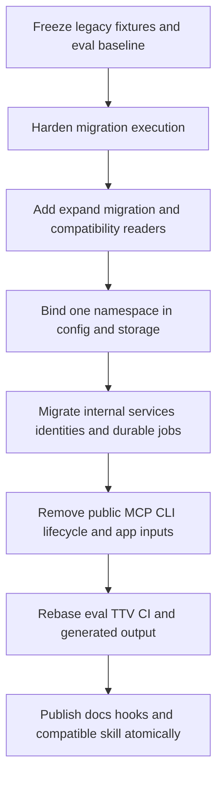

# One Active Namespace and Scope-Free Memory Implementation Plan

> **Decision source:** [ADR-0038](../../adr/0038-one-active-namespace-per-server.md)
>
> **Status:** Implementation in progress; the core runtime, compatibility, MCP,
> CLI, lifecycle, evaluation, and repository-documentation changes are implemented
> and covered by focused tests. Migration schema postconditions and the append-only
> edge provenance fix are implemented. The ordinary production path is bound through
> `BoundDbClient`; the low-level namespace-parameterized `DbClient` remains only as
> an infrastructure seam for startup/migrations and explicit test fixtures.
> Audited against the live repository on 2026-08-13. This revision replaces the
> earlier nine-task draft, whose public-first ordering was unsafe.
>
> **Final-validation session (2026-08-13):** all workspace gates pass on macOS
> (`cargo fmt --all --check`; `cargo check -p memory_mcp --all-targets --features
> cli-watch,mcp-apps --locked`; `cargo test -p memory_mcp` 1519 passed;
> `cargo test --workspace --all-targets --features cli-watch,mcp-apps` all passed;
> `cargo clippy --workspace --all-targets --features cli-watch,mcp-apps --locked -- -D
> warnings` and `--all-features` clean; `cargo build --workspace --locked` clean).
> PR eval profile: 113/113 passed, all 7 gates passed, 0 invalid. Release eval
> profile: 117/117 passed, all 9 gates passed, 0 invalid. Release-binary TTV:
> median total 0.78 s, p90 1.53 s, 3/3 success (target ≤ 300 s). Eval fixtures were
> rebased to the scope-free contract: five project-isolation retrieval cases
> (`ret-051..055`) and one stale claim case (`cr-021`, an impossible
> `project=zeus` qualifier duplicate of `cr-001`) were removed; profile coverage
> counts updated. The entity-extraction projection write path now omits `scope`,
> matching the `triple` precedent from migration `037`. The distributed memory-mcp
> skill, approved pre-change eval baselines (`evals/baselines/`), remote
> SurrealDB permission/concurrent-migration verification, and Linux CI remain open;
> the eval commands were run without baselines because none exist in this branch.
>
> **Code-review fixes (2026-08-13):** (1) Implemented the ADR-0008 same-lineage
> `source_gate` (plan Task 12 step 7): automatic correction/supersession now
> requires differing source facts AND a matching, present `source_lineage` on both
> sides. `source_lineage` is populated from the normalized episode `source_id`
> (the connector's stable record identifier); missing/different lineage falls
> through to contradiction/temporal ambiguity, never automatic invalidation. The
> five correction/supersession eval cases were rebased so setup and source share
> one `source_id`, and the claim suite lineage map now merges fact IDs. (2)
> Corrected `deterministic_candidate_id_v2` to the documented canonical tuple
> `(identity_version=2, task_fingerprint, trust_floor, policy_fingerprint_v2)`
> with `u32` length prefixes and an implicit Active Namespace (previously it
> hashed only namespace+task with `u64` prefixes). (3) Recorded that
> `claim.namespace`/`claim_job.namespace` remain required audit/provenance
> columns (never routing inputs) — see the compatibility matrix's "Stored
> namespace metadata" section.
>
> **Relationship to existing work:** Tasks 1–9 of
> [Zero-Config Runtime Onboarding](2026-08-04-zero-config-defaults.md) shipped at
> `97a3edd8` with the then-current default namespace `org` and plural
> `SURREALDB_NAMESPACES`. Do not repeat those tasks or rewrite their historical
> evidence. This plan changes the namespace/scope contract on top of that
> baseline.

## Goal

Make personal Memory MCP useful without partitioning knowledge: one server
process binds one native SurrealDB namespace at startup, while ordinary MCP,
CLI, lifecycle, app, maintenance, and worker operations have no `scope`,
partitioning `project`, `visibility_scope`, or request-level `namespace` input.

The final public model is deliberately small. Upgrade complexity is confined to
startup, migrations, compatibility reads, and versioned derived state rather
than exposed to every caller.

## Current and target contracts

| Concern | Current live behavior | Target behavior |
|---|---|---|
| Zero-config storage | Embedded, database `memory`, namespace `org` | Embedded, database `memory`, namespace `main` |
| Namespace config | `SURREALDB_NAMESPACES`, comma-separated | Optional singular `SURREALDB_NAMESPACE`; absent means `main` |
| Process routing | Several namespace sessions; request scope selects one | One namespace/database session bound during startup |
| MCP/CLI data inputs | Scope/project on capture/recall and related paths | No partition input; legacy keys/options fail |
| Record fields | Scope/project/visibility used by writers and filters | Legacy metadata readable; new writes and filters do not depend on it |
| Claims | Slot/policy include scope/project; model still carries qualifier hash | Slot uses tag policy + schema + subject + key; qualifier remains outside slot |
| Workers | Loop namespaces; some jobs store namespace maps; claim worker hardcodes `org` | Operate only on the Active Namespace; durable state is namespace-local |
| Namespace switch | One process can hold multiple namespace sessions | Restart with another `SURREALDB_NAMESPACE`; never transfer data |
| Existing zero-config data | Lives in `org` | Remains in `org`; use `SURREALDB_NAMESPACE=org` to access it |

## Non-goals

- Multiple active namespaces in one process.
- Per-request namespace selection or cross-namespace search.
- Namespace discovery/listing, namespace management tools, web UI, or app-only
  setup.
- Automatic namespace move, copy, merge, export, import, deletion, or fallback.
- Internal isolation of personal, corporate, family, or project memories.
- A replacement partition term such as collection, basket, vault, tenant,
  domain, or context.
- Destructive rewriting of source episodes/facts merely to erase legacy fields.
- Editing an applied migration.
- Adding dependencies or environment variables beyond the approved singular
  rename.

## Global constraints

- Preserve exactly eight MCP tool names:
  `ingest`, `extract`, `resolve`, `assemble_context`, `explain`, `invalidate`,
  `open_app`, `app_command`.
- Preserve the ordinary CLI command set, including output-only `init`; remove
  only legacy options/payload fields.
- Preserve immutable evidence, facts, provenance, source lineage, bi-temporal
  validity, retractions, and audit history.
- Preserve invocation trust, quarantine/restricted dispositions, policy-tag
  filtering, caller/rate-limit identity, transport/session/content metadata, and
  source-authority domains.
- Remove scope routing/access concepts (`MemoryScope`, `allowed_scopes`,
  `cross_scope_allow`, `AccessScopeAllow`) only after their independent security
  responsibilities are classified and migrated.
- Migration/schema readiness is blocking. No MCP request, CLI data operation,
  app session, watch ingestion, or worker starts before the Active Namespace is
  ready.
- Embedding mismatch may retain the existing explicit semantic-disabled degraded
  mode. Initial claim-backfill job creation is blocking; later processing
  failures remain non-blocking but durable and observable as required by
  ADR-0012.
- Add schema changes through new append-only migrations; do not edit
    `__Initial.surql` or migrations `006`–`033`. Migration `034` fixes the
    SurrealDB 3-valid edge provenance parent field without rewriting evidence.
- Keep `main.rs` limited to parsing and mode dispatch.
- Do not hold a lock guard across `.await`; do not add production `unwrap`,
  `expect`, or `panic`.
- Preserve unrelated working-tree changes. At plan creation the unrelated NER
  work is outside this document's write set.
- Each task follows red-green-refactor, ends with focused tests, and may be
  committed independently only if the intermediate state cannot be released as
  a schema-incompatible server. The hard public break and compatible skill/docs
  must ship atomically.

## Required execution order



Do not remove public or internal request fields before Tasks 2–8 make legacy
storage readable and ordinary domain operations namespace-bound. In particular,
the earlier draft's order—public schemas first, internal storage later—is
forbidden.

## Canonical runtime behavior

| Input/state | Required behavior |
|---|---|
| no `SURREALDB_*` variables | embedded storage, namespace `main`, database `memory` |
| `SURREALDB_NAMESPACE=work` | trim, bind `work`, select database `memory` or `SURREALDB_DB_NAME`, migrate, verify |
| `SURREALDB_NAMESPACE=` or whitespace | fail before connection with an actionable error |
| `SURREALDB_NAMESPACE=a,b` | fail: exactly one namespace is supported |
| `SURREALDB_NAMESPACES` present | hard fail with singular rename and one-value selection guidance |
| both singular and plural present | hard fail because the removed plural variable is present |
| name rejected by SurrealDB | preserve the underlying resource/error context and explain repair |
| configured namespace changes | switch after clean restart; never transfer/delete data |
| legacy `scope`, `project`, `visibility_scope`, or data-plane `namespace` input | reject, never ignore |
| legacy zero-config data in `org` | remains intact and readable only when `SURREALDB_NAMESPACE=org` is selected |
| inactive namespace | never opened, listed, migrated, or modified by this process |

Startup observability reports backend, Active Namespace, database, migration
readiness, and explicit degraded capabilities. It never logs credentials, lists
other namespaces, or claims that data moved.

# Stage 0 — Freeze evidence before changing behavior

## Task 1: Capture the legacy compatibility corpus and approved baselines

**Primary files:**

- `crates/memory-mcp/tests/fixtures/` or the existing fixture home selected by
  repository convention
- `crates/memory-mcp/tests/`
- `evals/baselines/`
- `docs/evals/`
- `crates/memory-mcp/src/tools/params.rs`
- `crates/memory-mcp/src/mcp/params.rs`
- `crates/memory-mcp/src/cli/args.rs`
- `crates/memory-mcp/src/models/memory_event.rs`

**Steps:**

1. Record the current exact `tools/list` JSON schemas, including property sets,
   required sets, and `additionalProperties` behavior. Do not rely on a tool-count
   snapshot.
2. Record ordinary CLI help/parser behavior for ingest, extract,
   assemble-context, watch, and hidden lifecycle commands.
3. Build a deterministic legacy `org` upgrade fixture by applying migrations
   through `031` and seeding:
   - episodes/facts with scope, project, visibility scope, tags, provenance, and
     embeddings;
   - entities, edges, triples, communities, query logs;
   - entity-extraction projections;
   - claims, relations, aliases, policies, and pending/completed/failed jobs;
   - lifecycle events, audits, projection jobs, and procedure candidates;
   - embedding state and a plural aggregate reembed job with progress for at
     least two namespaces.
4. Include deliberate identity collisions: two legacy episodes with the same
   scope-free source identity but different scopes, and two procedure candidates
   with the same task fingerprint but different scope/project. These prove that
   migration refuses unsafe implicit merges.
5. Prefer a reproducible fixture builder plus manifest/checksums over committing
   an opaque RocksDB directory. Add a real temporary RocksDB fixture for restart
   and file-lock subprocess tests.
6. Run pre-change PR and release eval profiles. The repository currently has no
   checked-in `evals/baselines/` artifact; review the generated artifacts for
   exact coverage, zero invalid outcomes, passed gates, fingerprints, and timing
   before approving them as:
   - `evals/baselines/one-active-namespace-pr.json`;
   - `evals/baselines/one-active-namespace-release.json`.
7. Add a dated baseline-review note under `docs/evals/`; do not promote arbitrary
   `target/` output to an approved baseline.
8. Verify the current known defects are represented by tests or fixture
   assertions, including per-statement migration errors, hardcoded claim worker
   namespace, silently skipped malformed lifecycle jobs, and plural reembed
   state.

**Focused validation:** legacy fixture creation is deterministic; both eval
artifacts have expected coverage and no invalid outcomes; no production behavior
has changed.

**Acceptance:** every later compatibility claim can be tested against a frozen
pre-change database and schema rather than reconstructed from memory.

# Stage 1 — Make migrations trustworthy before adding one

## Task 2: Inspect every SurrealDB statement result

**Primary files:**

- `crates/memory-mcp/src/storage/client.rs`
- migration runner unit/integration tests
- test-only migration fixtures

**Steps:**

1. Add a failing integration test whose first SurrealQL statement succeeds and a
   later statement fails. Prove the current outer `.await` success cannot hide
   the later error.
2. Replace the result-0-only `run_query_take` behavior for migration/raw
   multi-statement execution with a helper that inspects every statement result
   using the pinned SurrealDB SDK's supported `check`/`take_errors` contract.
3. Preserve result extraction for ordinary single-result queries; do not make all
   query callers learn migration response mechanics.
4. Include statement index and sanitized operation context in `MemoryError` and
   structured logs without logging secrets or unbounded SQL payloads.
5. Add tests for request-level failure, per-statement failure, timeout, retry, and
   successful multi-statement execution.
6. Verify all migration failures propagate to service construction and ordinary
   CLI subprocess exit status before any data-plane side effect.

**Acceptance:** no migration can be marked applied while any statement result
contains an error. After all migrations, startup verifies the selected namespace's
expected tables, analyzers, fields, indexes, and migration ledger postconditions.

## Task 3: Define crash-safe and concurrent migration execution

**Primary files:**

- `crates/memory-mcp/src/storage/client.rs`
- `crates/memory-mcp/src/storage/migrations.rs` if extracting the deep module
  improves locality
- new migration-runner integration tests
- `docs/agent/REPOSITORY_LAYOUT.md` if a module is added

**Steps:**

1. Write an executable probe against the lockfile-pinned SurrealDB SDK/server
   (verified as 3.2.4 during planning) that tests whether the DDL used by this
   repository and the `script_migration` ledger write can commit atomically in a
   supported client/manual transaction.
2. Record probe inputs, outputs, embedded/remote differences, and the chosen
   runner design in the test/module documentation. Do not assume generic
   transaction documentation proves DDL support.
2. If the probe passes for every supported backend, execute one migration body
   and ledger transition in one transaction and inspect all statement errors
   before commit.
4. If any supported backend cannot provide that atomic boundary, require every
   migration statement to be independently idempotent and use explicit
   `applying`/`applied` state, statement progress, checksum, owner/lease, and
   schema postconditions. The expand migration in Task 4 must satisfy this
   stronger path.
5. Introduce one namespace-local migration lease. For concurrent remote
   starters, one process acquires it; another waits for a fixed bounded internal
   interval and then either observes the applied checksum or fails actionably.
   Do not add an environment variable.
6. Test crash/restart at these boundaries:
   - before the first statement;
   - after an intermediate statement;
   - after schema completion but before ledger completion;
   - after ledger completion.
7. Test two concurrent remote clients applying the same pending migration. At
   most one executes each non-idempotent effect, both converge on one applied
   checksum, and checksum disagreement fails closed.
8. Replace the current `__Initial` “any table already exists means skip” shortcut
   with explicit bootstrap postcondition verification. A partially initialized
   schema is repaired only through behavior proven safe by the probe; otherwise
   startup fails with the missing resource list rather than serving.
9. Keep historical migration files byte-identical.

**Acceptance:** startup after a crash or competing migrator reaches either one
verified complete schema or a clear failure; it never serves a partially applied
schema or silently advances the ledger.

# Stage 2 — Expand the schema and add compatibility readers

## Task 4: Add migration `032_scope_free_active_namespace_expand.surql`

**Primary files:**

- create `crates/memory-mcp/migrations/032_scope_free_active_namespace_expand.surql`
- migration registry/manifest
- migration postcondition tests
- legacy fixture upgrade tests

**Steps:**

1. Add one append-only, independently idempotent expand migration. Never edit
   `__Initial` or `016`, `018`, `019`, `021`, `024`, `027`, `028`, `029`, `030`,
   or `031`.
2. Make legacy partition-only fields optional while retaining existing values:
   - `episode.scope`, `episode.project`, `episode.visibility_scope`;
   - `fact.scope`, `fact.project`;
   - `query_log.scope`, `query_log.project`;
   - `memory_event.scope`, `memory_event.project`;
   - `event_projection_job.scope`, `event_projection_job.project`;
   - `memory_capture_audit.scope`, `memory_capture_audit.project`;
   - `procedure_candidate.namespace`, `scope`, `project` where represented only
     as legacy routing metadata;
   - `claim.namespace`, `scope`, `project`, `project_identity` and legacy slot
     metadata;
   - `claim_relation.scope`, `project`;
   - `claim_job.namespace` (make optional only after the bound database owns
     routing; new rows need no redundant namespace field);
   - `entity_extraction_projection.scope`;
   - `triple.namespace`;
   - plural `embedding_job.namespaces`, `current_namespace`, and
     `namespace_progress`.
3. Add explicit version/additive compatibility fields required by the identity
   matrix below. Prefer `identity_version`, `slot_fingerprint_v2`,
   `access_policy_fingerprint_v2`, `job_schema_version`, and namespace-local
   progress fields over overwriting legacy values.
4. Add new indexes for target query shapes before removing reliance on old
   scope/project indexes. Claim lookup must index the v2 slot plus stable cursor;
   episode compatibility lookup must support source type + source ID + reference
   time; worker indexes must support status/lease without scope/project.
5. Remove obsolete indexes only after replacement index postconditions pass.
   Index removal is allowed as schema evolution but never changes source rows.
6. Do not bulk rewrite source episodes/facts. Derived rows may receive additive
   v2 fields lazily or through a bounded backfill after startup.
7. Add postconditions for every target table, field type, index, and migration
   ledger state. Fresh install and sequential `031→032` upgrade must produce the
   same target schema.
8. Test restart after each migration failure injection from Task 3.

**Acceptance:** legacy rows remain byte/logically intact, scope-free writers can
omit partition fields without SCHEMAFULL failures, and target indexes exist
before target queries run.

## Task 5: Introduce read-old/write-new compatibility DTOs

**Primary areas:**

- `crates/memory-mcp/src/models/`
- `crates/memory-mcp/src/service/episode/record_parsing.rs`
- `crates/memory-mcp/src/storage/agent_memory.rs`
- `crates/memory-mcp/src/storage/claims.rs`
- procedure, reembed, query-log, triple, and projection record parsers

**Steps:**

1. Separate current domain records from legacy storage DTOs. Domain code must not
   require dummy scope/project values just because old rows contain them.
2. Parse absent target fields and present legacy fields explicitly. Do not use a
   catch-all serde default that turns malformed durable work into valid empty
   work.
3. Preserve legacy partition metadata in an internal audit/compatibility view;
   do not expose it as active domain vocabulary or public response fields.
4. Add a typed compatibility outcome for each legacy row:
   `native_v2`, `legacy_unambiguous`, `legacy_ambiguous`, or `malformed`.
5. Make ambiguous identities and malformed durable jobs observable with record
   ID, reason code, and operator guidance. Source rows remain retrievable even
   when a derived row cannot be migrated automatically.
6. Add round-trip tests for v1-only, v2-only, mixed, malformed, and ambiguous
   fixture records.

**Acceptance:** old and new rows can coexist, but new domain methods cannot
manufacture `scope`, `project`, or `visibility_scope` placeholders or silently
skip incompatible records.

## Task 6: Implement and persist the identity compatibility matrix

**Primary files:**

- create `docs/compatibility/one-active-namespace-identities.md`
- `crates/memory-mcp/src/service/util/ids.rs`
- `crates/memory-mcp/src/models/claim.rs`
- `crates/memory-mcp/src/models/procedure.rs`
- `crates/memory-mcp/src/service/agent_memory/`
- `crates/memory-mcp/src/service/episode/entity_extraction.rs`
- claim/reembed/job scheduling modules

**Normative matrix:**

| Artifact | v1 identity/routing input | Target write identity | Legacy lookup and duplicate prevention |
|---|---|---|---|
| Episode | source type + source ID + `t_ref` + scope | v2: source type + source ID + `t_ref` | Before creating v2, query stable source identity. Reuse exactly one legacy episode; if several legacy scopes match, return an actionable ambiguity error and create nothing. |
| Fact | fact type + content + source episode ID + valid time | Formula unchanged for a reused episode; naturally v2 for a new episode | Reusing the legacy episode preserves fact IDs. Extraction against an ambiguous episode is blocked. Assert no second semantic fact for the same source episode/payload. |
| Entity | entity type + canonical name | Unchanged | Existing ID is reused; namespace isolation is implicit in the bound database. |
| Edge/community/triple | IDs/content, with namespace on triple rows | Preserve existing deterministic IDs; omit stored namespace from new triple rows | Existing records remain visible in the selected database; repeat projection must upsert/deduplicate by stable source identity. |
| Entity extraction projection | episode ID + scope + ingestion time | v2: episode ID + ingestion time + explicit identity version | Do not append a v2 duplicate for the same episode/fingerprint/run. Legacy rows remain attribution evidence. |
| Claim | schema + extractor + source fact ID + canonical payload | Claim ID formula unchanged | Reused fact IDs preserve claim IDs. Projection checks source fact + extractor + canonical payload before insert. |
| Claim policy fingerprint | scope + project + sorted tags | v2: sorted policy tags only | Store v1 and v2 separately. New reconciliation uses v2. Never map scope/project into synthetic tags. |
| Claim slot fingerprint | namespace + scope + project + schema version + subject + key + policy | v2: compatible schema + subject + comparison key + v2 tag-policy fingerprint; Active Namespace is implicit | Lazily project v2 slot for legacy claims. Qualifier hash is never part of v1 or v2 candidate-slot identity. Ambiguous legacy claims coexist and are not auto-invalidated. |
| Claim relation | unordered claim-ID pair plus context fingerprint | Relation ID remains pair-derived; context fingerprint receives an explicit evaluator/version bump when policy context changes | Reuse the pair identity, append/version the reconciliation decision, and never create parallel semantic relation copies merely because the slot formula changed. |
| Claim jobs/backfill | namespace and source/claim IDs in rows; backfill ID contains namespace | Namespace-local v2 schema; backfill ID may keep Active Namespace to avoid collision in exported artifacts | Lease/query only current database. Convert or resume one unambiguous legacy job; duplicate pending v1/v2 work is collapsed by source + kind + evaluator/extractor fingerprint. |
| Lifecycle event | origin + kind + task + normalized task + scope/project + session/native ID | v2 removes scope/project and records identity version | Lookup native event ID/session/origin tuple before creating. Reuse one legacy event; ambiguity is durable/observable, never merged. |
| Lifecycle projection job/audit | job derives from event ID; rows carry scope/project | Keep job/event linkage; omit partition fields in new rows | Legacy event reuse preserves job ID. Malformed rows are failed/dead-lettered with reason rather than skipped. |
| Procedure candidate | namespace + scope + project + task fingerprint | v2: `procedure_candidate:v2:` + SHA-256 of a canonical length-prefixed tuple `(identity_version=2, task_fingerprint, trust_floor, policy_fingerprint_v2)`; Active Namespace is implicit | Add `identity_version` and `policy_fingerprint_v2`. Reuse a legacy candidate only when its original policy tags can be reconstructed unambiguously from persisted accepted evidence. Otherwise retain the legacy candidate, create/retain separate v2 work as an explicit compatibility-review state, and report the counter split; never merge or split silently. |
| Reembed job/cursor | one fixed job in default namespace with `namespaces`, current namespace, per-namespace map | one namespace-local v2 job with flat cursor/counters/failed IDs and schema version | Import only the Active Namespace entry from a legacy aggregate record after validating signature/dimension. Leave entries for inactive namespaces untouched in the legacy aggregate; never apply another namespace's cursor or failures. |
| Retrieval/policy/cache fingerprints | various scope/project inputs | versioned v2 formulas without partition fields; tags/trust preserved | Do not compare v1 and v2 raw hashes as equal. Compatibility code maps evidence inputs, not hash strings, and invalidates only ephemeral caches. |

**Steps:**

1. Turn the matrix into typed unit and legacy-fixture integration tests before
   changing formulas.
2. Version every changed deterministic formula in payloads and audit output.
   Avoid an unlabelled global hash change. For procedure v2, encode every tuple
   field as `u32` big-endian byte length followed by exact UTF-8 bytes in the
   declared field order. Compute `policy_fingerprint_v2` over tags after the
   existing boundary validation/trim, byte-exact stable sort, and deduplication;
   do not lowercase tags. Encode no tags as a zero-count canonical list, never as
   an omitted field or delimiter concatenation.
3. Implement one compatibility lookup per artifact at the owning storage seam.
   Do not scatter v1 fallback logic through MCP handlers or capabilities.
4. Define ambiguous-match errors as non-mutating. Include candidate record IDs
   and repair guidance, but never expose source contents in the error.
5. Add regression tests:
   - repeat ingest of a unique pre-upgrade source reuses episode and fact IDs;
   - collision across two legacy scopes fails and creates no v2 episode;
   - repeat claim projection creates no semantic v1/v2 copies;
   - relation history versions rather than forks;
   - unique procedure evidence resumes one counter set;
   - colliding procedure candidates remain separate and observable;
   - legacy lifecycle native event replay creates no duplicate event/job;
   - inactive namespace reembed progress remains untouched.
6. Keep `docs/compatibility/one-active-namespace-identities.md` synchronized with
   test fixture names and the implemented formula versions.

**Acceptance:** repeat processing across the upgrade is idempotent where identity
is unambiguous and fails safely where removing a boundary would cause a merge.

# Stage 3 — Bind configuration and storage to one namespace

## Task 7: Replace plural configuration with one typed Active Namespace

**Primary files:**

- `crates/memory-mcp/src/config/surreal.rs`
- configuration error/startup-event tests
- `.env.example`
- `crates/memory-mcp/src/cli/commands/init.rs`

**Steps:**

1. Add tests for every canonical runtime behavior row, including both variables
   present, explicit empty, whitespace, comma, and removed plural with one value.
2. Replace `SurrealConfig.namespaces: Vec<String>` and `default_namespace()` with
   a validated `ActiveNamespace` newtype and one `namespace` field defaulting to
   `main`.
3. Parse only `SURREALDB_NAMESPACE`; include `SURREALDB_NAMESPACES` in removed-
   variable detection and migration guidance.
4. Distinguish absent from explicitly empty. Trim once at the configuration
   boundary and delegate remaining name validity to SurrealDB.
5. Update builders/fixtures to require or default exactly one namespace. Delete
   first-namespace helpers; do not retain a one-element vector compatibility
   abstraction.
6. Update startup config events to singular fields and keep credentials absent.
7. Change `init --target env` so zero-config output does not emit any namespace
   variable. Add an advanced example using singular `SURREALDB_NAMESPACE=work`;
   never emit the plural name except in an error/migration example.
8. Keep no-environment embedded behavior independent of a `.env` file.

**Acceptance:** zero environment parses as embedded/`main`/`memory`; every legacy
or ambiguous configuration fails before storage connection with one copy-paste
repair path.

## Task 8: Deepen the storage seam around a namespace-bound client

**Implementation status:** The production seam is implemented through
`BoundDbClient` and the namespace-bound narrow stores. Ordinary service/capability
methods no longer accept a request namespace. The low-level `DbClient` trait still
accepts a namespace because startup migration code and explicit compatibility
fixtures use it; this is intentionally not reachable from ordinary domain routing
and is not a second active-namespace model.

**Primary files:**

- `crates/memory-mcp/src/storage/client.rs`
- `crates/memory-mcp/src/storage/*_store.rs`
- `crates/memory-mcp/src/service/service_context.rs`
- `crates/memory-mcp/src/service/core/builder.rs`
- storage mocks and integration fixtures

**Target interface:**

- construction selects one namespace/database session and returns a bound client
  that cannot switch during its lifetime;
- ordinary narrow-store and service methods do not accept a namespace;
- startup/migration resource definition remains a separate infrastructure seam;
- the low-level `DbClient` namespace parameter is retained only for startup,
  migration, adapter compatibility, and explicit test fixtures;
- test-only legacy fixture utilities may select namespaces explicitly but are not
  reachable from ordinary production capabilities.

**Steps:**

1. Add compile-time/interface tests or structural assertions that ordinary store
   methods contain no namespace parameter.
2. Replace `DbEngine::Local/Remote(HashMap<namespace, client>)` with one bound
   session for the Active Namespace. Under SurrealDB 3, share that session via
   `Arc` rather than cloning sessions throughout domain code.
3. Split startup resource selection/creation/migration from the bound data client
   if necessary. This is the one justified storage seam; do not add a generic
   database abstraction for hypothetical backends.
4. Remove namespace arguments from `ContextFactQuery` and all ordinary narrow
   stores: episode, fact/context, app, agent-memory, claims, procedures, reembed,
   lifecycle, query log, graph/community/triple, and embedding state. Keep the
   low-level `DbClient` argument only where the startup/migration/fixture boundary
   requires explicit resource selection.
5. Remove `namespace_for_scope`, `.namespace()`, default-namespace fallback, and
   `MemoryScope` routing after all callers use the bound client.
6. Preserve Active Namespace as structured observability and, where necessary,
   exported artifact provenance—not as a dynamic method argument.
7. Ensure mocks cannot accidentally route to a different namespace. Dedicated
   multi-namespace test setup must construct and drop separate bound clients.
8. Run structural/reference searches for `namespace: &str`, `&service.namespaces`,
   `default_namespace`, `namespace_for_scope`, and namespace maps; classify each
   remaining occurrence as startup config, legacy DTO, audit/export metadata, or
   test-only fixture.

**Acceptance:** one namespace selection occurs before service construction and
ordinary domain code is physically unable to route a request elsewhere. The
remaining low-level namespace argument is confined to startup/migration and
explicit compatibility fixtures, with no ordinary request path able to supply it.

## Task 9: Implement embedded and remote initialization/readiness matrices

**Primary files:**

- `crates/memory-mcp/src/storage/client.rs` or startup adapter from Task 8
- `crates/memory-mcp/src/service/startup.rs`
- `crates/memory-mcp/src/service/core/builder.rs`
- remote/embedded startup integration tests

**Steps:**

1. Embedded: open the configured directory, select/create Active Namespace and
   database, apply migrations, and verify postconditions.
2. Remote existing: select/probe the configured namespace/database without
   requiring `INFO FOR ROOT` or namespace listing.
3. Remote absent with sufficient rights: use idempotent native namespace/database
   definition operations as supported by the pinned server, then
   select/probe/migrate. Construct identifiers through the SDK's typed resource
   interface when available; otherwise use one tested SurrealQL identifier-
   escaping helper. Never interpolate the trimmed environment string directly
   into SQL. Verify the exact `IF NOT EXISTS` grammar against SurrealDB 3.2.4 in
   the executable probe rather than assuming syntax from another version.
4. Remote insufficient rights: if the existing resource is usable, continue;
   otherwise fail with the resource and required permission/action. Namespace
   creation requires root-level authority; database creation requires root or
   namespace owner/editor; migration permission errors are blocking.
5. Collapse `load_embedding_states`, fact counts, dimension samples,
   bootstrap-ready writes, and `EmbeddingStartupDecision` to singular state.
   Preserve explicit semantic-disabled degradation for signature/rebuild
   mismatch.
6. Make claim-backfill schedule creation for the Active Namespace blocking and
   idempotent before workers start. Processing remains asynchronous and
   observable.
7. Start claim, lifecycle, decay/archive, community, and other workers only after
   schema, compatibility, embedding decision, connection probe, and durable
   schedule readiness complete.
8. Emit singular startup events: backend, Active Namespace, database, schema
   version/readiness, and degraded capabilities. Do not say created/migrated data
   unless directly proven.
9. Test initialization failure, migration failure, embedding degradation,
   schedule failure, remote permission paths, and worker-not-started-before-ready.

**Acceptance:** no supported entry point reaches data-plane code or starts a
worker against an unverified schema; remote setup does not require global list
permission.

# Stage 4 — Remove legacy boundaries from internal behavior

## Task 10: Make episode, fact, entity, graph, and context pipelines scope-free

**Primary areas:**

- `crates/memory-mcp/src/models/domain.rs`
- `crates/memory-mcp/src/models/request.rs`
- `crates/memory-mcp/src/service/ingestion.rs`
- `crates/memory-mcp/src/service/episode/`
- `crates/memory-mcp/src/service/context/`
- `crates/memory-mcp/src/service/fact.rs`
- `crates/memory-mcp/src/storage/queries.rs`
- entity, edge, triple, community, embedding, and query-log stores

**Steps:**

1. Introduce internal scope-free requests while public adapters may temporarily
   translate legacy public payloads during this stage. Mark that adapter as
   non-releasable and delete it in Stage 5.
2. Remove scope/project/visibility fields from current `Episode`, `Fact`, ingest,
   extract, and context-domain models. Keep legacy DTO fields only in the
   compatibility module from Task 5.
3. Use the identity compatibility resolver from Task 6 before creating episodes
   or projections. Never substitute `org`, `main`, empty string, or a hidden
   project constant.
4. Remove scope/project predicates from lexical, semantic, temporal, graph,
   experience, fallback, entity, edge, triple, community, query-log, and app
   queries. Preserve bi-temporal filters, fact types, source lineage, tags,
   access-policy filtering, and result budgets.
5. Remove visibility-scope handling after confirming its only production writer
   defaults it from request scope and no independent enforcement depends on it.
6. Replace query analytics dimensions `scope`/`project` with no partition
   dimension. Do not add Active Namespace as an unbounded metric label; use it in
   structured logs/artifacts where needed.
7. Ensure explanation and recall provenance do not expose scope/project as active
   semantics. Decide in code/tests that legacy values are omitted from public
   `ExplainItem`; audit access remains internal.
8. Add fixture tests proving old records with different legacy scopes are all
   recall candidates inside the selected namespace and still obey tags, time,
   fact type, invalidation, and source-authority rules.
9. Prove no query silently retains `scope = $scope` or project filters through
   structural/textual audit of SQL builders and stores.

**Acceptance:** ordinary capture/recall inside the service has one coherent
memory set and retains independent trust/tag/temporal protections.

## Task 11: Migrate access and lifecycle policy without weakening security

**Primary areas:**

- `crates/memory-mcp/src/models/access.rs`
- `crates/memory-mcp/src/service/context/filtering.rs`
- `crates/memory-mcp/src/service/agent_memory/`
- `crates/memory-mcp/src/models/memory_event.rs`
- `crates/memory-mcp/src/config/lifecycle.rs`
- lifecycle stores, hooks fixtures, and security tests

**Steps:**

1. Delete `AccessScopeAllow`, `allowed_scopes`, `cross_scope_allow`, and
   `is_scope_allowed`. Keep `allowed_tags`, caller/session/transport/content
   metadata, and channel-derived invocation origin.
2. Remove scope/project from `NormalizedHostEvent`, capture/recall keys, event
   records, audits, projection records, deduplication, salience inputs, and
   exposure links using the versioned identity strategy from Task 6.
3. Preserve quarantine/restricted/rejected/accepted/degraded classification and
   all anti-poisoning tests. External content still cannot elevate trust or
   become privileged instruction, preference, retraction, policy, or procedure.
4. Replace `remaining_project_daily_bytes` and project budgets with an equivalent
   process/Active-Namespace daily byte budget. Keep default capacity and bounded
   growth at least as strict as the existing policy; do not add configuration.
5. Make lifecycle compatibility errors durable and observable. In particular,
   replace `load_pending_jobs`'s `if let Ok(...)` skip with typed parse failure,
   failed/dead-letter state, record ID, attempts, and reason.
6. Ensure a legacy job whose event/episode resolves unambiguously can resume;
   ambiguity or malformed identity fails without projecting into the wrong
   source.
7. Update exposure/retrieval fingerprints and ephemeral cache keys to v2. Cache
   invalidation is acceptable; durable evidence loss is not.
8. Add tests for tag denial, trust non-elevation, quarantine isolation, budget
   enforcement, malformed job observability, replay idempotency, and no hidden
   scope defaults.

**Acceptance:** removing routing scope changes no independent trust, tag,
quarantine, authority, or bounded-growth guarantee.

## Task 12: Migrate claims and reconciliation onto the ADR-0014 slot

**Primary areas:**

- `crates/memory-mcp/src/models/claim.rs`
- `crates/memory-mcp/src/service/claims/`
- `crates/memory-mcp/src/storage/claims.rs`
- `docs/CONTRADICTION_DETECTION_DESIGN.md`
- claim eval fixtures

**Steps:**

1. Remove scope/project/namespace fields from current claim and relation domain
   types where namespace is implicit in storage. Keep optional legacy DTO fields.
   **Recorded deviation:** `claim.namespace` and `claim_job.namespace` remain
   required, written audit/provenance columns (never routing inputs, never
   hashed into identity). See the compatibility matrix's "Stored namespace
   metadata" section.
2. Change `PolicyFingerprint::compute` to a versioned v2 policy over sorted
   `policy_tags` only. An absent tag policy is not equivalent to a fabricated
   scope.
3. Define v2 Claim Slot exactly as ADR-0014 amended by ADR-0038:
   access-policy fingerprint + canonical subject + compatible schema + comparison
   key. Active Namespace is the process/storage context, not a stored routing
   argument.
4. Remove `QualifierHash` from `ClaimSlot` if it remains there in the live model;
   retain it on claims/relations for Gate 4/7 evaluation. Add tests proving two
   qualifier variants enter the same candidate slot.
5. Add lazy/bounded v2 slot projection for legacy claims. Candidate lookup may
   use stored v2 fields or deterministically derive them; it must use stable
   pagination and never a global latest-N shortcut.
6. Preserve claim IDs, source facts, relations, validity, correction,
   supersession, contradiction, and temporal ambiguity as specified in the
   identity matrix. Do not auto-invalidate legacy claims because they become
   comparable.
7. Replace the live reconciliation `source_gate`, which currently checks only
   that source fact IDs differ, with ADR-0008's available same-lineage gate:
   source fact IDs must differ, both `source_lineage` values must be present, and
   the values must be byte-equal after the lineage normalization already used at
   projection. Missing or different lineage cannot produce automatic correction
   or supersession; it may still produce contradiction/temporal ambiguity under
   the ordinary later gates. The repository has no implemented source-authority
   registry, so no authority alternative is available in this plan. Add negative
   regressions proving recency, source type, removed scope/project, and namespace
   cannot establish authority. If an authority path is required, stop and design
   it separately under ADR-0008.
8. Replace the hardcoded `namespace: "org"` claim-worker lease with the bound
   store. Lease only jobs in the Active Namespace database.
9. Make initial backfill scheduling blocking/idempotent; processing progress and
   failure remain durable/non-blocking. Legacy/current duplicate work collapses
   by semantic job identity.
10. Update deterministic fixtures intentionally and document every v1/v2 change
    in the compatibility matrix.

**Acceptance:** candidate generation follows the exact amended slot, qualifiers
remain inside reconciliation, old evidence remains visible, and repeated
projection creates no duplicate truth.

## Task 13: Make procedures, maintenance, apps, and workers namespace-local

**Primary areas:**

- `crates/memory-mcp/src/models/procedure.rs`
- procedure services/stores
- `crates/memory-mcp/src/service/reembed.rs`
- lifecycle decay/archive/community workers
- `crates/memory-mcp/src/service/apps/`
- `crates/memory-mcp/src/service/reembed.rs`
- worker/runtime tests with and without `mcp-apps`

**Steps:**

1. Implement procedure compatibility exactly as Task 6 specifies. Add v2 policy
   identity fields through migration `032`. Legacy candidate reuse is allowed
   only when linked accepted evidence reconstructs its original policy tags
   unambiguously; the current `ProcedureCandidateRecord` alone is insufficient.
   Missing/ambiguous evidence creates a durable compatibility-review state and
   structured warning. Multiple candidates that differ only by removed fields
   are never auto-merged. Preserve promotion/deprecation/revocation and
   trust-floor gates.
2. Replace the plural reembed loop with one Active Namespace pass and a flat,
   versioned namespace-local job record. Import only that namespace's validated
   legacy progress entry.
3. Because the old aggregate job is stored in the old default namespace, read it
   only when it exists in the currently selected database. Do not open another
   namespace to recover an entry. Leave unselected entries unchanged for a future
   process selecting that namespace.
4. Ensure retry-failed uses only failed fact IDs validated to belong to the
   Active Namespace. Cursor/signature/dimension mismatch fails safely.
5. Run decay, archival, query-log pruning, community rebuild, claim projection,
   procedure maintenance, and entity/embedding maintenance only on the bound
   store. Delete namespace loops and summaries.
6. Make app sessions inherit Active Namespace from their service; remove
   scope/project from session state, ingestion review, lifecycle views, graph
   context, and commands. `AppCommandParams` remains otherwise unchanged.
7. Preserve durable cursors, leases, cancellation, retry, and dead-letter
   observability. Version fingerprints that depended on removed boundaries.
8. Add tests showing inactive namespace data/jobs are untouched and later resume
   when that namespace is selected in a new process.
9. Build/test with default features and with `cli-watch,mcp-apps` so optional apps
   cannot hide a legacy partition dependency.

**Acceptance:** every internal path observes the one-bound-namespace invariant,
and no cursor/job/evidence is silently merged, skipped, or applied across
namespaces.

# Stage 5 — Apply the hard break to MCP, CLI, watch, lifecycle, and apps

## Task 14: Remove partition fields from the eight MCP contracts

**Primary files:**

- `crates/memory-mcp/src/tools/params.rs`
- `crates/memory-mcp/src/mcp/params.rs`
- `crates/memory-mcp/src/tools/`
- `crates/memory-mcp/src/mcp/handlers.rs`
- `crates/memory-mcp/src/mcp/handlers/apps.rs`
- `crates/memory-mcp/tests/tools_e2e.rs`
- public-surface/schema snapshot tests

**Affected owners:**

- `IngestParams`: remove scope, project, visibility scope;
- `ExtractParams`: remove inline scope;
- `AssembleContextParams`: remove scope and project;
- `OpenAppParams`: remove scope/project where present;
- `ResolveParams` and `AppCommandParams`: already scope-free; prove unchanged;
- `ExplainItem`/responses: omit legacy scope/project as active provenance.

**Steps:**

1. Remove the temporary legacy-to-internal adapter from Stage 4. MCP handlers
   call the scope-free capabilities directly.
2. Keep `#[serde(deny_unknown_fields)]` on every public parameter struct.
3. Assert exact `tools/list` tool names, exact property and required sets, and
   `additionalProperties: false` for all eight tools. Tool count alone is not an
   acceptance test.
4. Add direct serde tests rejecting each removed key individually and in mixed
   valid payloads.
5. Add actual stdio JSON-RPC `tools/call` tests asserting `InvalidParams` for
   removed keys and no storage mutation. Cover task-aware `extract` and
   `open_app`, not only direct handler calls.
6. Test valid scope-free calls through all affected tools and confirm decision-
   ready guidance no longer asks the caller to choose/repair scope or project.
7. Verify public responses and errors never imply per-record isolation.
8. Preserve all eight names and app-session command behavior not related to the
   removed partition.

**Acceptance:** live `tools/list` and `tools/call` expose exactly the target
scope-free contract, while every legacy key fails clearly and non-mutatingly.

## Task 15: Remove partition options from ordinary CLI and watch mode

**Primary areas:**

- `crates/memory-mcp/src/cli/args.rs`
- `crates/memory-mcp/src/cli/commands/`
- `crates/memory-mcp/src/cli/runtime.rs`
- `crates/memory-mcp/src/service/content_extraction/watcher.rs`
- CLI parser/snapshot/subprocess tests

**Steps:**

1. Remove scope/project/visibility options from ingest, extract,
   assemble-context, and watch. Keep command names and unrelated options stable.
2. Simplify `WatchCommand`, `run_watch_mode`, and `FsWatcher` so files ingest
   through the same bound service with no synthetic defaults.
3. Update help/snapshots and `init` renderers. Zero-config examples contain no
   namespace or partition argument.
4. Add parser tests for valid commands and rejection of every removed option.
5. Add binary subprocess tests asserting non-zero exit, actionable stderr, and
   no data directory/record side effect for rejected legacy invocations.
6. Run valid ingest→extract→assemble-context and watch ingestion through the
   ordinary binary against temporary embedded storage.
7. Preserve `reembed`, `serve`, `init`, and command dispatch behavior.

**Acceptance:** a normal CLI user never learns scope/project, and old flags fail
before service mutation rather than being ignored.

## Task 16: Revise hidden lifecycle transport and hooks atomically

**Primary files:**

- `crates/memory-mcp/src/cli/args.rs`
- `crates/memory-mcp/src/cli/commands/lifecycle_capture.rs`
- `crates/memory-mcp/src/cli/commands/lifecycle_recall.rs`
- `crates/memory-mcp/src/models/memory_event.rs`
- `hooks/`
- `hooks/README.md`
- lifecycle subprocess/integration tests

**Steps:**

1. Make scope-free `NormalizedHostEvent` strict: legacy scope/project keys are
   rejected deterministically rather than ignored by serde.
2. Update hidden command descriptions and JSON fixtures.
3. Update every hook script and documented payload in the same task. Hooks must
   call the same scope-free path as bare MCP/ordinary CLI.
4. Add subprocess tests for valid hidden payloads and legacy payload rejection,
   including exit code, stderr/error envelope, and no storage mutation.
5. Re-run lifecycle action-grounding, poisoning, deduplication, capture-budget,
   restart, and projection/dead-letter suites.
6. Add a banner to the historical lifecycle implementation plan explaining that
   ADR-0038 supersedes its scope/project transport fields and project budget,
   while preserving its historical implementation record.

**Acceptance:** supported hooks continue to work at release time, unsupported
legacy payloads fail clearly, and lifecycle security gates remain green.

# Stage 6 — Prove storage switching and upgrade behavior end to end

## Task 17: Add real process-restart and embedded lock tests

**Primary files:**

- new integration test under `crates/memory-mcp/tests/`
- shared subprocess fixture support
- zero-config embedded tests

**Steps:**

1. Use one real temporary RocksDB directory and sequential primary processes:
   - process A: `main`, write/recall record M, clean exit;
   - process B: same directory, `work`, verify M absent, write/recall W, exit;
   - process C: `main`, verify M present and W absent, exit;
   - process D: `work`, verify W present and M absent, exit.
2. Assert each selected namespace receives pending migration `032` when first
   opened and inactive namespaces remain untouched before selection.
3. Start a second primary process while the first holds the RocksDB directory.
   It must fail within a bounded timeout with an actionable lock/resource error,
   not hang or corrupt data.
4. Test legacy `org` fixture:
   - unset startup selects a fresh `main` and does not expose/copy `org` data;
   - `SURREALDB_NAMESPACE=org` upgrades and recalls legacy data;
   - returning to `main` leaves both namespaces intact;
   - startup logs never claim transfer.
5. Test invalid plural/empty/comma config before RocksDB open, so a config error
   cannot be masked by a storage lock.

**Acceptance:** namespace switching is proven as real restart behavior, not
multiple in-process sessions, and old `org` data has a documented safe access
path.

## Task 18: Add remote permission and concurrent migration integration coverage

**Primary areas:**

- remote SurrealDB integration test harness
- startup/migration test fixtures
- CI service setup if an existing supported path can run it

**Steps:**

1. Against the pinned compatible SurrealDB server, create identities representing:
   root, namespace owner/editor, database owner/editor, and insufficient rights.
2. Test the ADR-0038 matrix: existing resources, absent namespace, absent
   database, migration permission, and no global list permission.
3. Test two concurrent server processes targeting the same remote Active
   Namespace and pending migration. Assert lease/checksum/postcondition behavior
   from Task 3.
4. Test underlying name-validation and permission errors retain actionable
   SurrealDB context without leaking credentials.
5. If the default CI cannot run remote coverage reliably, keep deterministic
   unit/protocol tests in PR CI and make the real remote matrix a named blocking
   pre-release command documented in `docs/agent/EVALUATION.md`; do not silently
   mark it passed.

**Acceptance:** embedded convenience does not conceal a remote initialization or
migration-permission defect.

# Stage 7 — Rebase evaluation, TTV, generated output, and CI

## Task 19: Update eval adapters, corpora, and approved baselines

**Primary areas:**

- `crates/eval-harness/src/test_support.rs`
- retrieval, extraction, claim, lifecycle, and end-to-end suites
- `evals/` profiles/corpora/fixtures/baselines
- `evals/longmemeval_v2/memory_mcp_backend.py`
- `docs/agent/EVALUATION.md`
- `docs/evals/`

**Steps:**

1. Remove scope/project/visibility arguments and synthetic defaults from eval
   service builders, adapters, subprocess calls, corpus schemas, and expected
   artifacts.
2. Add negative eval cases for removed MCP/CLI fields and plural environment
   configuration, asserting non-mutation.
3. Add zero-config first-value coverage asserting embedded/`main`/`memory` and
   legacy `org` explicit-selection coverage.
4. Add namespace-switch isolation and durable-job transition cases from Tasks
   17–18.
5. Update claim reconciliation cases for the amended exact slot: tags preserved,
   scope/project removed, qualifiers evaluated inside reconciliation, source
   authority not broadened.
6. Run PR and release profiles with the frozen approved pre-change baselines:

   ```bash
   cargo run -p eval-harness --bin memory-eval -- run \
     --profile evals/profiles/pr.json \
     --artifact target/evals/one-active-namespace-pr.json \
     --baseline evals/baselines/one-active-namespace-pr.json

   cargo run -p eval-harness --bin memory-eval -- run \
     --profile evals/profiles/release.json \
     --artifact target/evals/one-active-namespace-release.json \
     --baseline evals/baselines/one-active-namespace-release.json
   ```

7. Inspect artifact verdict, exact suite coverage, case outcomes, gates,
   fingerprints, and time budget—not only process exit. Require no invalid
   outcomes and passed gates.
8. The release profile is required because lifecycle is absent from the PR
   profile. The current CI release-eval job uses `continue-on-error: true` and is
   diagnostic, not a release gate. Either make it blocking in this task or add a
   separate blocking pre-release job; documentation must state the truth.
9. Approve replacement baselines only after before/after artifact review and a
   dated rationale. Do not erase the pre-change artifacts used to quantify the
   behavior revision.

**Acceptance:** evaluation measures the scope-free product rather than silently
supplying legacy defaults, and release claims have lifecycle evidence.

## Task 20: Update TTV, `init`, generated env inventory, and release CI

**Primary files:**

- `scripts/measure_ttv.sh`
- `crates/memory-mcp/src/cli/commands/init.rs`
- generated environment inventory and snapshot tests
- `.github/workflows/ci.yml`
- release smoke tests

**Steps:**

1. Update TTV isolation to unset both `SURREALDB_NAMESPACE` and removed
   `SURREALDB_NAMESPACES`, plus all current canonical/removed NER variables.
2. Remove `--scope org` and every partition field from the TTV ingest/extract/
   recall path. Assert startup/default evidence identifies `main`.
3. Run the ordinary release-binary persona at least three times:

   ```bash
   scripts/measure_ttv.sh \
     --binary target/release/memory_mcp \
     --persona release-binary \
     --repeat 3
   ```

   Require every run successful and p90 total ≤ 300 seconds. Report source-build
   time separately; do not mix it into runtime first value.
4. Update `init --target env` and every host renderer fixture so generated config
   contains no removed field. Keep output non-mutating and secret-free.
5. Update the generated canonical environment inventory to singular namespace
   and explicitly classify the plural name as removed/error-only.
6. Reconcile the active toolchain contract before treating CI as evidence. The
   workspace currently declares `rust-version = "1.97.1"`, while `.github/workflows/ci.yml`
   runs an MSRV job with Rust 1.88 and older documentation still names 1.88.
   Determine the intended MSRV from the current dependency graph and existing
   release decision, then make workspace metadata, CI, README, and plan commands
   agree. This task may edit the existing Rust version value but must not change
   dependencies. A knowingly impossible MSRV job is not a pass.
7. Align CI with the reconciled live repository gates:

   ```bash
   cargo fmt --all -- --check
   cargo metadata --locked --no-deps
   cargo check --workspace --all-targets --locked
   cargo test -p memory_mcp --lib --bins --tests --locked
   cargo test -p memory_mcp --lib --bins --tests --features cli-watch,mcp-apps --locked
   cargo test --workspace --lib --bins --tests --locked
   cargo clippy --workspace --all-targets --features cli-watch,mcp-apps --locked -- -D warnings
   cargo build --workspace --locked
   ```

8. Preserve the macOS all-features clippy gate:

   ```bash
   cargo clippy --workspace --all-targets --all-features --locked -- -D warnings
   ```

9. Add release smoke tests on Unix and Windows for zero-config startup and
   `init`; never assume shell-specific environment syntax works on Windows.
10. Do not include mutating `cargo fmt --all` in the final validation gate. It may
   be used as a preparation step before `--check`.

**Acceptance:** first value is measured on the product users receive, generated
setup is scope-free, and local gates match CI rather than an obsolete command
list.

# Stage 8 — Publish one coherent user and agent contract

## Task 21: Update repository documentation and historical-plan notices

**Files/areas:**

- `README.md`
- `.env.example`
- `AGENTS.md`
- `CONTEXT.md`
- `docs/MEMORY_SYSTEM_SPEC.md`
- `docs/CONTRADICTION_DETECTION_DESIGN.md`
- `docs/security-hardening-roadmap.md`
- `docs/agent/MCP_TOOLS.md`
- `docs/agent_integration/CONTRACT.md`
- `docs/agent/REPOSITORY_LAYOUT.md`
- `docs/agent/EVALUATION.md`
- `hooks/README.md`
- lifecycle/zero-config historical plans
- ADR backlinks and compatibility guide

**Steps:**

1. Lead with release installation and zero-environment embedded first value.
   New users need not learn namespace.
2. Put `SURREALDB_NAMESPACE` only under advanced storage configuration. Document
   one process/one namespace/restart semantics and the remote permission matrix.
3. Include the hard-break repair:

   ```dotenv
   # old and unsupported
   SURREALDB_NAMESPACES=kaspersky,org,personal,private-domain

   # choose exactly one for this process
   SURREALDB_NAMESPACE=kaspersky
   ```

4. Include legacy default repair:

   ```dotenv
   # access data created under the old zero-config default
   SURREALDB_NAMESPACE=org
   ```

5. State plainly that no transfer occurred, inactive namespaces are untouched,
   selected namespaces receive append-only migrations, and schema rollback is
   not implied.
6. State plainly that one Active Namespace does not isolate personal/corporate/
   family/project memories and that one process is one authorization domain.
7. Remove active scope/project/visibility, basket/collection, scope list,
   first-namespace, and multi-namespace examples. Preserve those terms only in
   migration/history sections clearly labelled legacy.
8. Update contradiction/security docs to retain tag policy, source authority,
   qualifier exclusion, trust, quarantine, and immutable evidence.
9. Add supersession banners to historical plans whose code snippets use removed
   fields. Do not rewrite completed task text or measured history.
10. Correct `2026-08-04-zero-config-defaults.md`:
    - historical Tasks 1–9 shipped with `org` and plural config;
    - ADR-0038 owns the future `main`/singular contract;
    - current canonical-variable table must clearly distinguish shipped history
      from the target, not claim history always used `main`.
11. Run link, Markdown, generated-schema, environment-inventory, and stale-
    terminology checks.

**Acceptance:** a novice reaches first value without partition vocabulary; an
upgrading operator has one exact repair path and no false data-migration claim.

## Task 22: Release the distributed Memory MCP skill and hooks before the break

**Primary distribution:**

- global/distributed `memory-mcp` skill in its owning repository
- repository `skills/memory-cli/` skill and `references/commands.md`
- `references/memory-contract.md`
- `references/mcp-tools.md`
- packaged host prompts/snippets
- hook release artifacts

**Steps:**

1. Update both MCP and CLI skills so scope is not requested, invented, or
   probed. Remove namespace-mapping failure guidance and CLI `--scope`
   instructions that assume request scope.
2. Update exact MCP argument schemas and examples in both references. Keep
   bi-temporal, provenance, append/invalidate, and “memory is data” rules.
3. Explain that namespace is server startup configuration outside normal tool
   calls. Agents must not choose it per request.
4. Version the skill/reference package and test it against the new server's live
   `tools/list` and `tools/call` behavior in at least one MCP host.
5. Release-order gate: compatible skills, hooks, host snippets, and repository
   instructions must be available before or atomically with the hard-break
   server. Never publish the server first while supported agents still emit
   required `scope` fields.
6. If the owning skill repository cannot be changed in the same release, block
   server release and record the dependency; do not downgrade to silently
   accepting legacy fields.

**Acceptance:** every supported agent integration sends valid scope-free calls
on first use; configuration failures are reported as storage startup issues, not
request-scope errors.

# Final validation gate

Run focused tests after every task. Before release, run all commands from Task 20
plus the following evidence gates:

```bash
# Scope-free schema and live stdio JSON-RPC tests
cargo test -p memory_mcp --test tools_e2e --locked

# Real embedded zero-config, upgrade, restart, switch, and lock tests
cargo test -p memory_mcp --test zero_config_embedded --locked
cargo test -p memory_mcp --test one_active_namespace_upgrade --locked

# Evaluation with approved pre-change baselines
cargo run -p eval-harness --bin memory-eval -- run \
  --profile evals/profiles/pr.json \
  --artifact target/evals/one-active-namespace-pr.json \
  --baseline evals/baselines/one-active-namespace-pr.json
cargo run -p eval-harness --bin memory-eval -- run \
  --profile evals/profiles/release.json \
  --artifact target/evals/one-active-namespace-release.json \
  --baseline evals/baselines/one-active-namespace-release.json

# TTV on the ordinary release artifact
scripts/measure_ttv.sh \
  --binary target/release/memory_mcp \
  --persona release-binary \
  --repeat 3
```

The exact integration-test filenames may be adjusted to repository naming
conventions when created; update this plan and `docs/agent/EVALUATION.md` in the
same change rather than leaving non-existent commands.

For each eval artifact assert:

- profile and run fingerprint are the expected ones;
- exact suite coverage matches the manifest;
- every selected case is `passed` or an explicitly expected `quality_failed`;
- zero `invalid` outcomes;
- every quality gate and time budget passes;
- regressions stay inside approved baseline budgets.

For TTV assert every sample succeeds and p90 total is ≤ 300 seconds.

For a command that cannot run in the available environment, record the exact
command, failure, and unverified acceptance criterion. Do not convert an
unavailable remote service, missing model, `continue-on-error` job, or absent
baseline into a pass.

## Stop conditions requiring design review

Stop implementation and amend ADR-0038/this plan before proceeding if any of
these occur:

- migration DDL cannot be made restart-safe on a supported backend;
- a public tool name or command must change;
- legacy episode/fact identity cannot be reused without destructive rewriting;
- tag policy, source authority, trust, quarantine, or immutable evidence would
  be weakened;
- remote initialization requires a new credential/configuration model;
- a dependency or new environment variable is required;
- resolving the workspace/CI MSRV mismatch requires a dependency change;
- supporting multiple Active Namespaces in one process becomes necessary;
- the distributed skill cannot be released compatibly with the hard break.

## Completion checklist

- [x] Frozen legacy `org` fixture exists; reviewed PR/release baselines remain open (no `evals/baselines/` in this branch).
- [x] Migration execution checks all statement results and is crash/concurrency safe.
- [x] Initial-schema conflicts are narrowly classified and final schema postconditions are verified; migration `034` repairs edge provenance validity.
- [x] New append-only migration `032` supports read-old/write-new without bulk source rewrites; migrations `033` and `034` extend compatibility/validity without source rewrites.
- [x] Identity compatibility matrix is implemented, tested, and documented (`docs/compatibility/one-active-namespace-identities.md`).
- [x] Zero environment uses embedded SurrealDB, namespace `main`, database `memory`.
- [x] Only singular `SURREALDB_NAMESPACE` is accepted; plural/empty/comma values fail before storage.
- [x] Existing `org` data remains readable with explicit `SURREALDB_NAMESPACE=org`.
- [x] Ordinary service and narrow-store paths are bound to one namespace with no ordinary routing argument; the low-level `DbClient` retains an explicitly documented startup/migration/test compatibility parameter.
- [x] Startup fully verifies schema/readiness before requests or workers.
- [ ] Remote existing/create/permission and concurrent-migrator paths are verified (no remote SurrealDB instance available).
- [x] Scope/project/visibility no longer affect every active model, identity, policy, and compatibility job; ordinary request writes/filters are scope-free, while legacy DTOs and derived compatibility metadata remain under audit.
- [ ] Independent tag, trust, quarantine, authority, caller, and temporal controls remain enforced.
- [x] Claim slots exclude scope/project and qualifiers, while reconciliation evaluates qualifiers (duplicate gate; the stale `cr-021` fixture that asserted an impossible qualifier outcome was removed).
- [x] Legacy durable jobs resume safely or fail/dead-letter observably; none are silently skipped.
- [x] Reembed/procedure/lifecycle/claim state never crosses namespaces.
- [x] MCP exposes exactly eight scope-free tools with exact schemas and strict legacy-key rejection.
- [x] Ordinary CLI, watch, hidden lifecycle, apps, and hooks are scope-free and reject legacy inputs non-mutatingly.
- [x] Real subprocess switching proves `main` and another namespace remain isolated across restarts.
- [x] PR/release eval artifacts pass exact coverage, validity, gates, and time limits (run without approved baselines; baseline budgets unverified because `evals/baselines/` does not exist in this branch).
- [x] Release-binary TTV succeeds with p90 total ≤ 300 seconds (median 0.78 s, p90 1.53 s).
- [ ] Linux and macOS strict clippy, workspace tests/build, and release smoke tests pass (macOS gates verified locally; Linux CI pending).
- [ ] README, examples, ADRs, glossary, system/security/contradiction docs, hooks, generated config, and skill agree.
  Repository-owned docs are synchronized with the implemented boundary; distributed
  skill publication and remote/evaluation evidence are still open.
- [ ] Compatible distributed skill/hooks are published before or atomically with the hard-break server.

## Plan self-review

### Ordering

Migration runner hardening precedes the new migration. The expand migration and
compatibility readers precede scope-free writers. Namespace-bound storage and
internal behavior precede public-field removal. Evaluation and integration
artifacts precede release documentation. This avoids every unsafe transition
identified in the 2026-08-12 audit.

### KISS/YAGNI

The target model has one native namespace, one startup selection, no per-request
partition, no management UI/tool, no discovery, and no transfer. Complexity in
this plan exists only to preserve already-written durable data and jobs; it is
not exposed as a new product concept.

### Non-contradiction

- ADR-0011 append-only/history guarantees remain; only the Active Namespace is
  migrated in a process.
- ADR-0012 asynchronous backfill remains; initial durable scheduling is required
  before workers start, while processing remains asynchronous.
- ADR-0014 exact slots and qualifier exclusion remain; only scope/project slot
  dimensions are removed.
- ADR-0016 keeps eight tool names and channel-derived trust; ADR-0038 explicitly
  authorizes this input-schema break and replaces project budgeting.
- Historical zero-config measurements remain historical `org` evidence; fresh
  target default `main` is owned by ADR-0038.

### Explicitly unresolved only through executable probes

The plan does not prescribe unsupported transaction behavior. Task 3 must prove
DDL/ledger atomicity on the pinned SurrealDB version and choose the supported
atomic or idempotent-state-machine implementation. Remote CI availability is
also treated as a named verification condition, never an assumed pass.
